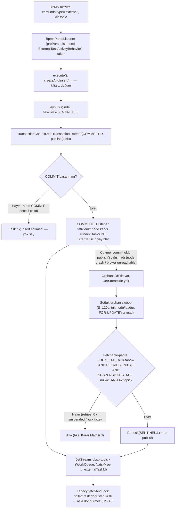
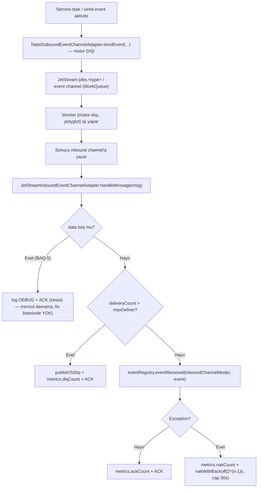
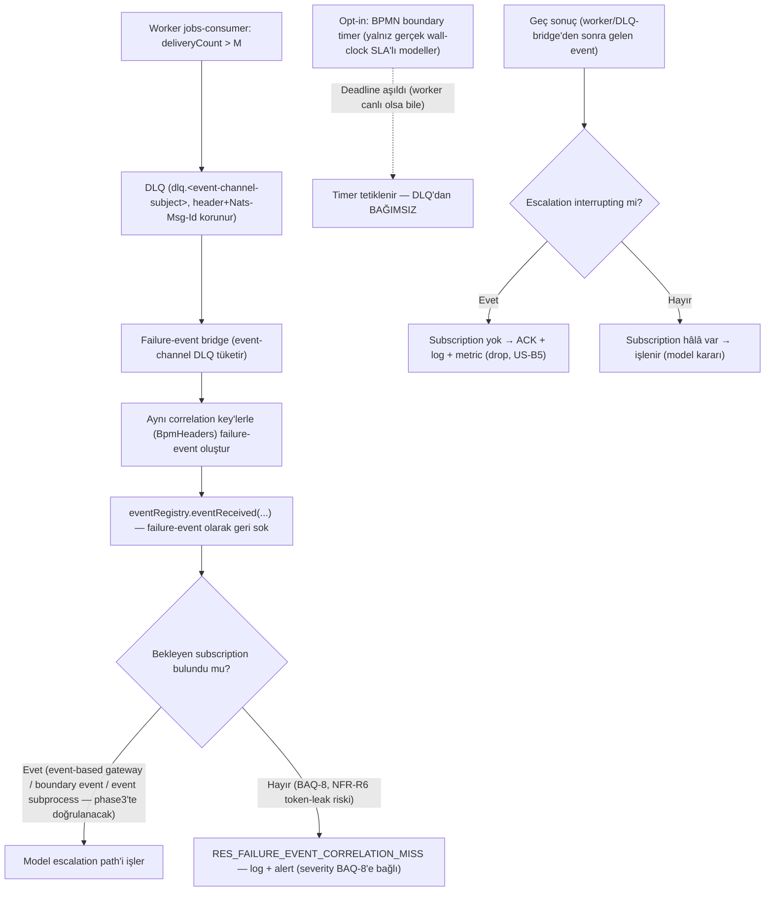
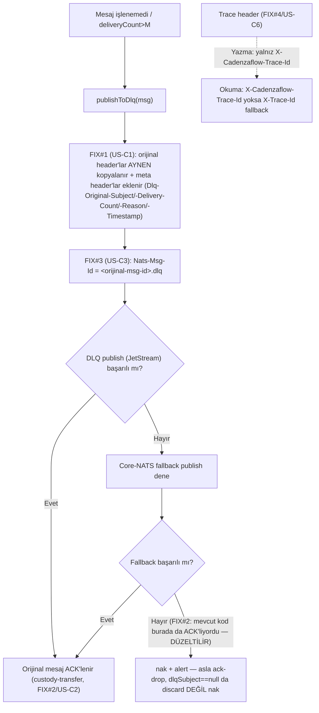
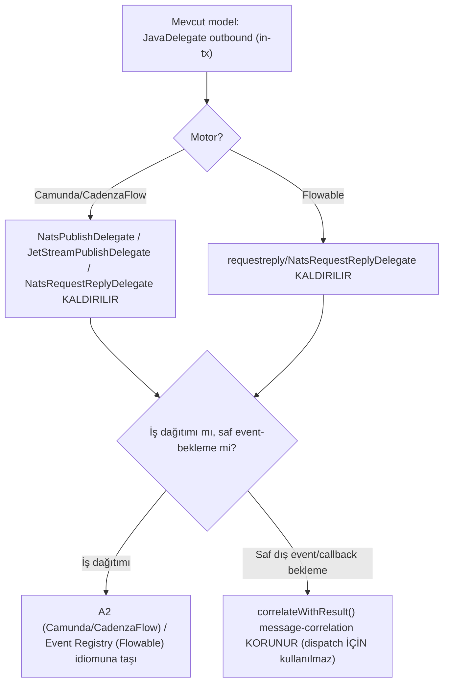
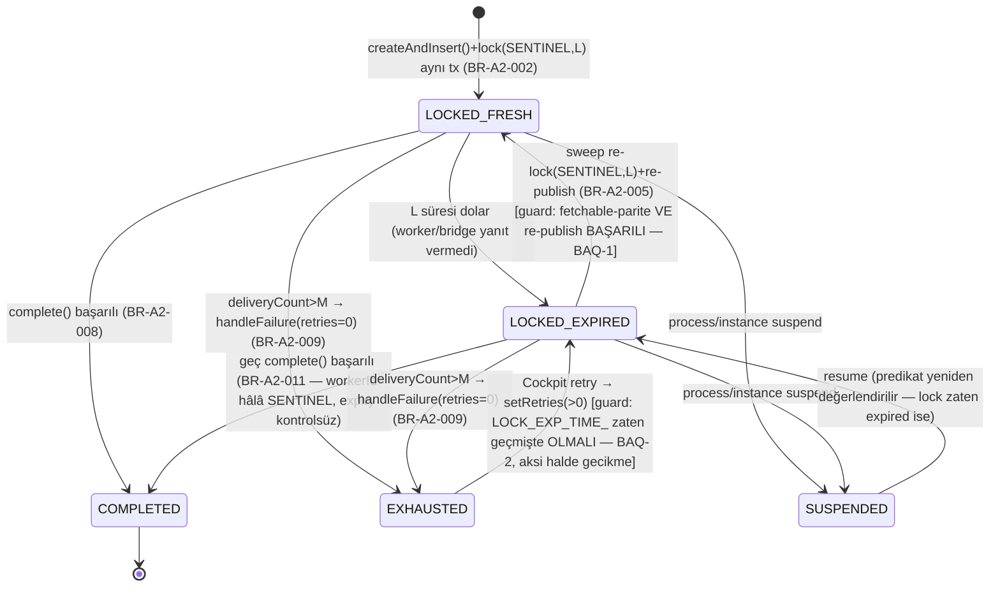
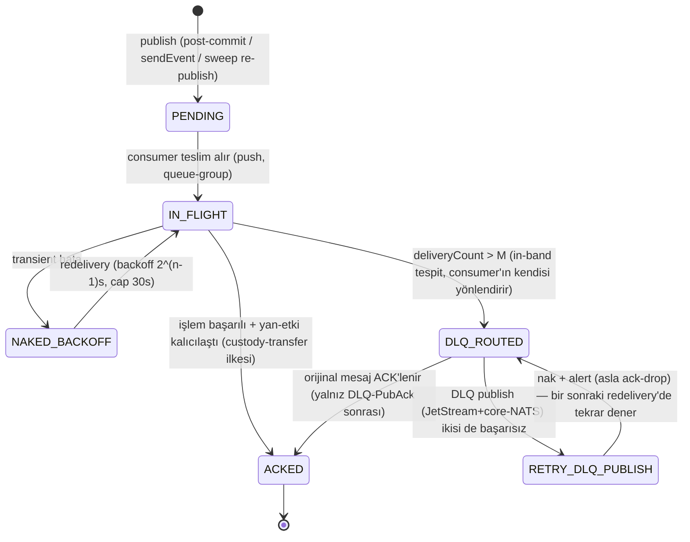

# BUSINESS LOGIC — Basamak-1: External Task / Event-Driven Work Offload over JetStream

**Repo:** `nats-bpm-channels` (3eAI Labs, Apache 2.0)
**Sentinel fazı:** Phase 2 — Business Analyst
**Girdi:** `docs/sentinel/phase1/USER_STORIES.md` (24 US, 5 epic), `SRS.md` (27 FR + 21 NFR + 6 IR), `docs/06-external-task-over-jetstream.md` (D-A…D-F)
**Tarih:** 2026-07-14
**Durum:** İnceleme bekliyor (insan onayı — Phase 3 kapısı)

> Bu belge SRS'in **ne**'sini iş kuralına, süreç akışına ve durum makinesine çevirir. Her kural bir US/FR'ye bağlanır (§8 izlenebilirlik). Motor/adapter davranış iddiaları `file:line` kanıtlıdır — bu fazda **bizzat yeniden doğrulanan** kanıtlar `[BA-VERIFIED]` etiketiyle işaretlidir (phase1'in doğruladıklarının üstüne, bu fazda ek kaynak dosyaları okunarak teyit edildi); doğrulanamayan/phase3'e kalan iddialar `[phase3'te doğrulanacak]` etiketlidir. **Effort tahmini içermez.** Reddedilen kararlar (hot-poll, timer-only, advisory-DLQ, heartbeat/D-H, gRPC/D-G) bu belgede **yeniden açılmamıştır** — yalnız referans olarak anılır.

---

## 0. Kapsam ve yöntem notu

Bu iş mantığı belgesi 24 user story'nin tamamını kapsar (EPIC-A…E). BA Guideline §1 "Edge Case Rule" gereği her gereksinim için en az 3 hata/kenar-durum senaryosu tanımlanmıştır; bu süreçte SRS/US'de açıkça çözülmemiş **5 yeni kenar-durum bulgusu** ortaya çıktı (kaynak koddan bizzat doğrulandı) — bunlar ilgili iş kuralına eklenmiş ve §9 BA-QUESTIONS'a taşınmıştır. Bunlar **kapsam genişletmesi değildir**; mevcut US/FR'lerin içindeki tanımsız kenar durumlardır.

---

## 1. Süreç akışları (Mermaid)

### 1.1 A2 — Doğum, kilit, post-commit yayın, soğuk sweep (US-A1, A2, A3, A5, A8)



**Not:** `createAndInsert` kilitsiz doğurur + entity döndürür — `[BA-VERIFIED]` `ExternalTaskEntity.java:568-588` (fork: `~/Workspaces/cadenzaflow/.../persistence/entity/ExternalTaskEntity.java`); `lock(workerId,lockDuration)` yalnız iki alan setter'ı — `[BA-VERIFIED]` `:471-474` (`workerId` + `lockExpirationTime` set edilir, ayrı DB çağrısı yok, flush ile aynı INSERT'e biner).

### 1.2 A2 — Completion yolu (US-A4, A7)

```mermaid
flowchart TD
    A["Worker: iş biter"] --> B["jobs.&lt;topic&gt;.reply'a yayınla (Nats-Msg-Id=externalTaskId)"]
    B --> C["Worker job mesajını ACK'ler (reply-önce-ack)"]
    C --> D["Engine-inbound bridge reply'ı tüketir"]
    D --> E{"Reply türü?"}
    E -->|Başarı| F["complete(extTaskId, SENTINEL, vars)"]
    E -->|BPMN business error| G["handleBpmnError(extTaskId, SENTINEL, errorCode, ...)"]
    E -->|Transient hata (worker error-reply'da işaretledi)| H["handleFailure(extTaskId, SENTINEL, ...)"]
    F --> I{"Task bulundu mu? (findExternalTaskById)"}
    I -->|Hayır — NotFoundException| J["Yakala + log WARN + ACK (idempotent yut, US-A7)"]
    I -->|Evet| K{"workerId eşit mi? (validateWorkerViolation)"}
    K -->|"Hayır — BadUserRequestException (ASLA OLMAMALI, invariant)"| L["ESCALATE: log ERROR + alert (BA-QUESTION BAQ-7)"]
    K -->|Evet| M["complete() çalışır → token ilerler"]
    M --> N["reply mesajı ACK'lenir (complete-sonrası-ack, custody-transfer)"]
    G --> N
    H --> N
    J -.->|"reply mesajı da ACK'lenir — idempotent yut"| N
```

**Not:** `execute()` akışı — `[BA-VERIFIED]` `HandleExternalTaskCmd.java:44-68`: satır 48-50 `findExternalTaskById` null → `EnsureUtil.ensureNotNull(NotFoundException.class, ...)`; satır 52-53 `validateWorkerViolation` true → `throw new BadUserRequestException(...)`. **Bu iki exception FARKLI tiptedir** — bridge implementasyonu bunları ayrı `catch` blokları ile ayırt edebilir (bkz. EXCEPTION_CODES.md RES_EXTERNAL_TASK_NOT_FOUND vs SYS_SENTINEL_WORKER_CONFLICT).

### 1.3 A2 — DLQ → incident → Cockpit-retry (US-A6)

```mermaid
flowchart TD
    A["jobs.&lt;topic&gt;.reply consumer: deliveryCount &gt; M"] --> B["publishToDlq: dlq.jobs.&lt;topic&gt; (header+Nats-Msg-Id korunur — US-C1/C3)"]
    B --> C["Orijinal reply mesajı ACK'lenir (DLQ-PubAck-sonrası-ack)"]
    C --> D["DLQ-bridge (dlq.jobs.&gt; tüketir)"]
    D --> E["handleFailure(extTaskId, SENTINEL, retries=0, retryDuration=X)"]
    E --> F["setRetriesAndManageIncidents(0): areRetriesLeft() idi + şimdi 0 → createIncident()"]
    F --> G["Cockpit: incident görünür"]
    G --> H["Operatör Cockpit'ten Retry verir"]
    H --> I["SetExternalTaskRetriesCmd.execute(): setRetriesAndManageIncidents(retries&gt;0)"]
    I --> J{"LOCK_EXP_TIME_ hâlâ gelecekte mi? (X'ten miras, DOKUNULMADI)"}
    J -->|Evet| K["BA-QUESTION BAQ-2: fetchable-parite henüz sağlanmaz — sweep bu satırı X süresi dolana kadar ATLAR"]
    J -->|Hayır (X küçük/0 seçildiyse)| L["Satır ANINDA fetchable — sweep bir sonraki S döngüsünde re-lock+re-publish eder"]
```

**Not:** `[BA-VERIFIED]` `ExternalTaskEntity.java:402-419` (`failed(...)`: `lockExpirationTime = now + retryDuration`, ardından `setRetriesAndManageIncidents(retries)`); `:443-452` (`setRetriesAndManageIncidents`: `areRetriesLeft() && retries<=0 → createIncident()`; `!areRetriesLeft() && retries>0 → removeIncidents(true)`); `[BA-VERIFIED]` `SetExternalTaskRetriesCmd.java:48-51` (Cockpit-retry komutu **yalnız** `setRetriesAndManageIncidents(retries)` çağırır — `lockExpirationTime`'a **dokunmaz**). Bu üçü birlikte BAQ-2'nin kanıt zinciridir (bkz. §9).

### 1.4 Flowable — Outbound/inbound + JetStream sağlamlığı (US-B1, B2)



**Not:** `[BA-VERIFIED]` bütün akış `JetStreamInboundEventChannelAdapter.java:118-176` (bizzat okundu, bu fazda). `NatsRequestReplyDelegate` (in-tx blocking) bu akıştan **çıkarılır** (US-B1/E1).

### 1.5 Flowable — Katmanlı escalation (US-B3, B4, B5)



### 1.6 Ortak DLQ/ack wire-contract düzeltmeleri (US-C1…C6)



### 1.7 JavaDelegate phase-out & idiom netliği (US-E1, E2)



---

## 2. Durum makineleri

### 2.1 A2 External Task — türetilmiş durum makinesi

`ACT_RU_EXT_TASK` satırının bir `status` kolonu **yoktur** — durum üç kolonun (`LOCK_EXP_TIME_`, `RETRIES_`, `SUSPENSION_STATE_`) fonksiyonu olarak **türetilir**. Bu, klasik BA state-machine şablonundan sapmadır ve kasıtlıdır (kanıt: `[BA-VERIFIED]` `ExternalTask.xml` fetchable predicate, satır ~220-222'ye tekabül eden blok bu fazda bizzat okundu).



**Guard notu (BAQ-1):** `LOCKED_EXPIRED --> LOCKED_FRESH` geçişi sweep'in **re-lock ADIMI** ile tetiklenir; ancak re-lock (DB yazısı) ile re-publish (JetStream yayını) **iki ayrı adımdır**. Re-lock başarılı + re-publish başarısız olursa satır `LOCKED_FRESH` görünür (lock taze) ama **hiçbir yere teslim edilmemiştir** — bir sonraki L (320s) süresince sweep bu satırı "taze kilit" sanıp atlar (bkz. Karar Matrisi 3, satır 4). Bu, BR-A2-013 / BAQ-1'in kanıt temelidir.

### 2.2 JetStream mesaj custody-transfer durumu (özet — üç rol ayrımı Karar Matrisi 1'de)



**Not:** Bu diyagram özet/görselleştirmedir; her rolün (worker consumer / engine-inbound consumer / DLQ-bridge) tam guard-koşulları için bkz. `DECISION_MATRIX.md` §1.

---

## 3. İş Kuralları Kataloğu (BR-XXX)

> Format: `BR-{MODÜL}-{NO}`. Modüller: **A2** (EPIC-A), **FLW** (EPIC-B), **SUB** (EPIC-C substrat), **OBS** (EPIC-D), **MIG** (EPIC-E). Her kural US + FR'ye bağlıdır. **29 kural** (24 US'nin tamamı kapsanır — bkz. §8; sıfır boşluk).

### BR-A2-001: Happy-path'te fetchAndLock sorgusu sıfır
**User Story:** US-A1 | **FR:** FR-A1 | **Öncelik:** Must

**Tanım:** A2-topic'li bir external task doğduğunda worker'a teslim, JetStream push ile yapılır; ne worker ne merkezi bir poller `fetchAndLock` (SELECT FOR UPDATE) çalıştırır.

**Koşullar:**
| # | Koşul | Beklenen sonuç |
|---|---|---|
| 1 | Task A2-topic'li VE happy-path (crash yok) | `fetchAndLock` fingerprint hit = 0 |
| 2 | N worker aynı topic'e queue-group ile bağlı | Tam olarak 1 worker işi alır (WorkQueue claim) |
| 3 | Worker redeliver alır (nak/timeout sonrası) | Worker kodu değişmeden idempotent işler (dedup + at-least-once) |

**Test senaryoları:**
| Senaryo | Girdi | Beklenen çıktı | Tür |
|---|---|---|---|
| Happy path | 1 task doğar | `pg_stat_statements` fetchAndLock=0 | Positive |
| Çoklu worker | 5 worker, 1 task | Yalnız 1 worker alır | Positive |
| Redeliver | ack-wait dolar | Aynı worker/başka worker idempotent işler | Edge case |

**Bağımlılık:** BR-A2-002 (kilit doğumda), BR-SUB-005 (WorkQueue stream).

---

### BR-A2-002: Doğumda in-tx sentinel kilit — sıfır ek DB yazısı
**User Story:** US-A2 | **FR:** FR-A2 | **Öncelik:** Must

**Tanım:** External task satırı, onu oluşturan transaction içinde `createAndInsert(...)` ile kilitsiz doğar, aynı tx'te flush'tan önce `lock(SENTINEL, L)` çağrılır → kilit alanları aynı INSERT'e biner.

**Kanıt:** `[BA-VERIFIED]` `ExternalTaskEntity.java:568-588` (`createAndInsert` — workerId/lockExpirationTime hiç set edilmiyor, yalnız `insert()` çağrılıyor); `:471-474` (`lock(String workerId, long lockDuration)` — yalnız iki alan setter'ı, DB round-trip yok).

**Koşullar:**
| # | Koşul | Beklenen sonuç |
|---|---|---|
| 1 | A2-topic'li aktivite parse edilir | `BpmnParseListener` behavior'ı swap eder (`BpmnParse.java:2564`) |
| 2 | `execute()` çağrılır | `createAndInsert` + aynı tx'te `lock(SENTINEL,L)` |
| 3 | Flush gerçekleşir | Tek INSERT üretilir — ikinci bir UPDATE YOK |
| 4 | A2 olmayan (klasik) external task | Davranış değişmez — kilitsiz doğar (native) |

**Sınır değerler:** L=320s default; topic-başına override edilebilir (bkz. BR-A2-006 için alt sınır kısıtı).

**Test senaryoları:**
| Senaryo | Girdi | Beklenen çıktı | Tür |
|---|---|---|---|
| Happy path | A2-topic aktivite | 1 INSERT, kilit alanları dolu | Positive |
| Klasik ext-task | camunda:type=external, A2 değil | Kilitsiz doğar (davranış korunur) | Negative (regresyon kontrolü) |
| Flush-öncesi çift lock çağrısı | (savunma) | Tek INSERT'e biner, hata yok | Edge case |

**Bağımlılık:** BR-A2-003.

---

### BR-A2-003: SENTINEL workerId küme-geneli tek sabit
**User Story:** US-A2 | **FR:** FR-A3 | **Öncelik:** Must

**Tanım:** `SENTINEL` (örn. `a2-jetstream-bridge`) küme-geneli **tek** sabittir; node-başına farklı id KULLANILMAZ (aksi halde reply queue-group'tan farklı bir node tüketirse `complete()` workerId eşitliği kırılır). Id ayrıca payload'da audit için taşınır.

**Koşullar:**
| # | Koşul | Beklenen sonuç |
|---|---|---|
| 1 | Reply'ı queue-group'tan herhangi bir bridge node'u tüketir | `complete(extTaskId, SENTINEL, vars)` her node'da aynı sabitle çağrılır |
| 2 | Config'te SENTINEL değeri node'lar arası farklı yazılmış (config drift) | `SYS_SENTINEL_WORKER_CONFLICT` (bkz. EXCEPTION_CODES.md) — ASLA olmamalı invariant |

**Bağımlılık:** BR-A2-002, BR-A2-008.

---

### BR-A2-004: Post-commit publish — sorgusuz, yarışsız
**User Story:** US-A3 | **FR:** FR-A4 | **Öncelik:** Must

**Tanım:** Task'ı oluşturan node, `TransactionState.COMMITTED` listener'ında elindeki entity ile yayınlar. DB sorgusu YOK, cross-node yarış YOK (her node yalnız kendi yarattığını yayınlar).

**Koşullar:**
| # | Koşul | Beklenen sonuç |
|---|---|---|
| 1 | Commit başarılı | Aynı node, tx dışı, task'ı DB sorgusuz yayınlar |
| 2 | Node commit ÖNCESİ çöker | Task hiç insert edilmedi — yayın da yok, tutarlı |
| 3 | Node commit SONRASI ama publish() ÖNCESİ çöker | Orphan (DB'de var, JetStream'de yok) → sweep yakalar (BR-A2-005) |
| 4 | Çift yayın (post-commit + sweep aynı task'ı iki kez yayınlarsa) | `Nats-Msg-Id=externalTaskId` dedup penceresinde yutulur |

**Bağımlılık:** BR-A2-002, BR-A2-005.

---

### BR-A2-005: Soğuk sweep — fetchable-parite kriteri (+ re-publish güvenliği)
**User Story:** US-A3, US-A5 | **FR:** FR-A5, FR-A6 | **Öncelik:** Must

**Tanım:** Sweep, engine'in native fetchable predicate'inin (`LOCK_EXP_TIME_ null|≤now AND RETRIES_ null|>0 AND SUSPENSION_STATE_ null|=1`) birebir aynısını sorgular; `SELECT FOR UPDATE` KULLANMAZ; yayın öncesi sentinel re-lock yapar (aynı workerId → her zaman geçer).

**Kanıt:** `[BA-VERIFIED]` fetchable predicate WHERE bloğu (`ExternalTask.xml`, bu fazda bizzat okundu — `LOCK_EXP_TIME_`/`SUSPENSION_STATE_`/`RETRIES_` üç koşul AND'li); `[BA-VERIFIED]` `LockExternalTaskCmd.java:50-61` — re-lock ihlali yalnız *farklı worker + süresi DOLMAMIŞ kilit* kombinasyonunda (`validateWorkerViolation`: `workerValidation AND lockValidation`, `lockValidation` yalnız `existingLockExpirationTime != null && !now.after(existingLockExpirationTime)` iken true) → aynı SENTINEL workerId ile veya süresi dolmuş herhangi bir kilitle re-lock HER ZAMAN geçer.

**Koşullar (bkz. Karar Matrisi 3 — tam tablo):**
| # | Koşul | Beklenen sonuç |
|---|---|---|
| 1 | Lock expired/null AND retries≠0 AND not suspended AND A2 topic | Re-lock(SENTINEL,L) + re-publish |
| 2 | retries=0 (DLQ'lanmış) | Atla — asla yeniden yayınlama |
| 3 | Suspended (process/instance) | Atla — resume bekle |
| 4 | Lock hâlâ taze (LOCK_EXP_TIME_ > now) | Atla — in-flight, orphan değil |

**Edge-case (BAQ-1, bu fazda bulundu):** Re-lock (DB yazısı) başarılı olur ama ardından re-publish (JetStream) başarısız olursa, satır artık "taze kilitli" görünür (LOCK_EXP_TIME_ = now+L) ama **hiçbir yere teslim edilmemiştir**. Sonraki sweep döngüleri (≤ L/S ≈ 2-3 döngü, ~240-320s) bu satırı "in-flight" sanıp atlar → gerçek orphan, kendi taze kilidi yüzünden **görünmez** hale gelir. Re-lock ve re-publish adımlarının sıralaması/atomikliği bu belgenin kapsamı dışıdır (Phase 3/4 tasarım kararı) ama **iş kuralı olarak şart koşulur:** re-publish başarısız olursa satır bir sonraki sweep döngüsünde **yine orphan sayılmalıdır** (ör. kısa/geçici lock veya publish-önce-relock-sonra sıralaması). Bkz. §9 BAQ-1.

**Bağımlılık:** BR-A2-002, BR-A2-004, BR-A2-006 (L formülü sweep periyodunu S'yi içerir).

---

### BR-A2-006: Şemsiye kilit formülü — L ≥ M·W + Σbackoff + S + ε
**User Story:** US-A5 | **FR:** FR-A8 | **Öncelik:** Must

**Tanım:** JetStream tek redelivery otoritesidir (`ack-wait`=W, `maxDeliver`=M); engine sentinel kilidi (L) bunu kapsayan bir **şemsiyedir**, rakip bir saat değildir. Default: W=30s, M=4, S=120s, ε=60s, Σbackoff=1+2+4=7s → alt sınır **307s**; default **L=320s** (13s marj).

**Kanıt:** `[BA-VERIFIED]` `HandleExternalTaskCmd.java:89-91` (`validateWorkerViolation` — yalnız workerId eşitliği kontrol edilir; expiry kontrolü YOK) → engine kilidi redelivery saati DEĞİLDİR, JetStream'dir.

**Koşullar:**
| # | Koşul | Beklenen sonuç |
|---|---|---|
| 1 | Default parametreler (W=30,M=4,S=120,ε=60,Σbackoff=7) | L ≥ 307s zorunlu; default 320 |
| 2 | Topic-başına W override (uzun işli topic) | L de buna göre yeniden türetilmeli |
| 3 | Operatör L'yi elle formülün ALTINA yazarsa | `VAL_UMBRELLA_LOCK_TOO_SHORT` — davranış BAQ-3'e bağlı (reject vs warn) |

**Sınır değerler:**
| Parametre | Min (kabul edilebilir) | Default | Geçersiz örnek |
|---|---|---|---|
| L | M·W+Σbackoff+S+ε (307s default'ta) | 320s | 300s (ilk yazımda MAJOR-B ile düzeltildi) |

**Bağımlılık:** BR-A2-005, BR-A2-007.

---

### BR-A2-007: Heartbeat yok — W·M sert tavan
**User Story:** US-A5 | **FR:** FR-A9 | **Öncelik:** Must

**Tanım:** `msg.inProgress()` ve engine `extendLock` **kullanılmaz**; W·M basamak-1'de sert bütçedir (D-H'ye ertelendi — **yeniden açılmaz**).

**Kanıt:** `[BA-VERIFIED]` `ExtendLockOnExternalTaskCmd.java:44-47` (`execute`: `EnsureUtil.ensureGreaterThanOrEqual(..., "Cannot extend a lock that expired", lockExpirationTime, now)` — süresi dolmuş kilit UZATILAMAZ, bu da zaten heartbeat'i basamak-1 worker kontratı olmadan anlamsız kılar).

**Koşullar:**
| # | Koşul | Beklenen sonuç |
|---|---|---|
| 1 | Uzun işli topic, W küçük seçilmiş | Worker `msg.inProgress()` KULLANAMAZ — W topic-başına artırılmalı |
| 2 | `extendLock` çağrısı denenirse (kilit dolmuşsa) | `BadUserRequestException` (kanıt yukarıda) |

**Bağımlılık:** BR-A2-006.

---

### BR-A2-008: Inbound completion-bridge
**User Story:** US-A4 | **FR:** FR-A7 | **Öncelik:** Must

**Tanım:** Reply mesajı `externalTaskService.complete(extTaskId, SENTINEL, vars)`'a bağlanır; business-error → `handleBpmnError`; transient → `handleFailure`. `complete` **başarılı olduktan sonra** reply ACK'lenir.

**Koşullar (bkz. Karar Matrisi 2 — tam tablo):**
| # | Koşul | Beklenen sonuç |
|---|---|---|
| 1 | Task bulundu + workerId eşit | `complete()` çalışır → ACK |
| 2 | Task bulunamadı (`NotFoundException`, `HandleExternalTaskCmd.java:48-50`) | Yakala + log WARN + ACK (idempotent yut — BR-A2-011) |
| 3 | workerId eşit değil (`BadUserRequestException`, `:52-53`) | **ASLA olmamalı** — invariant, escalate (BAQ-7) |
| 4 | Worker business-error döndü | `handleBpmnError(...)` |
| 5 | Complete çağrısı sırasında transient hata (DB down vb.) | `nak` — redelivery |

**Bağımlılık:** BR-A2-002 (kilit ön şart), BR-SUB-002 (custody-transfer ack).

---

### BR-A2-009: DLQ → incident bridge
**User Story:** US-A6 | **FR:** FR-A10, FR-A11 | **Öncelik:** Must

**Tanım:** `deliveryCount > M` → `dlq.jobs.<topic>` → incident-bridge → `handleFailure(..., retries=0)` → Cockpit incident. `retries=0` task fetchable-predicate dışıdır, sweep asla dirtmez.

**Kanıt:** `[BA-VERIFIED]` `ExternalTaskEntity.java:443-448` (`setRetriesAndManageIncidents`: `areRetriesLeft() && retries<=0 → createIncident()`).

**Koşullar:**
| # | Koşul | Beklenen sonuç |
|---|---|---|
| 1 | deliveryCount > M | DLQ + incident |
| 2 | İkinci kez aynı DLQ mesajı redeliver edilirse (bridge nak sonrası) | `setRetriesAndManageIncidents(0)` tekrar çağrılır ama `areRetriesLeft()` artık false → `createIncident()` **tekrar çağrılmaz** (doğal idempotency) |
| 3 | Task DLQ-bridge işlerken zaten bir başka yoldan complete edilmişse | `NotFoundException` → aynı idempotent-yut yolu (BR-A2-011) |

**Bağımlılık:** BR-SUB-001 (DLQ header preservation — korelasyon için şart), BR-SUB-004.

---

### BR-A2-010: Cockpit-retry revival path
**User Story:** US-A6 | **FR:** FR-A11 | **Öncelik:** Must

**Tanım:** Operatör Cockpit'ten retry verirse (`retries>0`), task teorik olarak yeniden fetchable olur ve sweep onu doğal olarak yeniden yayınlar.

**Kanıt:** `[BA-VERIFIED]` `SetExternalTaskRetriesCmd.java:48-51` — `execute()` **yalnız** `externalTask.setRetriesAndManageIncidents(retries)` çağırır; `lockExpirationTime`'a dokunmaz.

**Edge-case (BAQ-2, bu fazda bulundu):** DLQ→incident bridge'in çağırdığı `handleFailure(..., retries=0, retryDuration=X)` çağrısı `lockExpirationTime = now+X` set eder (BR-A2-009 kanıtı). Cockpit-retry bu alana dokunmadığından, eğer operatör X süresi dolmadan retry verirse, satır `retries>0` olsa BİLE `LOCK_EXP_TIME_ > now` olduğundan fetchable-parite predikatını **henüz sağlamaz** → sweep bu satırı bir sonraki S döngülerinde "taze kilit" sanıp atlar, ta ki X süresi geçene kadar. Bu, US-A6'nın "operatör retry verirse task yeniden fetchable olur" iddiasını **koşullu** kılar (X'e bağlı bir gecikme vardır).

**Koşullar:**
| # | Koşul | Beklenen sonuç |
|---|---|---|
| 1 | Cockpit retry verilir, X zaten geçmiş | Satır anında fetchable, sweep bir sonraki S'de yakalar |
| 2 | Cockpit retry verilir, X henüz geçmemiş | Satır X süresi dolana kadar sweep'e görünmez (BAQ-2) |

**Bağımlılık:** BR-A2-009, BR-A2-005.

---

### BR-A2-011: Geç-complete idempotency
**User Story:** US-A7 | **FR:** FR-A12 | **Öncelik:** Must

**Tanım:** L dolduktan sonra gelen reply yine başarılı complete olur (expiry kontrolü yok); ikinci (çift) complete "task yok" ile karşılaşır → yakalanır + ACK.

**Kanıt:** `[BA-VERIFIED]` `HandleExternalTaskCmd.java:89-91` (expiry kontrolsüz workerId eşitliği).

**Sınır değerler:**
| Girdi | Durum | Beklenen |
|---|---|---|
| Reply, L içinde | normal | complete başarılı |
| Reply, L sonrası ama re-lock/sweep araya girmemiş | expiry kontrolsüz | complete YİNE başarılı |
| İkinci (duplicate) reply, aynı task zaten complete edilmiş | task silinmiş | `NotFoundException` → yut+ACK |
| Duplicate, `duplicate_window` (2dk) İÇİNDE | stream dedup | Nats-Msg-Id ile zaten yutulur, complete-idempotency'e gelmez |
| Duplicate, `duplicate_window` DIŞINDA (L=320s > 2dk) | stream dedup çalışmaz | complete-idempotency (bu kural) yutar |

**Test senaryoları:**
| Senaryo | Girdi | Beklenen çıktı | Tür |
|---|---|---|---|
| Pencere-dışı çift | 2 reply, 400s ara | 1. complete, 2. yut+ACK | Edge case |
| workerId hep SENTINEL | — | Sahiplik asla el değiştirmez | Invariant |

**Bağımlılık:** BR-A2-008, BR-SUB-005 (dedup penceresi).

---

### BR-A2-012: Migrasyon guard — legacy poller dışlanması
**User Story:** US-A8 | **FR:** FR-A13 | **Öncelik:** Should (Q6: basamak-1'e dahil)

**Tanım:** A2 task'ı doğuştan sentinel-kilitli olduğundan native fetchable-predicate dışındadır; legacy `fetchAndLock` onu asla döndürmez. A2 olmayan (klasik) external task'lar etkilenmez.

**Koşullar:**
| # | Koşul | Beklenen sonuç |
|---|---|---|
| 1 | A2-topic task, legacy poller çalışıyor | Poller onu görmez (lock dolu) |
| 2 | Klasik (A2-olmayan) task, aynı poller | Normal fetchAndLock ile alınır (davranış aynı) |
| 3 | Migration ortasında karışık topic seti | Behavior swap yalnız A2-topic'li aktivitelerde |

**Bağımlılık:** BR-A2-002.

---

### BR-A2-013: Sweep re-lock/re-publish sıralaması güvenliği (edge-case, BR-A2-005'in devamı)
**User Story:** US-A3 | **FR:** FR-A5, FR-A6 | **Öncelik:** Must (kenar-durum netliği — BAQ-1)

**Tanım:** Bkz. BR-A2-005 edge-case notu ve state machine §2.1 guard notu. Bu kural ayrı numaralandırılmıştır çünkü Karar Matrisi 3'te bağımsız bir satır (potansiyel 5. çıktı: "re-lock başarılı, re-publish başarısız") olarak izlenmesi gerekir.

**Koşullar:**
| # | Koşul | Beklenen sonuç |
|---|---|---|
| 1 | Re-lock DB yazısı başarılı, JetStream publish başarılı | Normal (BR-A2-005 satır 1) |
| 2 | Re-lock DB yazısı başarılı, JetStream publish BAŞARISIZ (broker down) | Satır "taze kilitli" görünür ama teslim edilmedi — **iş kuralı gereği bir sonraki döngüde yine orphan sayılmalı** (mekanizma phase3/4) |
| 3 | Re-lock DB yazısı BAŞARISIZ (DB down) | `SYS_SWEEP_RELOCK_FAILED` — sweep döngüsü bu satırı atlar, bir sonraki döngüde tekrar dener |

**Bağımlılık:** BR-A2-005.

---

### BR-FLW-001: JavaDelegate → sendEvent (Flowable outbound)
**User Story:** US-B1 | **FR:** FR-B1 | **Öncelik:** Must

**Tanım:** `requestreply/NatsRequestReplyDelegate.java:19` (in-tx blocking) kaldırılır; outbound `NatsOutboundEventChannelAdapter.sendEvent(...)` ile motor-dışı yapılır; native push idiom korunur.

**Koşullar:**
| # | Koşul | Beklenen sonuç |
|---|---|---|
| 1 | Model delegate kullanıyor | Migrasyon rehberi ile `sendEvent`'e taşınır |
| 2 | Yeni model | Baştan `sendEvent` kullanır, delegate hiç görülmez |
| 3 | Fast-RPC istisnası talep edilirse | REDDEDİLDİ (05 §9) — yok |

**Bağımlılık:** BR-MIG-001.

---

### BR-FLW-002: JetStream ack+DLQ+dedup zorunluluğu
**User Story:** US-B2 | **FR:** FR-B2, FR-C6 | **Öncelik:** Must

**Tanım:** Basamak-1 kritik iş için core adapter'ın ack'siz/log-only yolu KULLANILMAZ; JetStream variant (`maxDeliver+1` DLQ tespiti + `Nats-Msg-Id`/correlation dedup) zorunludur.

**Koşullar:**
| # | Koşul | Beklenen sonuç |
|---|---|---|
| 1 | Basamak-1 kritik channel tanımlanır | JetStream adapter seçilmeli, core adapter değil |
| 2 | deliveryCount > maxDeliver | DLQ'ya yönlenir (`:133-146`) |
| 3 | İşleme sırasında exception | `nakWithBackoff` (2^(n-1)s, cap 30s) |
| 4 | Boş mesaj gövdesi (BAQ-5) | Mevcut davranış: log DEBUG + ACK (fix listesi dışı — sorgulanıyor) |

**Bağımlılık:** BR-SUB-001, BR-SUB-002, BR-SUB-003.

---

### BR-FLW-003: DLQ → failure-event bridge (default escalation)
**User Story:** US-B3 | **FR:** FR-B3 | **Öncelik:** Must

**Tanım:** DLQ mesajı aynı correlation key'leri koruyarak failure-event'e çevrilip `eventRegistry.eventReceived(...)`'a sokulur; happy-path ek DB maliyeti sıfır.

**Koşullar:**
| # | Koşul | Beklenen sonuç |
|---|---|---|
| 1 | Worker W·M bütçesini tüketir (kalıcı ölüm) | DLQ→failure-event, tespit gecikmesi=W·M, SLA beklenmez |
| 2 | Bekleyen instance escalation path'i var (event-based gateway/boundary/subprocess) | Correlate olur, model işler |
| 3 | Bekleyen subscription YOK (instance zaten resolve olmuş / correlation key kayıp) | `RES_FAILURE_EVENT_CORRELATION_MISS` (BAQ-8) |

**Bağımlılık:** BR-SUB-001 (korelasyon key'siz DLQ → bu köprü çalışamaz).

---

### BR-FLW-004: Opt-in boundary timer (wall-clock SLA)
**User Story:** US-B4 | **FR:** FR-B4 | **Öncelik:** Should (Q6 dahil)

**Tanım:** Yalnız gerçek deadline'ı olan modellerde opt-in boundary timer modellenir; timer-job satır maliyeti yalnız o modellerde ödenir.

**Koşullar:**
| # | Koşul | Beklenen sonuç |
|---|---|---|
| 1 | Model gerçek SLA'ya sahip | Boundary timer opt-in modellenir |
| 2 | Model SLA'sız (default) | Timer YOK, yalnız DLQ→failure-event (BR-FLW-003) |
| 3 | Timer-only default talep edilirse | REDDEDİLDİ — yeniden açılmaz |

**Bağımlılık:** BR-FLW-003.

---

### BR-FLW-005: Geç-sonuç politikası
**User Story:** US-B5 | **FR:** FR-B5 | **Öncelik:** Should (Q6 dahil)

**Tanım:** Escalation interrupting ise geç sonuç subscription bulamaz → ack+log+metric (drop); non-interrupting ise işlenir.

**Koşullar:**
| # | Koşul | Beklenen sonuç |
|---|---|---|
| 1 | Interrupting escalation zaten fırlamış, geç event gelir | Drop (ack+log+metric), `BUS_EVENT_CORRELATION_NOT_FOUND` |
| 2 | Non-interrupting escalation | Geç event yine işlenir |
| 3 | `eventReceived`'ın gerçek no-match davranışı | `[phase3'te doğrulanacak]` (D-D c) |

**Bağımlılık:** BR-FLW-003, BR-FLW-004.

---

### BR-SUB-001: DLQ header preservation (contract-fix #1)
**User Story:** US-C1 | **FR:** FR-C1 | **Öncelik:** Must

**Tanım:** `publishToDlq`, orijinal payload byte'larını VE orijinal header'ların tamamını kopyalar; ek meta header'lar eklenir (`X-Cadenzaflow-Dlq-Original-Subject`, `-Dlq-Delivery-Count`, `-Dlq-Reason`, `-Dlq-Timestamp`).

**Kanıt (mevcut açık, `[BA-VERIFIED]` bu fazda):** `JetStreamInboundEventChannelAdapter.java:210-236` (`publishToDlq`) — yalnız `msg.getData()` yayınlanıyor (satır 216-218, 227), header hiç okunmuyor/kopyalanmıyor. Aynı desen `JetStreamMessageCorrelationSubscriber.java:202-229` (satır 208-210 JetStream publish, 218-219 core-NATS fallback) — ikisi de yalnız `data` taşıyor.

**Koşullar:**
| # | Koşul | Beklenen sonuç |
|---|---|---|
| 1 | Mesaj DLQ'ya yönleniyor | Orijinal header'lar + 4 meta header eklenir |
| 2 | DLQ mesajından correlation key okunur | Bridge (US-A6/B3) correlate edebilir |
| 3 | Meta header `-Dlq-Reason` | Yalnız hata SINIFI/kodu taşır, payload/PII sızdırmaz (DP-6) |

**Bağımlılık:** yok (fix; BR-A2-009/BR-FLW-003 buna bağlı).

---

### BR-SUB-002: Custody-transfer ack — koşulsuz ack kaldırılır (contract-fix #2)
**User Story:** US-C2 | **FR:** FR-C2, FR-C6 | **Öncelik:** Must

**Tanım:** Ack yalnız kalıcılık el değiştirdikten sonra verilir. `dlqSubject==null` iken mesaj discard EDİLMEZ (nak edilir); DLQ publish başarısızsa nak edilir; dlq-of-dlq yok (bridge işleyemezse nak+alert, asla ack-drop).

**Kanıt (mevcut açık, `[BA-VERIFIED]` bu fazda):** `JetStreamInboundEventChannelAdapter.java:210-214` (`dlqSubject==null` → log WARN + `return`, ardından ÇAĞIRAN KOD satır 141-145'te `msg.ack()` çağırıyor — yani mesaj sessizce kaybediliyor); `:222-235` (JetStream VE core-NATS ikisi de başarısız → yalnız `log.error`, yine çağıran kod ack'liyor). Aynı desen cadenzaflow'da `JetStreamMessageCorrelationSubscriber.java:203-207` (`dlqSubject==null` → return, çağıran satır 127'de ack).

**Koşullar (bkz. Karar Matrisi 1 — tam tablo):**
| # | Koşul | Beklenen sonuç |
|---|---|---|
| 1 | Worker reply yayınladı | reply-PubAck-sonrası-ack |
| 2 | Engine-inbound complete/correlate başarılı | complete-sonrası-ack |
| 3 | DLQ publish başarılı | DLQ-PubAck-sonrası-ack (orijinal mesaj) |
| 4 | `dlqSubject==null` | **discard YOK** → nak (DÜZELTME) |
| 5 | DLQ publish (her iki yol) başarısız | nak + alert (DÜZELTME — mevcut kod ack'liyordu) |
| 6 | Bridge DLQ mesajını işleyemez | nak + alert, asla ack-drop (dlq-of-dlq yok) |

**Bağımlılık:** BR-SUB-006 (backoff deseni paylaşılır).

---

### BR-SUB-003: DLQ publish'te Nats-Msg-Id (contract-fix #3)
**User Story:** US-C3 | **FR:** FR-C3 | **Öncelik:** Must

**Tanım:** Her DLQ publish `Nats-Msg-Id = <orijinal-msg-id>.dlq` taşır — çökme-sonrası çift DLQ kaydına karşı.

**Kanıt (mevcut açık, `[BA-VERIFIED]` bu fazda):** `JetStreamInboundEventChannelAdapter.java:218` (`jetStream.publish(dlqSubject, data)` — 2. argüman yok, `Nats-Msg-Id` set edilmiyor); aynı `JetStreamMessageCorrelationSubscriber.java:210`.

**Koşullar:**
| # | Koşul | Beklenen sonuç |
|---|---|---|
| 1 | Aynı poison mesaj iki kez DLQ'ya yönlenir (crash-restart) | Stream dedup penceresi İÇİNDE tek kayıt |
| 2 | İki DLQ yönlenmesi arası `duplicate_window`'dan (2dk) uzun | Çift kayıt oluşur (dedup dışı, dürüst sınır) |

**Bağımlılık:** BR-SUB-001.

---

### BR-SUB-004: Tek ortak DLQ stream topolojisi
**User Story:** US-C4 | **FR:** FR-C4 | **Öncelik:** Should (Q6 dahil)

**Tanım:** Tüm DLQ trafiği tek `DLQ` stream'inde (`dlq.>`) toplanır, limits-based retention (default 14g, kiracı-bazlı override). Tüketiciler subject filtresiyle ayrışır: `dlq.jobs.>` → Camunda/CadenzaFlow incident-bridge; event-channel DLQ'ları → Flowable failure-event bridge.

**Koşullar:**
| # | Koşul | Beklenen sonuç |
|---|---|---|
| 1 | A2 job DLQ'landı | `dlq.jobs.<topic>` → incident-bridge tüketir |
| 2 | Flowable event-channel DLQ'landı | `dlq.<event-subject>` → failure-event bridge tüketir |
| 3 | İdiom-başına ayrı stream talep edilirse | REDDEDİLDİ — yeniden açılmaz |
| 4 | **Flowable bir inbound channel'ı `jobs.<x>` adlandırırsa (BAQ-4)** | `dlq.jobs.<x>` yanlışlıkla incident-bridge'e gider — namespace çakışması |

**Bağımlılık:** BR-SUB-001.

---

### BR-SUB-005: WorkQueue stream + dedup penceresi
**User Story:** US-C5 | **FR:** FR-C5 | **Öncelik:** Must

**Tanım:** İş dağıtım stream'i WorkQueue tipindedir (her mesaj tek tüketici, nack→redeliver); `Nats-Msg-Id` dedup (A2: `externalTaskId`; Event Registry: correlation key); `duplicate_window` yapılandırılabilir (default 2dk).

**Koşullar:**
| # | Koşul | Beklenen sonuç |
|---|---|---|
| 1 | `jobs.<type>` / event channel subject'i tanımlanır | WorkQueue stream'de |
| 2 | L (320s) > duplicate_window (2dk) | Pencere-dışı çiftler apply-zamanı idempotency (BR-A2-011/BR-FLW-005) ile yutulur — dokümante edilmeli |

**Bağımlılık:** yok (substrat temeli).

---

### BR-SUB-006: Trace header standardizasyonu (contract-fix #4)
**User Story:** US-C6 | **FR:** FR-C7 | **Öncelik:** Must

**Tanım:** Yazma tarafı yalnız `X-Cadenzaflow-Trace-Id` üretir; okuma tarafı iki adı da kabul eder (önce `X-Cadenzaflow-Trace-Id`, yoksa `X-Trace-Id`).

**Kanıt (mevcut açık, `[BA-VERIFIED]` bu fazda):** `JetStreamInboundEventChannelAdapter.java:119` (`NatsHeaderUtils.extractHeader(msg, "X-Trace-Id")` — yalnız eski adı okuyor); `BpmHeaders.java:12` (`TRACE_ID = "X-Cadenzaflow-Trace-Id"` — standart yazım adı).

**Koşullar:**
| # | Koşul | Beklenen sonuç |
|---|---|---|
| 1 | Mesaj `X-Cadenzaflow-Trace-Id` taşıyor | MDC'ye alınır |
| 2 | Mesaj yalnız eski `X-Trace-Id` taşıyor (geçiş dönemi üreticisi) | Fallback ile MDC'ye alınır |
| 3 | Yeni yazım kodu | Yalnız `X-Cadenzaflow-Trace-Id` üretir, `X-Trace-Id` YAZILMAZ |

**Bağımlılık:** yok (fix).

---

### BR-OBS-001: Normalize DB-roundtrip metriği — TEK sert kapı
**User Story:** US-D1 | **FR:** FR-D1 | **Öncelik:** Must

**Tanım:** Task-yaşamdöngüsü başına DB round-trip bileşenleri raporlanır (Task INSERT=1, Poll=0, fetchAndLock UPDATE=0, complete tx=1, sweep okuması≈~0). Bu metrik basamak-1 kapanışının **TEK** sert kabul kapısıdır (Q7).

**Koşullar:**
| # | Koşul | Beklenen sonuç |
|---|---|---|
| 1 | A2-push modu ölçülür | poll+fetchAndLock=0, INSERT/complete artmıyor |
| 2 | Native-poll baseline ölçülür | Karşılaştırma referansı |
| 3 | `fetchAndLock` SQL'inin ayrı fingerprint verdiği | `[phase3'te doğrulanacak]` |

**Bağımlılık:** BR-A2-001, BR-A2-002, BR-A2-008, BR-OBS-003.

---

### BR-OBS-002: Destekleyici SLI katmanı (soft target)
**User Story:** US-D2 | **FR:** FR-D2 | **Öncelik:** Should (Q6 dahil)

**Tanım:** fetchAndLock QPS, lock-wait, HikariCP connection, dispatch p95, failure sayaçları izlenir; **hiçbiri sert kapı DEĞİLDİR** (Q7).

**Koşullar:**
| # | Koşul | Beklenen sonuç |
|---|---|---|
| 1 | Dispatch p95 > 200ms | Log/rapor, bench FAIL etmez |
| 2 | fetchAndLock QPS hot-path'te > 0 | Anomali sinyali (ama BR-OBS-001'in gölgesinde, ayrı sert kapı değil) |

**Bağımlılık:** BR-OBS-001.

---

### BR-OBS-003: Testcontainers bench — iki mod
**User Story:** US-D3 | **FR:** FR-D3 | **Öncelik:** Must

**Tanım:** Aynı senaryo native-poll ↔ A2-push modlarında koşar (`@Tag("bench")`, nightly/manuel); BR-OBS-001 metriğini iki mod için üretir.

**Koşullar:**
| # | Koşul | Beklenen sonuç |
|---|---|---|
| 1 | Docker/Testcontainers ortamı hazır | Bench koşar |
| 2 | Ortam hazır değil (CI'da Docker yok) | `SYS_BENCH_ENVIRONMENT_UNAVAILABLE` — build FAIL ETMEZ (nightly/manuel, ana CI'yı bloklamaz) |
| 3 | Bench sonucu BR-OBS-001 hedefini kaçırırsa | `BUS_BENCH_METRIC_REGRESSION` — sert kapı ihlali |

**Bağımlılık:** BR-OBS-001, BR-A2-001.

---

### BR-MIG-001: JavaDelegate outbound tam phase-out
**User Story:** US-E1 | **FR:** FR-E1 | **Öncelik:** Must

**Tanım:** Üç motorda tüm JavaDelegate outbound (senkron dahil, fast-RPC istisnası YOK) kaldırılır.

**Kanıt:** `NatsPublishDelegate.java:17`, `JetStreamPublishDelegate.java:17`, `NatsRequestReplyDelegate.java:19,56` (`connection.request(...)`, 30s in-tx blocking) — Camunda+CadenzaFlow; Flowable `requestreply/NatsRequestReplyDelegate.java:19`.

**Koşullar:**
| # | Koşul | Beklenen sonuç |
|---|---|---|
| 1 | Delegate kullanan model migrate edilir | A2 / Event Registry idiomuna taşınır |
| 2 | Fast-RPC istisnası talep edilirse | REDDEDİLDİ (05 §9) |

**Bağımlılık:** BR-A2-001, BR-FLW-001.

---

### BR-MIG-002: İdiom ayrımı netliği
**User Story:** US-E2 | **FR:** FR-E2 | **Öncelik:** Should (Q6 dahil)

**Tanım:** İş dağıtımı (A2/Event Registry) ↔ saf message-correlation (gerçek dış event) ayrımı dokümante edilir. `docs/04`'ün message-correlation idiomu iş dağıtımı için GEÇERSİZDİR (A2 supersede eder).

**Koşullar:**
| # | Koşul | Beklenen sonuç |
|---|---|---|
| 1 | Yeni model iş dağıtımı ihtiyacı | A2 / Event Registry kullanır |
| 2 | Yeni model gerçek dış event bekliyor | `correlateWithResult()` message-correlation kullanır |
| 3 | Dispatch için message-correlation seçilirse | Anti-pattern, tez ihlali — dokümantasyon bunu reddeder |

**Bağımlılık:** BR-A2-008.

---

## 4. Veri doğrulama kuralları

| Alan | Format | Aralık/bağımlılık | Cross-field |
|---|---|---|---|
| `Nats-Msg-Id` (job/reply) | string, boş olamaz | A2: `externalTaskId`; Event Registry: correlation key | Zorunlu — WorkQueue dedup için (BR-SUB-005) |
| `Nats-Msg-Id` (DLQ publish) | `<orijinal-msg-id>.dlq` | Yalnız DLQ publish yolunda | Orijinal id'ye bağımlı (BR-SUB-003) |
| `X-Cadenzaflow-Trace-Id` | string | Yazma zorunlu, okuma fallback | `X-Trace-Id` yalnız OKUNUR, hiç YAZILMAZ (BR-SUB-006) |
| `X-Cadenzaflow-Business-Key` | string, opsiyonel | Telco bağlamında MSISDN/abone-id olabilir | Masking kararı kiracıya ait (DP-8, normatif değil) |
| `L` (sentinel lockDuration) | ≥ M·W+Σbackoff+S+ε | Topic-başına override edilebilir | W/M/S/ε değişirse L yeniden türetilmeli (BAQ-3) |
| `W` (ack-wait) | > 0, topic p99 iş süresi + marj | Topic-başına override | L formülünü etkiler |
| `M` (maxDeliver) | ≥ 1, default 4 | — | Σbackoff = Σ 2^(n-1) (n=1..M-1) formülünü etkiler |
| `retryDuration` (handleFailure çağrısı) | ≥ 0 | DLQ→incident bridge'in kendi seçtiği parametre | **BAQ-2**: küçük/0 seçilmezse Cockpit-retry gecikmeli etkili olur |
| Mesaj gövdesi (job/reply/event) | boş OLMAMALI (business kuralı) | — | Mevcut kod boşu sessizce ack'liyor (BAQ-5) |

---

## 5. Entegrasyon noktaları

### Entegrasyon: Motor-dışı polyglot Worker
**Tür:** NATS/JetStream (WorkQueue push/pull)
**Yön:** Bidirectional (job tüketir, reply üretir)

**Kontrat:**
- **Subject:** `jobs.<type>` (job) / `jobs.<type>.reply` (reply) — A2; event channel subject'leri — Event Registry.
- **Protokol:** NATS/JetStream 2.10+.
- **Auth:** NKey/JWT (production zorunlu) — `[phase3'te doğrulanacak]` (NFR-S3).
- **Timeout/ack-wait:** W (default 30s, topic-başına override).

**Veri eşleme:**
| Bizim alan | Worker alanı | Dönüşüm | Zorunlu |
|---|---|---|---|
| `externalTaskId` | job id | Direkt | Evet (A2) |
| `X-Cadenzaflow-Trace-Id` | trace context | Direkt (fallback: eski ad) | Hayır |
| Process değişkenleri | job/reply payload | Kiracı-tanımlı serileştirme | Evet |

**Hata yönetimi:**
| Worker hatası | Bizim aksiyonumuz | Business Exception |
|---|---|---|
| Worker crash (reply hiç gelmez) | JetStream redelivery (M'e kadar) | `SYS_WORKER_TRANSIENT_FAILURE` |
| Worker business-error reply | `handleBpmnError` | `BUS_WORKER_BUSINESS_ERROR` |
| Worker deliveryCount>M | DLQ + incident/failure-event | `BUS_JOB_DELIVERY_BUDGET_EXCEEDED` |
| Worker yanlış workerId ile complete dener (asla olmamalı) | Escalate | `SYS_SENTINEL_WORKER_CONFLICT` |

**SLA:** Dispatch latency p95 ≤ 200ms (soft, Q7); worker'ın kendi SLA'sı kiracı-tanımlı (BR-FLW-004 opt-in timer).

---

## 6. Uyumluluk / veri koruma referansı

Bu belge PII sınıflandırmasını **tekrarlamaz** — tam envanter `docs/sentinel/phase1/DATA_CLASSIFICATION.md`'dedir. İş kuralı düzeyinde bağlayıcı noktalar:
- **DP-1/DP-2 (NFR-S1):** Payload/Business-Key değerleri hiçbir BR'nin log/metrik davranışında görünmez (bkz. BR-SUB-001 `-Dlq-Reason` notu).
- **DP-3 (NFR-S2):** DLQ retention 14g default + kiracı-bazlı config — BR-SUB-004'ün retention alanı.
- **DP-8 (normatif değil):** Business-Key masking kiracı kararı — hiçbir BR bunu zorunlu kılmaz.
- **KVKK/GDPR:** Worker güven sınırı dışına çıkan payload/Business-Key için `TENANT_PII_CHECKLIST_TEMPLATE.md` doldurulmadan production açılmaz (Q5 kararı) — bu, BR'lerin ÖNKOŞULUDUR, ayrı bir BR değildir.

---

## 7. Reddedilenler (kilitli, bu fazda yeniden açılmadı)

| Öğe | Durum | Bu BR kataloğuna etkisi |
|---|---|---|
| Hot central poller | REDDEDİLDİ | BR-A2-004'te "REDDEDİLDİ" olarak anıldı, kural olarak modellenmedi |
| Timer-only escalation | REDDEDİLDİ | BR-FLW-004'te anıldı |
| DLQ→ops-only escalation | REDDEDİLDİ | BR-FLW-003'ün zıttı, modellenmedi |
| Advisory-tabanlı DLQ tespiti | REDDEDİLDİ | BR-SUB-002 yalnız in-band `maxDeliver+1`'i modeller |
| Post-commit `lock()` / lazy kilit | REDDEDİLDİ | BR-A2-002 yalnız doğumda-kilit modelini kural yaptı |
| İdiom-başına ayrı DLQ stream | REDDEDİLDİ | BR-SUB-004 |
| Yalnız-mutlak-QPS / latency-öncelikli metrik | REDDEDİLDİ | BR-OBS-001/002 ayrımı |
| InProgress heartbeat (D-H) | ERTELENDİ | BR-A2-007 |
| gRPC ön kapısı (D-G) | ERTELENDİ | Bu belgede yok |

---

## 8. İzlenebilirlik özeti (US → BR → FR)

| US | BR | FR |
|---|---|---|
| US-A1 | BR-A2-001 | FR-A1 |
| US-A2 | BR-A2-002, BR-A2-003 | FR-A2, FR-A3 |
| US-A3 | BR-A2-004, BR-A2-005, BR-A2-013 | FR-A4, FR-A5, FR-A6 |
| US-A4 | BR-A2-008 | FR-A7 |
| US-A5 | BR-A2-006, BR-A2-007 | FR-A8, FR-A9 |
| US-A6 | BR-A2-009, BR-A2-010 | FR-A10, FR-A11 |
| US-A7 | BR-A2-011 | FR-A12 |
| US-A8 | BR-A2-012 | FR-A13 |
| US-B1 | BR-FLW-001 | FR-B1 |
| US-B2 | BR-FLW-002 | FR-B2, FR-C6 |
| US-B3 | BR-FLW-003 | FR-B3 |
| US-B4 | BR-FLW-004 | FR-B4 |
| US-B5 | BR-FLW-005 | FR-B5 |
| US-C1 | BR-SUB-001 | FR-C1 |
| US-C2 | BR-SUB-002 | FR-C2, FR-C6 |
| US-C3 | BR-SUB-003 | FR-C3 |
| US-C4 | BR-SUB-004 | FR-C4 |
| US-C5 | BR-SUB-005 | FR-C5 |
| US-C6 | BR-SUB-006 | FR-C7 |
| US-D1 | BR-OBS-001 | FR-D1 |
| US-D2 | BR-OBS-002 | FR-D2 |
| US-D3 | BR-OBS-003 | FR-D3 |
| US-E1 | BR-MIG-001 | FR-E1 |
| US-E2 | BR-MIG-002 | FR-E2 |

**Sonuç:** 24/24 US kapsandı (**0 boşluk**). Toplam **29 iş kuralı** (BR-A2-013 tek başına bir US'ye değil, US-A3'ün kenar-durum genişletmesine karşılık gelir — ayrı satır olarak izlenmesi Karar Matrisi 3'te gereklidir).

---

## 9. BA-QUESTIONS (Levent onayına)

Aşağıdaki sorular bu fazda kaynak koddan bizzat doğrulanan kanıtlarla ortaya çıktı; hiçbiri Phase 1'in reddettiği/erteldiği kararları yeniden açmaz, hepsi MEVCUT US/FR'lerin içindeki tanımsız kenar durumlardır (BLOCKING/ESCALATE seviyesinde değildir — çakışan kural, gerçek belirsizlik ya da stratejik ödünleşim yok).

**BAQ-1 — Sweep re-lock/re-publish sıralaması:** Re-lock (DB yazısı) başarılı olup re-publish (JetStream) başarısız olursa satır bir sonraki ≤L (320s) süresince "taze kilitli" görünüp sweep'e görünmez hale geliyor (bkz. BR-A2-005/013, state machine §2.1). Bu, sweep'in kendi kendini kör ettiği bir kenar durum. Phase 3/4'te re-lock/re-publish sırasının (publish-önce mi, kısa-geçici-kilit mi) nasıl garanti altına alınacağına karar verilmeli — bu fazda yalnız iş kuralı olarak "re-publish başarısızsa satır orphan sayılmaya devam etmeli" şart koşuldu.

**BAQ-2 — Cockpit-retry residual lock gecikmesi:** DLQ→incident bridge'in `handleFailure(..., retries=0, retryDuration=X)` çağrısı `lockExpirationTime=now+X` set ediyor (kanıt: `ExternalTaskEntity.java:402-419`); Cockpit-retry (`SetExternalTaskRetriesCmd.java:48-51`) bu alana DOKUNMUYOR. Operatör X süresi dolmadan retry verirse task X dolana kadar sweep'e görünmez. **Soru:** DLQ→incident bridge'in kullandığı `retryDuration` değeri 0 (veya yakın-0) mu sabitlenmeli, yoksa kasıtlı bir tampon mu isteniyor?

**BAQ-3 — L-floor validasyon sıkılığı:** US-A5 AC metni "validasyon/uyarı" diyor (iki olası davranış). **Soru:** Operatör L'yi formül alt sınırının (M·W+Σbackoff+S+ε) altına elle yazarsa, topic aktivasyonu **reddedilsin mi** (hard reject) yoksa yalnız **WARN log** ile devam mı etsin?

**BAQ-4 — `jobs.*` namespace münhasırlığı:** US-C4, `dlq.jobs.>` subject'ini Camunda/CadenzaFlow incident-bridge'e sabit routing ile atıyor. IR-1 Flowable Event Registry channel'larının subject adını kısıtlamıyor — bir Flowable kiracısı inbound channel'ı `jobs.<x>` adlandırırsa, DLQ mesajı yanlışlıkla incident-bridge'e gider (failure-event bridge'e değil). **Soru:** `jobs.*` namespace'i A2'ye REZERVE edilsin mi (Flowable channel'ları farklı bir önek, örn. `events.*`, kullanmak ZORUNDA mı)?

**BAQ-5 — Boş mesaj gövdesi:** Mevcut kod (`JetStreamInboundEventChannelAdapter.java:124-131`) boş-body mesajı sessizce ACK'liyor (yalnız DEBUG log, metrik yok). Ne bir job dispatch'i ne bir reply/event payload'ı meşru olarak boş olabilir. **Soru:** Bu, "4 fix" listesine 5. madde olarak eklenmeli mi (WARN+metrik, hâlâ ACK — çünkü retry aynı boş body'yi üretir) yoksa bilinçli savunma-kodu olarak kapsam dışında mı bırakılsın?

**BAQ-6 — DLQ-bridge kendi hata backoff'u:** Tasarım "bridge DLQ mesajını işleyemezse nak+alert" diyor ama bridge'in kendi nak'ının standart `2^(n-1)s cap 30s` desenini mi kullanacağını, yoksa DLQ-bridge→engine çağrılarının (incident/failure-event oluşturma) zaten-bozuk bir downstream'e karşı hot-loop yapmaması için ayrı/uzun bir backoff ya da circuit-breaker (ERROR_HANDLING_GUIDELINE §4.2, "external service calls için ZORUNLU") mu gerektiğini belirtmiyor. **Soru:** DLQ-bridge hata yönetimi standart consumer backoff'unu mu paylaşsın, yoksa ayrı bir politika mı olsun?

**BAQ-7 — SYS_SENTINEL_WORKER_CONFLICT ciddiyeti:** `BadUserRequestException` (workerId eşitsizliği) "asla olmamalı" bir invariant ihlalidir — ERROR_HANDLING_GUIDELINE'ın "BUS_* WARN'dır, iş kuralı ihlalleri beklenen davranıştır" kuralı burada UYGULANMAZ (bu bir iş kuralı ihlali değil, konfigürasyon/bug sinyalidir). **Soru:** Bu durum ERROR seviyesinde loglanıp on-call'a page mi atsın (örn. P2 incident sınıfı)? Onay bekleniyor.

**BAQ-8 — RES_FAILURE_EVENT_CORRELATION_MISS ciddiyeti:** Flowable failure-event bridge'in `eventReceived()` çağrısı bekleyen subscription bulamazsa (US-B3 kabul kriteri #4, `[phase3'te doğrulanacak]` D-D c) — bu, NFR-R6'nın (token-leak yasağı) son savunma hattıdır. **Soru:** Bu durum WARN+metrik (masum varsayım — instance başka yoldan zaten resolve oldu) mu, yoksa ERROR+alert (NFR-R6 riski varsayımı, phase3 kanıtlanana kadar temkinli) mu ele alınsın? Bu belgede temkinli tarafı (ERROR+alert) öneriyoruz — onay bekleniyor.

---

*Devamı: `DECISION_MATRIX.md` (4 ana + 2 destekleyici karar matrisi), `EXCEPTION_CODES.md` (exception-code kataloğu). BA-QUESTIONS madde numaraları (BAQ-1…8) her iki belgede de referans olarak kullanılır.*
