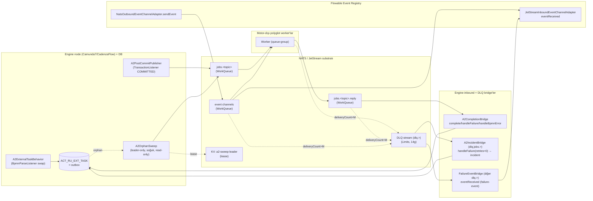

# HLD — High-Level Design
## Basamak-1: External Task / Event-Driven Work Offload over JetStream

**Repo:** `nats-bpm-channels` (3eAI Labs, Apache 2.0)
**Sentinel fazı:** Phase 3 — Architect (AI performs, Human validates)
**Girdi:** `docs/sentinel/phase2/` (BUSINESS_LOGIC 31 BR, DECISION_MATRIX 44 satır, EXCEPTION_CODES 23 kod), `docs/sentinel/phase1/` (24 US, 30 FR + 23 NFR + 6 IR), `docs/06-external-task-over-jetstream.md` (D-A…D-F kilitli)
**Tarih:** 2026-07-14
**Durum:** KOŞULLU ONAY sonrası güncellendi (2026-07-14) — ARCH-Q1…4 kararlaştı (ADR-0002/0003/0007 Kabul), yeni ADR-0008 (subject-authz, MAJOR-2), MAJOR-1/MINOR/NIT işlendi

> Bu belge **HLD**'dir (bileşen mimarisi + entegrasyon), LLD değildir. Sınıf-içi algoritma detayı phase4'e bırakılır. Motor/adapter iddiaları `file:line` kanıtlıdır (phase1/2 doğrulamaları temel alındı). Kilitli kararlar (D-A…D-F, PO-Q1…7, BAQ-1…8) DEĞİŞTİRİLMEZ; mimari onların üstüne kurulur. **Effort tahmini içermez.** Dokümantasyon TR, kod/tanımlayıcı EN.

---

## 1. Mimari genel bakış

Basamak-1, outbound yolunu **motor-içi in-tx JavaDelegate**'ten **motor-dışı push**'a taşır; inbound correlation altyapısının büyük kısmını yeniden kullanır. İki motor idiomu ortak JetStream substratında buluşur:

- **A2 (Camunda 7 / CadenzaFlow):** native external-task semantiğini korur; `fetchAndLock` polling'ini **JetStream push** ile değiştirir. `ACT_RU_EXT_TASK` = transactional **outbox**; push onun idempotent türevi (dual-write yok, docs/05 D2).
- **Event Registry (Flowable):** native push zaten doğru idiom; basamak-1 olgunluğuna (ack+DLQ+dedup+escalation) çekilir.

**Dürüst tavan (kilitli):** basamak-1 dispatch/polling'i kaldırır; **token-move/completion transaction** (P2) kalır — basamak-6'ya kadar. "Sıfır DB lock" satılmaz.

---

## 2. Bileşen mimarisi

### 2.1 A2ExternalTaskBehavior + BpmnParseListener (US-A2, FR-A2/A3 · BR-A2-002/003 · D-C)

**Sorumluluk:** A2-topic'li (`camunda:type="external"`) aktivitelerde default external-task behavior'ını swap eder; `execute()`'te external task'ı **doğumda in-tx sentinel-kilitli** oluşturur ve post-commit publish kancasını kurar.

**Mekanizma (kanca noktaları phase1/2 DOĞRULANDI, fork değişikliği YOK):**
1. `A2BpmnParseListener implements BpmnParseListener`, `preParseListeners`'a kaydolur (`ProcessEngineConfigurationImpl.java:687,2189`). A2-topic listesinde olan aktivitelerde behavior'ı swap eder (`BpmnParse.java:2564`).
2. `A2ExternalTaskBehavior.execute()`:
   - `createAndInsert(...)` → task **kilitsiz doğar** ve entity döner (`ExternalTaskEntity.java:568-588`).
   - Aynı tx'te `task.lock(SENTINEL, L)` (`:471-474`, yalnız iki alan setter'ı) → **flush-öncesi**; kilit alanları **aynı INSERT'e biner** (sıfır ek DB yazısı — phase4/5 guard testi kanıtlayacak, §11).
   - `TransactionContext.addTransactionListener(TransactionState.COMMITTED, publish(task))` (`TransactionContext.java:49`, `TransactionState.java:25`) — D-A publish kancası aynı noktada.

**Sentinel workerId** = küme-geneli TEK sabit (`a2-jetstream-bridge`, config), audit için payload'da taşınır (BR-A2-003). Node-başına farklı id complete'i kırar (`SYS_SENTINEL_WORKER_CONFLICT` — invariant, CRITICAL+page).

**A2-topic ayrımı:** hangi topic'lerin A2 olduğu config ile bildirilir (`spring.nats.a2.topics[]`); behavior swap ve sweep sorgusu yalnız bu topic'lere uygulanır → klasik external task etkilenmez (US-A8/BR-A2-012 migrasyon guard).

**impl-sınıf bağımlılığı:** ADR-0005 (yüzey izolasyonu + guard test + upgrade runbook).

### 2.2 A2PostCommitPublisher (US-A3, FR-A4 · BR-A2-004 · D-A)

**Sorumluluk:** commit sonrası (tx dışı), oluşturan node'un **elindeki entity** ile task'ı yayınlar — **DB sorgusu yok, cross-node yarış yok** (herkes yalnız kendi yarattığını yayınlar). Fast-path **at-most-once**.

- Publish hedefi: `jobs.<topic>` (WorkQueue), `Nats-Msg-Id = externalTaskId` (dedup).
- Broker o an erişilemezse: `EXT_JETSTREAM_PUBLISH_UNAVAILABLE` → **log WARN, özel aksiyon YOK** — tasarım gereği sweep bu orphan'ı ≤ L+S içinde toplar (NFR-R3). Bu, at-most-once fast-path + at-least-once sweep net garantisidir.

### 2.3 A2OrphanSweep + SweepLeaderLease (US-A3/A5, FR-A5/A6 · BR-A2-005/013 · D-A/D-B · ADR-0002/0003)

**Sorumluluk:** post-commit'in kaçırdığı **çökme-orphan'larını** (commit oldu, publish çalışmadı) toplar. **Soğuk · tek node/leader.**

> **NIT-1 netleştirmesi:** "read-only / `SELECT FOR UPDATE`'siz" yalnız **fetchable-parite SELECT'i** için geçerlidir (hot-path'te DB'ye bindirmeyen kısım — NFR-P5). Sweep'in **DB yazısı üreten iki dalı** vardır ve bunlar sıcak-yol değildir: (a) re-publish edilecek her orphan için `re-lock(SENTINEL,L)` (BR-A2-005); (b) publish-fail dalında telafi `unlock()` (ADR-0003). Yani "read-only" bir bütün-bileşen niteliği değil, **tarama sorgusunun** niteliğidir.

- **Sorgu = fetchable-parite:** engine'in native fetchable predicate'inin (`ExternalTask.xml:220-222`) birebir aynısı — `LOCK_EXP_TIME_ null|≤now AND RETRIES_ null|>0 AND SUSPENSION_STATE_ null|=1 AND TOPIC_ IN (a2-topics)`. "Native poller neyi alabilirse onu ve yalnız onu."
- **Re-lock → publish (BAQ-1 sabit sıra):** yayın öncesi `re-lock(SENTINEL, L)` (aynı workerId her zaman geçer — `LockExternalTaskCmd.java:50-61`), sonra publish. Atomiklik: **ADR-0003 telafi edici unlock** (publish fail → `LOCK_EXP_TIME_=now`, görünmez-orphan penceresi ≤S).
- **DLQ'lanmış (`retries=0`) task dirilmez** (fetchable-predicate dışı); Cockpit-retry verirse yeniden fetchable → sweep doğal yeniden yayınlar.
- **Leader:** `SweepLeaderLease` (JetStream KV, TTL=2S), tek node koşar (ADR-0002 · NFR-P5: amortize ≤ 1 read / S / cluster). `SYS_SWEEP_QUERY_FAILED`/`RELOCK_FAILED`/`REPUBLISH_FAILED` (EXCEPTION_CODES §4).

### 2.4 A2CompletionBridge (US-A4/A7, FR-A7/A12 · BR-A2-008/011 · Matris 2)

**Sorumluluk:** worker'ın `jobs.<topic>.reply` sonucunu external task completion'a bağlar (mevcut `NatsMessageCorrelationSubscriber.correlateWithResult()` deseninin evrimi — §2.8).

| Reply türü | Aksiyon | Custody-transfer |
|---|---|---|
| Başarı | `complete(extTaskId, SENTINEL, vars)` | complete-sonrası-ack |
| BPMN business-error | `handleBpmnError(extTaskId, SENTINEL, errorCode, ...)` | ack |
| Transient | `handleFailure(extTaskId, SENTINEL, ...)` | ack |
| Task yok (`NotFoundException`, `HandleExternalTaskCmd.java:48-50`) | **yut + WARN + ACK** (geç/çift reply idempotency, US-A7) | ack |
| workerId ≠ SENTINEL (`BadUserRequestException`, `:52-53`) | **CRITICAL + on-call page, ack YOK** (invariant, BAQ-7) | — |
| complete sırasında transient (DB down) | **nak** (redelivery) | — |

`complete` yalnız workerId eşitliğini kontrol eder, expiry'yi kontrol etMEZ (`:89-91`) → geç complete (L sonrası) yine başarılı; tek SENTINEL olduğundan sahiplik el değiştirmez.

### 2.5 A2IncidentBridge (US-A6, FR-A10/A11 · BR-A2-009/010 · D-D/D-E)

**Sorumluluk:** `dlq.jobs.>` tüketir; `deliveryCount>M` ile DLQ'ya düşen A2 job'ını **incident**'e çevirir.

- `handleFailure(extTaskId, SENTINEL, retries=0, retryDuration=0)` (BAQ-2: `retryDuration=0` sabit → `lockExpirationTime=now` → Cockpit-retry residual-lock gecikmesi yok).
- `setRetriesAndManageIncidents(0)`: `areRetriesLeft() && retries<=0 → createIncident()` (`ExternalTaskEntity.java:443-448`) → Cockpit görünürlüğü. Tekrar-işleme duplicate incident üretmez (`BUS_INCIDENT_ALREADY_CREATED`, doğal idempotency).
- Tespit gecikmesi = W·M; **SLA beklenmez**. **Circuit-breaker** (ADR-0004) korur.

### 2.6 FailureEventBridge (US-B3/B5, FR-B3/B5 · BR-FLW-003/005 · D-D)

**Sorumluluk:** A2-dışı `dlq.>` (event-channel DLQ'ları) tüketir; DLQ mesajını **aynı correlation key'lerle** (BpmHeaders) failure-event'e çevirip `eventRegistry.eventReceived(...)`'a sokar → bekleyen instance escalation path'ini işler.

- Yakalama biçimleri (event-based gateway / event-registry boundary event / event subprocess): §11 WebSearch ✅ **var** (Flowable Event Registry boundary + start events); tam davranış phase4/5 test.
- Bekleyen subscription yok → `RES_FAILURE_EVENT_CORRELATION_MISS` = **WARN + metrik + eşik-alarmı** (BAQ-8; tek olay benign yarış, süreklilik `failure_event_correlation_miss` sayacı üzerinden alarm).
- Geç-sonuç: interrupting → ack+log+metric (drop); non-interrupting → işlenir (model kararı). `BUS_EVENT_CORRELATION_NOT_FOUND`.
- **Circuit-breaker** (ADR-0004) korur.

### 2.7 Ortak substrat + 5 kontrat-fix (US-C1…C6 · BR-SUB-001…007 · D-E)

Mevcut iki adapter (`JetStreamInboundEventChannelAdapter` flowable / `JetStreamMessageCorrelationSubscriber` cadenzaflow) **özdeş** DLQ/backoff deseni taşır; 5 açık **ortak `publishToDlq` yardımcısına** (`nats-core`, ADR-0007) toplanır → tek yerde fix:

| # | Fix | Mevcut açık (`file:line`) | FR/BR |
|---|---|---|---|
| 1 | DLQ header preservation + 4 meta header | flowable `:216-218,227` / cadenzaflow `:208-210,219` (yalnız `data`) | FR-C1/BR-SUB-001 |
| 2 | Custody-transfer: `dlqSubject==null`→nak, publish-fail→nak (koşulsuz ack kalkar) | flowable `:210-214,222-235` / cadenzaflow `:203-207,223-227` | FR-C2/BR-SUB-002 |
| 3 | `Nats-Msg-Id=<orijinal>.dlq` | flowable `:218` / cadenzaflow `:210` (id yok) | FR-C3/BR-SUB-003 |
| 4 | Trace-header: yazma tek ad, okuma fallback (`X-Trace-Id`) | flowable `:119` okuma vs `BpmHeaders.java:12` yazma | FR-C7/BR-SUB-006 |
| 5 | Boş-body → WARN+DLQ (sessiz DEBUG+ack kalkar) | flowable `:124-131` / cadenzaflow `:107-114` | FR-B2/C2/BR-SUB-007 |

**Substrat kararları (kilitli D-E):** WorkQueue (iş dağıtımı) + TEK `DLQ` stream (`dlq.>`, Limits, 14g); custody-transfer ack; in-band `maxDeliver+1` tespiti (advisory reddedildi); `jobs.*` namespace A2'ye REZERVE (`VAL_TOPIC_NAMESPACE_COLLISION`, bootstrap validasyon). Tam sözleşme: `API_CONTRACTS.md` + `api/asyncapi.yaml`.

### 2.8 Flowable outbound/inbound olgunluğu + JavaDelegate phase-out (US-B1/E1)

- Outbound: `NatsOutboundEventChannelAdapter.sendEvent(...)` (motor-dışı; `:29`, JetStream variant `:36`).
- Inbound: JetStream variant zorunlu (ack+DLQ+dedup; `:152`), core ack'siz/log-only yolu basamak-1 kritik iş için KULLANILMAZ.
- **Phase-out (US-E1):** `NatsPublishDelegate`/`JetStreamPublishDelegate`/`NatsRequestReplyDelegate` (camunda+cadenzaflow) + flowable `requestreply/NatsRequestReplyDelegate` kaldırılır. Fast-RPC istisnası YOK (in-tx blocking `connection.request(...)` 30s — tez ihlali).
- **İdiom netliği (US-E2):** iş dağıtımı → A2/Event Registry; saf message-correlation yalnız gerçek dış-event bekleme için korunur (`correlateWithResult()` A2 completion-bridge'e evrilir, saf-event yolu için kalır). `docs/04` message-correlation idiomu iş dağıtımı için A2 tarafından supersede.

### 2.9 Testcontainers bench modülü (US-D1/D2/D3, FR-D1/D2/D3 · BR-OBS-001/002/003)

**Yeni modül `nats-bpm-bench`** (ADR-0007): PG+engine+NATS+N worker; **aynı senaryo iki modda** (native-poll baseline ↔ A2-push); `@Tag("bench")`, nightly/manuel.

- **TEK sert kapı (BR-OBS-001/Q7):** normalize **task-başına DB round-trip** — poll + fetchAndLock bileşenleri **0**, INSERT/complete **artmıyor**. Kaçarsa `BUS_BENCH_METRIC_REGRESSION` → build-fail.
- Destekleyici SLI'lar (dispatch p95 ≤ 200ms dahil) **izlenen hedef**, sert kapı DEĞİL (`SYS_BENCH_SLI_DRIFT` → warn). Ortam yoksa `SYS_BENCH_ENVIRONMENT_UNAVAILABLE` → ana CI'yı bloklamaz.
- Ölçüm: `pg_stat_statements` fingerprint (§11: fetchAndLock ayrı queryid — ✅ doğrulandı, IN-list arity uyarısıyla).

---

## 3. Modül / paket yerleşimi (ADR-0007)

| Bileşen | Modül | Paket |
|---|---|---|
| `BpmHeaders`, DLQ meta sabitleri, ortak `publishToDlq`, `SweepLeaderLease`, umbrella-lock config+validasyon, metrik genişletme | `nats-core` | `com.threeai.nats.core.*` |
| A2 behavior/publisher/sweep/completion/incident-bridge (Camunda) | `camunda-nats-channel` | `com.threeai.nats.camunda.a2` |
| A2 aynası (CadenzaFlow) | `cadenzaflow-nats-channel` | `com.threeai.nats.cadenzaflow.a2` |
| FailureEventBridge, boş-body fix, JetStream inbound sağlamlığı | `flowable-nats-channel` | `org.flowable.eventregistry.spring.nats.*` |
| Bench (iki-mod) | **`nats-bpm-bench`** (yeni) | `com.threeai.nats.bench` |

Ayna-tekrar (camunda ↔ cadenzaflow) mevcut repo deseniyle tutarlı (NFR-M2); ortak `a2-core` soyutlaması **ARCH-Q4 = ONAYLANDI ayna-tekrar** (soyutlama basamak-6'ya ertelendi — ADR-0007).

---

## 4. Veri akışı & durum (özet)

A2 external task durumu `ACT_RU_EXT_TASK`'ın üç kolonundan (`LOCK_EXP_TIME_`, `RETRIES_`, `SUSPENSION_STATE_`) **türetilir** (status kolonu yok). Tam durum makinesi: `BUSINESS_LOGIC.md §2.1`. Custody-transfer mesaj durumu: `§2.2` + `DECISION_MATRIX.md` Matris 1 (3 rol).

Kritik invariant'lar (NFR-R):
- **R1** at-least-once + idempotent tüketiciler (dedup + apply-zamanı idempotency).
- **R2** custody-transfer: sessiz mesaj kaybı YOK.
- **R3** çökme-orphan ≤ L+S (~7dk) toplanır.
- **R4** tek redelivery otoritesi = JetStream; engine kilidi şemsiye (ADR-0001).
- **R5** dual-write yok (outbox türevi).
- **R6** DLQ→escalation ile token leak yok.

---

## 5. Ölçekleme & performans

- **Happy-path'te `fetchAndLock` = 0** (NFR-P1): ne worker ne poller poll'ü; publish post-commit listener'dan (DB sorgusuz).
- Sweep: leader-only, amortize ≤ 1 FOR-UPDATE'siz read / S / cluster (NFR-P5).
- `complete` token-move tx **kalır** (P2, dürüst tavan) — 1 kısa tx/task.
- Worker fan-out: WorkQueue queue-group; tek-worker-alır.
- Beklenen kazanç (bench ile kanıtlanacak): HikariCP aktif connection ↓ (NFR-P3), lock-wait ~0 (NFR-P4), dispatch p95 ≤ 200ms (SLI hedef, NFR-P2).

---

## 6. Güvenilirlik & hata yönetimi

Tam taksonomi: `EXCEPTION_CODES.md` (23 kod, 7 kaynak). Mimari-düzey ilkeler:
- **Custody-transfer** her rolde (worker/inbound/DLQ-bridge) — ack yalnız kalıcılık el değiştirince.
- **In-band DLQ tespiti** (`maxDeliver+1`); advisory reddedildi (§11 teyit: advisory gerçek ama best-effort + seq-lookup gerektirir).
- **dlq-of-dlq YOK**: bridge işleyemezse nak+alert + circuit-breaker (ADR-0004), asla ack-drop.
- **Orphan güvenliği**: post-commit at-most-once + sweep at-least-once → net at-least-once; `Nats-Msg-Id` dedup + complete/correlate idempotency pencere-dışı çifti yutar.

---

## 7. Güvenlik & veri koruma (per DATA_CLASSIFICATION / SECURITY)

Tam envanter: `DATA_CLASSIFICATION.md` (DP-1…8). **Uyumluluk sürücüsü:** telco-PII (MSISDN/IMSI/IMEI) işlendiğinden **KVKK + GDPR** normatiftir (GUIDELINES_MANIFEST compliance.enabled); aşağıdaki kararlar bu iki rejimin veri-minimizasyon/erişim-kontrolü yükümlülüklerini karşılar (ayrıntı DATA_CLASSIFICATION §4-§5). Mimari-düzey kararlar:

| Konu | Karar | Kaynak |
|---|---|---|
| **Transport** | Production'da TLS + NKey/JWT zorunlu; `NatsProperties.Tls` + credentials/nkey alanları mevcut (`NatsProperties.java:14-15,97-135`) | DP-4/NFR-S3 · **ADR-0008** |
| **Subject-level authz** | jobs.* / dlq.* namespace izolasyonu + subject-level permission **tabanı basamak-1'e DAHİL** (worker yalnız kendi topic'inin job/reply subject'lerine pub/sub); kiracı-başına granülerlik deploy kararına ertelendi. **NFR-S3 bununla kapanır.** | DP-4 · **ADR-0008** |
| **Log/metrik PII** | payload/business-key değeri log/metrik-tag'e YAZILMAZ; metrik tag yalnız `subject`/`channel` (düşük kardinalite) | DP-1/DP-2/NFR-S1 |
| **DLQ maruziyeti** | DLQ payload byte-aynen (14g) = en uzun PII maruziyeti → erişim kontrolü + kiracı-bazlı retention kısaltma (PII kiracı) | DP-3/NFR-S2 |
| **`-Dlq-Reason`** | yalnız hata sınıfı/kod; payload/PII sızdırMAZ | DP-6 |
| **Business-Key masking** | normatif DEĞİL — hash/mask önerilir, karar kiracının (`TENANT_PII_CHECKLIST_TEMPLATE.md`) | DP-8/NFR-S1 |
| **Worker güven sınırı** | Business-Key + process değişkenleri motor-dışı polyglot worker'a (güven sınırı dışına) geçer → erişim kontrolü + saklama dokümante (worker impl repo dışı) | DP-5/NFR-S4 |

**Yeni saldırı yüzeyi (katmanlı savunma — ADR-0008):** post-commit publisher + bridge'ler NATS'a dışarı açılır; kimlik doğrulanmamış/yetkisiz bir aktör `jobs.*.reply`'a sahte reply yazarsa `complete` tetiklenebilir. **Birincil (yapısal) hat:** subject-level authz — worker hesabı yalnız kendi topic'inin subject'lerine yetkili, `jobs.*.reply`'ı yalnız engine-inbound tüketir (ADR-0008). **İkincil hat:** `complete` yalnız var olan (SENTINEL-kilitli, `externalTaskId`-bilinen) task'ı ilerletir → körlemesine enjeksiyon `NotFoundException`'a düşer; yanlış workerId → `SYS_SENTINEL_WORKER_CONFLICT` (CRITICAL+page).

---

## 8. Gözlemlenebilirlik (per OBSERVABILITY / NFR-O)

Mevcut Micrometer tabanı (`NatsChannelMetrics.java:15-82`) üstüne kurulur:
- **Mevcut sayaçlar:** consumed/errors/ack/nak/dlq/published/processingTimer (subject+channel tag).
- **Yeni sayaçlar (FR-D2/NFR-O1):** sweep-republish, en-yaşlı-orphan yaşı, `failure_event_correlation_miss`, dispatch-latency (commit→deliver), `fetchAndLock` QPS (hot-path 0 doğrulaması), HikariCP aktif connection, `ACT_RU_EXT_TASK` lock-wait.
- **Trace korelasyonu (NFR-O2):** `X-Cadenzaflow-Trace-Id` → MDC; okuma `X-Trace-Id` fallback (FR-C7). Metrik tag'lerine PII girmez (DP-1/2).
- **Birincil metrik (FR-D1):** task-başına DB round-trip; `pg_stat_statements` fingerprint. Bench raporu (FR-D3) baseline↔A2 karşılaştırmalı, nightly.
- **Alarm:** CB OPEN geçişi (ADR-0004), `failure_event_correlation_miss` eşik (BAQ-8), en-yaşlı-orphan yaşı (ADR-0003 telafi başarısızlığı sinyali).

---

## 9. Bileşen → BR/FR izlenebilirliği (her bileşen ≥1 BR/FR)

| Bileşen (§2) | BR | FR | US | ADR |
|---|---|---|---|---|
| A2ExternalTaskBehavior + ParseListener | BR-A2-002/003/012 | FR-A2/A3/A13 | US-A2/A8 | 0005 |
| A2PostCommitPublisher (+ push-dispatch sonucu: fetchAndLock=0) | BR-A2-001/004 | FR-A1/A4 | US-A1/A3 | — |
| A2OrphanSweep + SweepLeaderLease | BR-A2-005/013 | FR-A5/A6 | US-A3 | 0002/0003 |
| A2CompletionBridge | BR-A2-008/011 | FR-A7/A12 | US-A4/A7 | — |
| A2IncidentBridge | BR-A2-009/010 | FR-A10/A11 | US-A6 | 0004 |
| FailureEventBridge | BR-FLW-003/005 | FR-B3/B5 | US-B3/B5 | 0004 |
| Ortak `publishToDlq` + 5 fix + transient-nak backoff | BR-SUB-001/002/003/006/007 | FR-C1/C2/C3/C6/C7 | US-C1/C2/C3/C6 | 0006 |
| Substrat (WorkQueue/DLQ/dedup/namespace) | BR-SUB-004/005/008 | FR-C4/C5 | US-C4/C5 | 0004/0006 |
| Flowable outbound/inbound olgunluk | BR-FLW-001/002 | FR-B1/B2 | US-B1/B2 | — |
| Umbrella-lock config+validasyon | BR-A2-006/007 | FR-A8/A9 | US-A5 | 0001 |
| Transport + subject-level authz | (NFR-S3/S4) | — | US-A4/A7 (savunma) | 0008 |
| Delegate phase-out + idiom netliği | BR-MIG-001/002 | FR-E1/E2 | US-E1/E2 | — |
| Bench modülü | BR-OBS-001/002/003 | FR-D1/D2/D3 | US-D1/D2/D3 | 0007 |
| Boundary-timer (opt-in, model) | BR-FLW-004 | FR-B4 | US-B4 | — |

**Sayarak doğrulama (MAJOR-1):** FR-A(13: A1–A13) + FR-B(5: B1–B5) + FR-C(7: C1–C7) + FR-D(3: D1–D3) + FR-E(2: E1–E2) = **30/30 FR**; US-A(8: A1–A8) + US-B(5: B1–B5) + US-C(6: C1–C6) + US-D(3: D1–D3) + US-E(2: E1–E2) = **24/24 US**. Her satır ≥1 BR/FR/US'ye bağlı — **0 boşluk** (izlenebilirlik: SRS §6, USER_STORIES §3, BUSINESS_LOGIC §8).

---

## 10. ADR endeksi

| ADR | Başlık | Durum |
|---|---|---|
| [0001](ADR/0001-umbrella-lock-parameter-ownership.md) | W/M/S/ε/L parametre sahipliği + default'lar | Kabul |
| [0002](ADR/0002-orphan-sweep-leader-election.md) | Orphan-sweep leader seçimi (KV-lease) | **Kabul** (ARCH-Q2) |
| [0003](ADR/0003-sweep-relock-publish-atomicity.md) | Sweep re-lock→publish atomiklik (telafi unlock) | **Kabul** (ARCH-Q1) |
| [0004](ADR/0004-dlq-bridge-circuit-breaker.md) | DLQ-bridge circuit-breaker | Kabul |
| [0005](ADR/0005-engine-impl-class-dependency-upgrade-strategy.md) | Engine impl-sınıf bağımlılığı + upgrade | Kabul |
| [0006](ADR/0006-asyncapi-machine-readable-wire-contract.md) | AsyncAPI contract-first | Kabul |
| [0007](ADR/0007-module-package-placement.md) | Modül/paket yerleşimi | **Kabul** (ARCH-Q4) |
| [0008](ADR/0008-nats-transport-and-subject-level-authz.md) | NATS transport + subject-level authz (NFR-S3 kapanır) | **Kabul** (ARCH-Q3, MAJOR-2) |

---

## 11. Phase3 doğrulama listesi kapanışı (kanıt-temelli)

Birikmiş `[phase3'te doğrulanacak]` kalemleri. **✅ = resmi doküman URL'siyle doğrulandı; ⏭ = phase4/5'te test ile doğrulanacak.**

| # | Kalem | Durum | Kanıt / gerekçe |
|---|---|---|---|
| 1 | JetStream `duplicate_window` default = 2dk | ✅ | NATS Docs (Streams): "default window to track duplicates in is 2 minutes". Dedup `Nats-Msg-Id` header ile. → L(320s) > 2dk olduğu için pencere-dışı çift **complete/correlate idempotency** ile yutulur (BR-A2-011, dürüst sınır). |
| 2 | `msg.inProgress()` ack-wait'i sıfırlar, deliveryCount'u ARTIRMAZ | ✅ (+ uyarı) | NATS Consumer docs: in-progress ack ack-timer'ı resetler, süreyi AckWait kadar uzatır; delivery count'u değiştirmez. **Uyarı:** fire-and-forget, teslimat garantisi yok (nats.java #1042) → D-H (heartbeat) ertelemesi bu nedenle de sağlam; W·M sabit bütçe tercihini güçlendirir (ADR-0001 §4). |
| 3 | `MAX_DELIVERIES` advisory subject/davranışı | ✅ | `$JS.EVENT.ADVISORY.CONSUMER.MAX_DELIVERIES.<STREAM>.<CONSUMER>` gerçek; payload `stream_seq` taşır; mesajın kendisi stream'de kalır (manuel ack/delete'e kadar). → **in-band `maxDeliver+1` tespiti** advisory'ye tercih edildi (D-E): advisory ayrı consumer + seq-lookup gerektirir, best-effort. Reddedilen kararı teyit eder (yeniden açılmadı). |
| 4a | Core-NATS fallback publish stream'e yakalanır | ✅ | NATS: stream subject'e bound; subject-overlap'te core publish de stream'e girer (yerleşik davranış). ANCAK **PubAck YOK** — "core NATS fire-and-forget publish does not surface the result". → fallback custody-transfer'i garanti edemez; ADR-0004/FR-C2: fallback fail → nak. |
| 4b | `Nats-Msg-Id` dedup core-publish'te ÇALIŞMAZ varsayımı | ⏭ | Resmi dokümanda kesin teyit YOK. Dedup header-tabanlı olduğundan core-published mesajda da uygulanabilir olabilir — **belirsiz**. Güvenli varsayım: fallback dedup'a güvenme; `<id>.dlq` yine gönderilir ama garanti test'le (phase4/5) doğrulanacak. |
| 5 | `pg_stat_statements` fetchAndLock fingerprint izolasyonu | ✅ (+ uyarı) | PostgreSQL docs: statements queryid (parse-tree hash) ile gruplanır; literal sabitler `$n`'e normalize. → fetchAndLock SELECT...FOR UPDATE ayrı queryid alır (INSERT/complete'ten ayrılır). **Uyarı:** IN-list arity değişirse parse-tree değişir → fetchAndLock birden çok queryid'e bölünebilir; ölçüm **fetchAndLock ailesini toplamalı** (BR-OBS-001 ölçüm notu, phase4). |
| 6a | Flowable Event Registry yakalama biçimleri (boundary event / event subprocess / event-based gateway) | ✅ | Flowable docs: Event Registry **start events** (instance başlatır) + **event boundary events** (herhangi aktivite boundary'sinde, interrupting/non-interrupting) + correlation parameters. → failure-event bridge escalation'ı buildable (6.5.0+). Event-based gateway ile birleşimi phase4 model doğrulaması. |
| 6b | boundary-timer `ACT_RU_TIMER_JOB` instance-başına INSERT+DELETE maliyeti | ⏭ | Resmi doküman kesin maliyet vermez; opt-in olduğundan yalnız SLA'lı modellerde ödenir (US-B4). Bench/entegrasyon test (phase4/5) ile ölçülecek. |
| 6c | `eventReceived` eşleşmeyen (geç) event davranışı (sessiz drop mu, hata mı) | ⏭ | Resmi doküman net değil; geç-sonuç politikasının (drop/non-interrupting) altyapı-teyidi phase4/5 test. `BUS_EVENT_CORRELATION_NOT_FOUND` bu belirsizliği ack+log+metric ile kapsar. |
| 7 | Custom behavior'da flush-öncesi `lock()`'un tek INSERT ürettiği (ikinci UPDATE yok) | ⏭ | Doğası gereği entegrasyon-test iddiası (persistence-session insert coalescing). ADR-0005 **guard test** olarak phase4/5'e sabitlendi (datasource-proxy/SQL sayaç). |

**Kaynaklar (Sources) §12'de.**

---

## 12. Referanslar & kaynaklar

**Proje girdileri:** `docs/06-external-task-over-jetstream.md`, `docs/05-db-offload-strategy.md §6.7/§7`, `docs/sentinel/phase1/*`, `docs/sentinel/phase2/*`.

**Resmi doküman kaynakları (§11 doğrulamaları):**
- [NATS Docs — Streams (duplicate_window, dedup)](https://docs.nats.io/nats-concepts/jetstream/streams)
- [NATS Docs — Consumers / Consumer Details (AckWait, InProgress, MAX_DELIVERIES advisory)](https://docs.nats.io/using-nats/developer/develop_jetstream/consumers)
- [NATS Docs — JetStream Headers (Nats-Msg-Id)](https://docs.nats.io/nats-concepts/jetstream/headers)
- [NATS Docs — JetStream Model Deep Dive](https://docs.nats.io/using-nats/developer/develop_jetstream/model_deep_dive)
- [nats.java Issue #1042 — inProgress() fire-and-forget](https://github.com/nats-io/nats.java/issues/1042)
- [nats-server Issue #7148 — MAX_DELIVERIES advisory behavior](https://github.com/nats-io/nats-server/issues/7148)
- [Synadia — Preventing Duplicate Publishes (core vs JetStream PubAck)](https://www.synadia.com/blog/prevent-existing-duplicate-messages-jetstream)
- [PostgreSQL Docs — pg_stat_statements (queryid/fingerprint normalization)](https://www.postgresql.org/docs/current/pgstatstatements.html)
- [Flowable Docs — Event Registry Usage in BPMN/CMMN (boundary/start events)](https://documentation.flowable.com/latest/model/event-channel/reference/bpmn-cmmn)
- [Flowable OSS Docs — Event Registry Introduction](https://www.flowable.com/open-source/docs/eventregistry/ch06-EventRegistry-Introduction)
