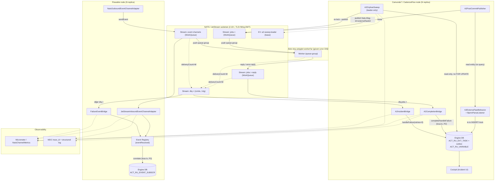

# INTEGRATION MAP — Sistem Entegrasyon Haritası
## Basamak-1: External Task / Event-Driven Work Offload over JetStream

**Repo:** `nats-bpm-channels` (3eAI Labs, Apache 2.0)
**Sentinel fazı:** Phase 3 — Architect
**Tarih:** 2026-07-14

> Bileşenlerin ve dış sistemlerin entegrasyon topolojisi. Her entegrasyon noktası bir protokol + bir BR/FR'ye izlenebilir. Bileşen ayrıntıları: `HLD.md §2`; sözleşme: `API_CONTRACTS.md` + `api/asyncapi.yaml`.

---

## 1. Sistem entegrasyon diyagramı



---

## 2. Entegrasyon noktaları kataloğu

| # | Kaynak → Hedef | Protokol / mekanizma | Sözleşme | BR / FR | ADR |
|---|---|---|---|---|---|
| I-1 | Behavior → Engine DB | in-tx JDBC (createAndInsert + lock, tek INSERT) | `ACT_RU_EXT_TASK` outbox | BR-A2-002 / FR-A2 | 0005 |
| I-2 | PostCommitPublisher → `jobs.<topic>` | JetStream publish (PubAck), `Nats-Msg-Id=externalTaskId` | asyncapi `a2JobDispatch` | BR-A2-004 / FR-A4 | — |
| I-3 | OrphanSweep → Engine DB | JDBC read-only (fetchable-parite, FOR-UPDATE'siz) | `ExternalTask.xml:220-222` paritesi | BR-A2-005 / FR-A5 | 0002 |
| I-4 | OrphanSweep → `jobs.<topic>` | re-lock (JDBC) → publish; telafi unlock | asyncapi `a2JobDispatch` | BR-A2-013 / FR-A6 | 0002/0003 |
| I-5 | OrphanSweep ↔ KV `a2-sweep-leader` | JetStream KV lease (TTL=2S) | leader election | BR-A2-005 / FR-A5 | 0002 |
| I-6 | `jobs.<topic>` → Worker | JetStream push, queue-group (WorkQueue claim) | asyncapi `consumeJob` | BR-A2-001 / FR-A1 | — |
| I-7 | Worker → `jobs.<topic>.reply` | JetStream publish (reply/error-reply), custody-transfer | asyncapi `publishReply` | BR-A2-008 / FR-A7 | — |
| I-8 | `.reply` → CompletionBridge → Engine DB | consume → `complete`/`handleFailure`/`handleBpmnError` (kısa tx, P2) | asyncapi `consumeReply` | BR-A2-008/011 / FR-A7/A12 | — |
| I-9 | Worker/`.reply`/event → `dlq.>` | in-band `maxDeliver+1` → publish (header+meta+`<id>.dlq`) | asyncapi `routeToDlq` | BR-SUB-001/002/003 / FR-C1/C2/C3 | 0006 |
| I-10 | `dlq.jobs.>` → IncidentBridge → Engine DB/Cockpit | consume → `handleFailure(retries=0)` → incident; CB korumalı | asyncapi `consumeDlq` | BR-A2-009 / FR-A10 | 0004 |
| I-11 | `dlq.<event>` → FailureEventBridge → Event Registry | consume → `eventReceived` (failure-event); CB korumalı | asyncapi `consumeDlq` | BR-FLW-003 / FR-B3 | 0004 |
| I-12 | Flowable outbound → event channel | `sendEvent` (JetStream publish) | asyncapi `sendFlowableEvent` | BR-FLW-001 / FR-B1 | — |
| I-13 | event channel → Flowable inbound → Event Registry | JetStream push → `eventReceived` (ack+DLQ+dedup) | asyncapi `receiveFlowableEvent` | BR-FLW-002 / FR-B2 | — |
| I-14 | Tüm bileşenler → Observability | Micrometer sayaç/timer + MDC log | `NatsChannelMetrics` | BR-OBS-002 / FR-D2 | — |
| I-15 | Bootstrap → config validasyon | deployment-time (L-floor, namespace) | `VAL_UMBRELLA_LOCK_TOO_SHORT` / `VAL_TOPIC_NAMESPACE_COLLISION` | BR-A2-006/BR-SUB-004 / FR-A8/C4 | 0001 |
| I-16 | Bench → PG+engine+NATS+worker | Testcontainers (iki mod) | `pg_stat_statements` fingerprint | BR-OBS-001/003 / FR-D1/D3 | 0007 |

---

## 3. Güven sınırları (trust boundaries)

```
[Engine node + DB]  ──(header+payload, TLS)──►  [JetStream]  ──(push, TLS)──►  [Worker: güven sınırı DIŞI]
   PII @ ACT_RU_VARIABLE          PII in transit              PII güven sınırından çıkar (NFR-S4/DP-5)
                                        │
                                        └──(deliveryCount>M)──►  [DLQ stream: 14g, en uzun PII maruziyeti — DP-3]
```

- **Kritik geçiş (DP-5/NFR-S4):** Business-Key + process değişkenleri motor-dışı polyglot worker'a geçer → PII güven sınırından çıkar. Worker erişim kontrolü dokümante (worker impl repo dışı).
- **Yeni saldırı yüzeyi:** kimliksiz worker `jobs.*.reply`'a sahte reply yazarsa `complete` tetiklenebilir → savunma: **subject-level authz (ARCH-Q3)** + `complete`'in yalnız var-olan SENTINEL-kilitli task'ı ilerletmesi (aksi `NotFoundException`).
- **En uzun maruziyet:** DLQ stream (14g) — erişim kontrolü + kiracı-bazlı retention (Q3/DP-3).

---

## 4. Dış bağımlılıklar

| Bağımlılık | Sürüm | Rol | Lisans (NFR-L1) |
|---|---|---|---|
| NATS/JetStream | 2.10+ | Mesaj substratı + KV | Apache 2.0 |
| jnats | 2.20+ | Java NATS client | Apache 2.0 |
| PostgreSQL | birincil | Engine DB (metrik `pg_stat_statements`) | PostgreSQL Lic. |
| Camunda 7 | 7.24+ | Engine (upstream) | Apache 2.0 (community) |
| CadenzaFlow | 1.2+ (fork) | Engine (org.cadenzaflow.*) | Apache 2.0 |
| Flowable | 7.1+ | Engine (Event Registry 6.5.0+ yakalama biçimleri) | Apache 2.0 |
| Spring Boot | 3.3+ | Uygulama runtime | Apache 2.0 |
| Micrometer | mevcut | Metrik | Apache 2.0 |
| Resilience4j | — | Circuit-breaker (ADR-0004) | Apache 2.0 |
| Testcontainers | mevcut | Bench (ADR-0007) | MIT |

Tüm runtime bağımlılıklar Apache 2.0 uyumlu (NFR-L1; toplam lisans maliyeti $0).
