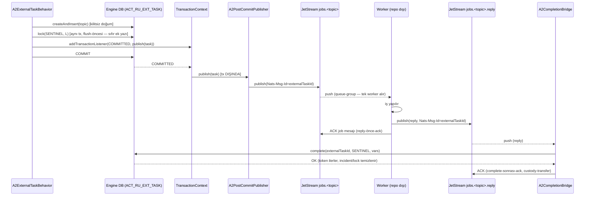
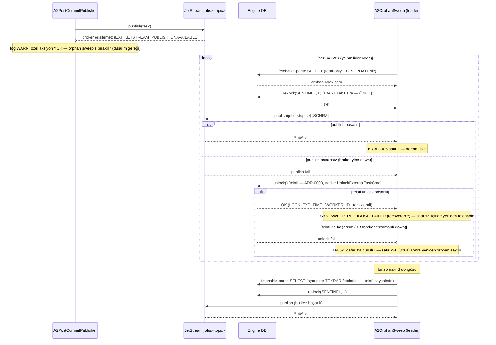
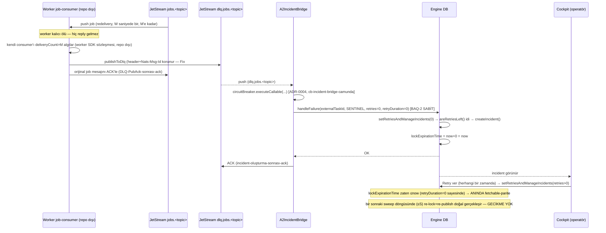
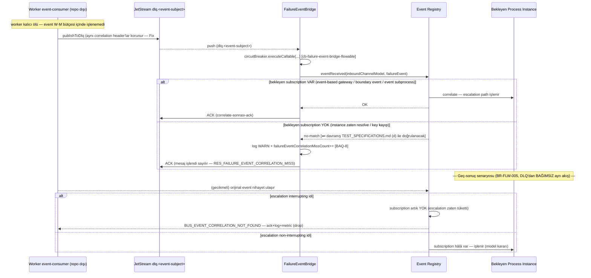
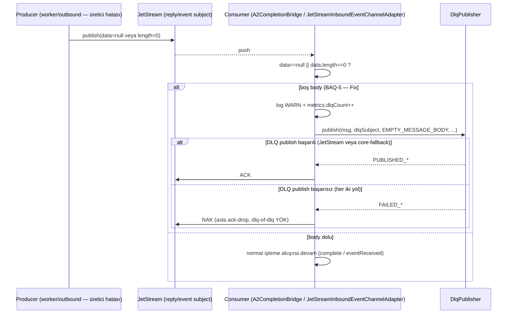
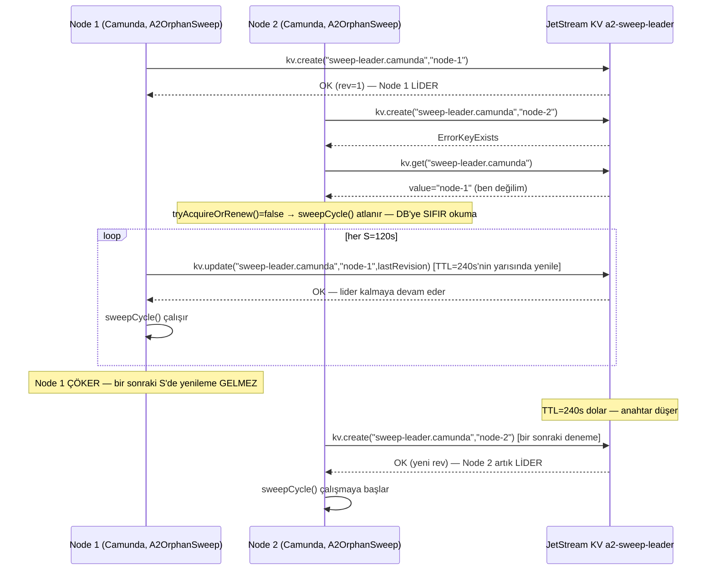
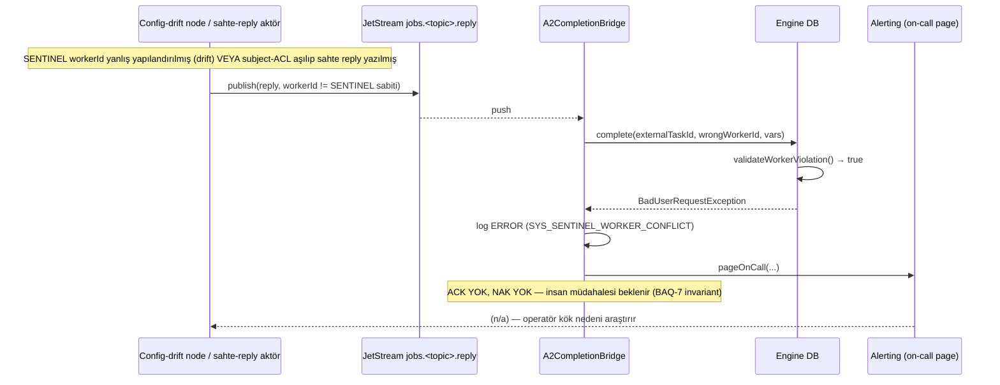

# Sequence Diyagramları — Basamak-1

**Sentinel fazı:** Phase 4 — Developer (LLD). **Kaynak:** `docs/sentinel/phase3/HLD.md` §1-§2, `docs/sentinel/phase2/BUSINESS_LOGIC.md` §1 (süreç akışları — bu diyagramlar o akışların **implementasyon-düzeyi** karşılığıdır, phase2 akışlarını değiştirmez, sınıf/metot isimleriyle somutlaştırır).
**Sınıf bağlaması:** `docs/sentinel/phase4/lld/external-task-jetstream/05_sequences.md`.
**Doğrulama:** her diyagram `mermaid-cli` (`mmdc`) ile render edildi — 0 sözdizimi hatası (bu fazda koşuldu; diyagram 6, LLD-Q1 düzeltmesi sonrası yeniden render edildi).
**Durum:** Onaylı (2026-07-15) — LLD-Q1…3 + review düzeltmeleri işlendi (diyagram 6: motor-başına lease anahtarı).

---

## 1. Happy-path: create → lock → commit → publish → worker → reply → complete → ack

**Kapsanan:** BR-A2-001/002/004/008, FR-A1/A2/A4/A7, US-A1/A2/A3/A4.

---

## 2. Publish-fail → soğuk sweep → telafi-unlock (ADR-0003)

**Kapsanan:** BR-A2-004/005/013, FR-A4/A5/A6, US-A3, ADR-0002/0003.

---

## 3. DLQ → incident → Cockpit-retry (BAQ-2: retryDuration=0 sabit)

**Kapsanan:** BR-A2-009/010, FR-A10/A11, US-A6, ADR-0004.

---

## 4. Flowable DLQ → failure-event bridge + geç-sonuç

**Kapsanan:** BR-FLW-003/005, FR-B3/B5, US-B3/B5, ADR-0004.

---

## 5. Boş-body → DLQ (contract-fix #5, BAQ-5)

**Kapsanan:** BR-SUB-007, FR-C2/B2, US-C2/B2.

---

## 6. `SweepLeaderLease` — leader seçimi ve devri (ADR-0002 + LLD-Q1: motor-başına anahtar)

**Kapsanan:** BR-A2-005, FR-A5, US-A3, ADR-0002. Aşağıdaki Node 1/Node 2, **aynı motor ailesinin** (ör. Camunda) iki replikasıdır — anahtar `sweep-leader.camunda` bu motor ailesine özeldir (LLD-Q1, 2026-07-15); CadenzaFlow node'ları aynı bucket'ta `sweep-leader.cadenzaflow` anahtarıyla **bağımsız** bir leader-election yürütür (bkz. `03_classes/3_cadenzaflow_a2_mirror.md` §2).

---

## 7. Sentinel worker-conflict — CRITICAL + on-call page (BAQ-7, ADR-0008 ikincil savunma)

**Kapsanan:** BR-A2-003, FR-A3, US-A2, `SYS_SENTINEL_WORKER_CONFLICT`.

