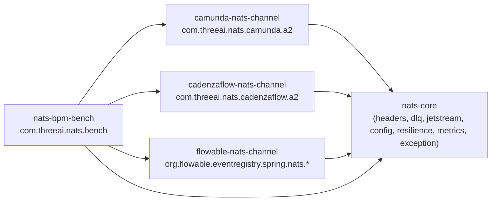

# 02 — Paket / Modül Yerleşimi

**Kaynak karar:** ADR-0007 (Kabul, ARCH-Q4). Bu dosya ADR-0007'nin sınıf-düzeyi somutlaştırmasıdır — kararı değiştirmez.

---

## 1. Maven modülleri (mevcut 4 + yeni 1)

`pom.xml:<modules>` mevcut hali (doğrulandı, bu fazda okundu):

```xml
<modules>
    <module>nats-core</module>
    <module>flowable-nats-channel</module>
    <module>camunda-nats-channel</module>
    <module>cadenzaflow-nats-channel</module>
</modules>
```

**Phase 5 değişikliği (bu LLD'nin öngördüğü, henüz uygulanmadı):** beşinci modül eklenir:

```xml
<modules>
    <module>nats-core</module>
    <module>flowable-nats-channel</module>
    <module>camunda-nats-channel</module>
    <module>cadenzaflow-nats-channel</module>
    <module>nats-bpm-bench</module>  <!-- YENİ — ADR-0007 §4 -->
</modules>
```

`nats-bpm-bench`'in `pom.xml` içeriği (parent, dependencies, Testcontainers) **Phase 5 kapsamıdır** — bu LLD yalnız modülün var olacağını, paket kökünü ve sınıf sorumluluklarını sabitler (`03_classes/5_bench.md`).

---

## 2. Paket kökü → sınıf haritası

| Paket kökü | Modül | İçerik (bu basamakta eklenen/değişen sınıflar) |
|---|---|---|
| `com.threeai.nats.core.headers` | `nats-core` | `BpmHeaders` (genişletilir — §4.1 yeni sabitler), `DlqHeaders` (**yeni**) |
| `com.threeai.nats.core.dlq` | `nats-core` | `DlqPublisher` (**yeni** — ortak `publishToDlq`), `DlqPublishResult`, `DlqReason` |
| `com.threeai.nats.core.jetstream` | `nats-core` | `JetStreamStreamManager` (mevcut, değişmez), `JetStreamKvManager` (**yeni**), `SweepLeaderLease` (**yeni**) |
| `com.threeai.nats.core.config` | `nats-core` | `UmbrellaLockProperties` (**yeni**), `UmbrellaLockCalculator` (**yeni**), `NamespaceValidator` (**yeni**) |
| `com.threeai.nats.core.resilience` | `nats-core` | `DlqBridgeCircuitBreakerFactory` (**yeni**, Resilience4j sarmalayıcı) |
| `com.threeai.nats.core.metrics` | `nats-core` | `NatsChannelMetrics` (mevcut, **genişletilir**) |
| `com.threeai.nats.core.exception` | `nats-core` | `NatsChannelException` + alt sınıflar (**yeni** — `07_errors.md`) |
| `com.threeai.nats.camunda.a2` | `camunda-nats-channel` | `A2ExternalTaskBehavior`, `A2BpmnParseListener`, `A2PostCommitPublisher`, `A2OrphanSweep`, `A2CompletionBridge`, `A2IncidentBridge`, `A2Properties`, `A2TopicConfig` (**hepsi yeni**) |
| `com.threeai.nats.camunda.config` | `camunda-nats-channel` | `CamundaNatsAutoConfiguration` (mevcut, **genişletilir** — A2 bean'leri + delegate bean'leri **kaldırılır**) |
| `com.threeai.nats.cadenzaflow.a2` | `cadenzaflow-nats-channel` | Camunda ile **birebir ayna** (yalnız `org.cadenzaflow.bpm.*` importları) — bkz. `03_classes/3_cadenzaflow_a2_mirror.md` |
| `org.flowable.eventregistry.spring.nats.escalation` | `flowable-nats-channel` | `FailureEventBridge` (**yeni** — paket adı `a2` değil, çünkü Flowable idiomunda A2 yok; bkz. isimlendirme notu aşağıda) |
| `org.flowable.eventregistry.spring.nats.jetstream` | `flowable-nats-channel` | `JetStreamInboundEventChannelAdapter` (mevcut, **değişir** — `DlqPublisher`'a devir + boş-body fix), `JetStreamOutboundEventChannelAdapter` (mevcut, değişmez) |
| `com.threeai.nats.bench` | **`nats-bpm-bench`** (yeni modül) | `BenchScenarioRunner`, `NativePollScenario`, `A2PushScenario`, `DbRoundTripReport`, `PgStatStatementsSnapshotter` (**hepsi yeni**) |

**İsimlendirme notu (FailureEventBridge):** HLD §2.6 bileşen adı "FailureEventBridge"dir; sınıf adı bilinçli olarak `A2FailureEventBridge` **DEĞİLDİR** — Flowable tarafında A2 idiomu yok, bu önek yanıltıcı olurdu. Kanonik ad: `org.flowable.eventregistry.spring.nats.escalation.FailureEventBridge` (paket + sınıf adı tutarlı, "a2" öneki yalnız Camunda/CadenzaFlow tarafında kullanılır).

---

## 3. Bağımlılık yönü (paket-arası, döngüsüz)



`nats-core` hiçbir engine-özgü modüle bağımlı DEĞİLDİR (mevcut kural korunur — `NatsProperties`, `NatsConnectionFactory`, `NatsHeaderUtils`, `NatsChannelMetrics`, `JetStreamStreamManager` zaten bu şekilde). `camunda-nats-channel` ↔ `cadenzaflow-nats-channel` arasında **hiçbir bağımlılık yoktur** (ayna-tekrar, ADR-0007 — ortak `a2-core` yok, basamak-6'ya ertelendi).

---

## 4. Silinen sınıflar (JavaDelegate phase-out, US-E1/BR-MIG-001)

| Sınıf | Modül | Kanıt |
|---|---|---|
| `NatsPublishDelegate` | `camunda-nats-channel/.../outbound/` | `NatsPublishDelegate.java:17` (`implements JavaDelegate`) |
| `JetStreamPublishDelegate` | `camunda-nats-channel/.../outbound/` | `JetStreamPublishDelegate.java:17` |
| `NatsRequestReplyDelegate` | `camunda-nats-channel/.../outbound/` | `NatsRequestReplyDelegate.java:19,56` (`connection.request(...)`, 30s in-tx blocking) |
| `NatsPublishDelegate` (ayna) | `cadenzaflow-nats-channel/.../outbound/` | ADR-0007 ayna-tekrar |
| `JetStreamPublishDelegate` (ayna) | `cadenzaflow-nats-channel/.../outbound/` | ADR-0007 ayna-tekrar |
| `NatsRequestReplyDelegate` (ayna) | `cadenzaflow-nats-channel/.../outbound/` | ADR-0007 ayna-tekrar |
| `NatsRequestReplyDelegate` | `flowable-nats-channel/.../requestreply/` | `requestreply/NatsRequestReplyDelegate.java:19` |

Bu 7 sınıfla birlikte kaldırılanlar: ilgili Spring `@Bean` tanımları (`CamundaNatsAutoConfiguration.natsPublishDelegate/jetStreamPublishDelegate/natsRequestReply` — mevcut kodda satır 67-89; `CadenzaFlowNatsAutoConfiguration` ayna; `FlowableNatsAutoConfiguration.natsRequestReply` — satır 64-70) ve karşılık gelen test sınıfları (`*DelegateTest.java`, 6 dosya — `03_classes/4_flowable.md` §3'te migrasyon notu).

**Bağımlılık:** BR-MIG-001, FR-E1, US-E1.
