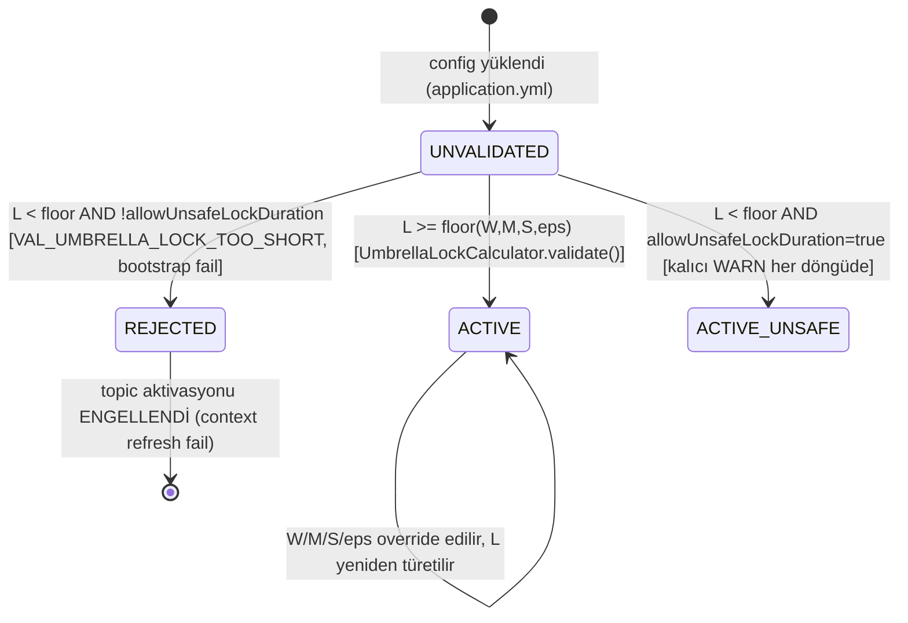

# 06 — Durum Makineleri (Implementasyon Bağlaması)

**Kaynak (tek doğruluk — DEĞİŞTİRİLMEZ):** `BUSINESS_LOGIC.md` §2.1 (A2 türetilmiş durum makinesi), §2.2 (JetStream custody-transfer). Bu dosya o diyagramları **tekrarlamaz** — her geçişi **hangi LLD sınıfının** uyguladığını bağlar (LLD_GUIDELINE §2.0: BA akışının her dalı LLD'de bir sınıfa/bloğa eşlenmeli).

---

## 1. A2 External Task — geçiş → sınıf bağlaması

| Geçiş (`BUSINESS_LOGIC.md` §2.1) | Uygulayan sınıf | Metot |
|---|---|---|
| `[*] → LOCKED_FRESH` (createAndInsert+lock, aynı tx) | `A2ExternalTaskBehavior` | `execute(ActivityExecution)` |
| `LOCKED_FRESH → COMPLETED` (complete başarılı) | `A2CompletionBridge` | `handleReply(Message)` → `SUCCESS` dalı |
| `LOCKED_FRESH → LOCKED_EXPIRED` (L süresi dolar) | — (pasif; DB-durumu zamanla türer, aktif kod yok) | `LOCK_EXP_TIME_ ≤ now` |
| `LOCKED_EXPIRED → LOCKED_FRESH` (sweep re-lock+re-publish) | `A2OrphanSweep` | `relockThenPublish(ExternalTaskEntity)` |
| `LOCKED_EXPIRED → COMPLETED` (geç complete) | `A2CompletionBridge` | `handleReply(Message)` → `SUCCESS` dalı (expiry kontrolsüz, `HandleExternalTaskCmd.java:89-91`) |
| `LOCKED_FRESH/LOCKED_EXPIRED → EXHAUSTED` (deliveryCount>M) | `A2IncidentBridge` | `handleDlqMessage(Message)` |
| `EXHAUSTED → LOCKED_EXPIRED` (Cockpit-retry) | — (Cockpit UI → `SetExternalTaskRetriesCmd`, motor-native; bu repo kod YAZMAZ) | `setRetriesAndManageIncidents(>0)` |
| `LOCKED_FRESH/LOCKED_EXPIRED → SUSPENDED` / `SUSPENDED → LOCKED_EXPIRED` | — (motor-native suspend/resume, bu repo kod YAZMAZ) | — |

**Guard notu (ADR-0003 — bu LLD'nin somutlaştırdığı ek geçiş):** `LOCKED_EXPIRED → LOCKED_FRESH` geçişi başarısız olursa (re-lock başarılı, publish başarısız) `A2OrphanSweep.relockThenPublish` **telafi dalına** girer (`unlock()` çağrısı) — bu, phase2 diyagramında **açıkça çizilmemiş** ama BR-A2-013/ADR-0003'ün öngördüğü bir **alt-geçiş**tir: `LOCKED_FRESH(telafi-öncesi, teslim edilmemiş) → LOCKED_EXPIRED(unlock ile)`. Bu, üst-seviye durum makinesini **çelişmez, yalnız bir ara-adımı netleştirir** (satır zaten `LOCK_EXP_TIME_` alanına göre "fresh" görünüyordu, telafi onu tekrar "expired" görünüme döndürür — dıştan gözlemlenen durum kümesi değişmez, yalnız iç mekanizma).

---

## 2. JetStream Custody-Transfer — geçiş → sınıf bağlaması

| Geçiş (`BUSINESS_LOGIC.md` §2.2) | Uygulayan sınıf |
|---|---|
| `PENDING → IN_FLIGHT` (consumer teslim alır) | JetStream runtime (push+queue-group) — uygulama kodu yok |
| `IN_FLIGHT → ACKED` | `A2CompletionBridge` / `FailureEventBridge` / `A2IncidentBridge` / `JetStreamInboundEventChannelAdapter` — her biri kendi `msg.ack()` çağrısında |
| `IN_FLIGHT → NAKED_BACKOFF` | Aynı sınıflar, `msg.nakWithDelay(...)` |
| `IN_FLIGHT → DLQ_ROUTED` | `DlqPublisher.publish(...)` (nats-core, ortak) |
| `DLQ_ROUTED → ACKED` (DLQ-PubAck-sonrası) | `DlqPublisher` içi `PUBLISHED_JETSTREAM`/`PUBLISHED_CORE_FALLBACK` dönüşü + caller `msg.ack()` |
| `DLQ_ROUTED → RETRY_DLQ_PUBLISH → DLQ_ROUTED` | `DlqPublisher` içi `FAILED_*` dönüşü + caller `msg.nakWithDelay(...)` |

---

## 3. Umbrella-lock parametre durumu (ADR-0001 — yeni, bu LLD'nin config-katmanı)

**Bağlama:** `08_config.md` §1.4 (`UmbrellaLockValidator`), `BAQ-3`.
