# BUSINESS LOGIC — Basamak-2: History Offload (ACT_HI → NATS → async query-store)

**Repo:** `nats-bpm-channels` (3eAI Labs, Apache 2.0)
**Sentinel fazı:** Phase 2 — Business Analyst (basamak-2)
**Girdi:** `docs/sentinel/step2/phase1/USER_STORIES.md` (25 US, 7 epic — EPIC-A…G), `SRS.md` (26 FR + 30 NFR + 7 IR), `DATA_CLASSIFICATION.md` (DP-1…16, §6 KVKK katmanlı politika), `GUIDELINES_MANIFEST.yaml`, `docs/07-history-offload.md` (D-A…D-G KİLİTLİ, 2026-07-15/16), `docs/05-db-offload-strategy.md §6.7` (basamak zinciri)
**Tarih:** 2026-07-17
**Durum:** BA-Q1…8 KARARA BAĞLANDI (2026-07-17, hepsi önerilen — §9); phase-review KOŞULLU ONAY (🔴0 🟠0 🟡2 🟢4, spot-check 5/5) + bulgular F-001…005 DÜZELTİLDİ (bkz. `PHASE2_REVIEW.md` kapanış kaydı) — Levent faz-3 onayı bekleniyor

> Bu belge basamak-2 SRS'inin **ne**'sini iş kuralına, süreç akışına ve durum makinesine çevirir. Her kural bir US'ye ve FR'ye bağlanır (§8 izlenebilirlik). **Kanıt etiketleri:** `[07§3]` = `docs/07-history-offload.md §3/§7`'de **zaten DOĞRULANMIŞ** motor/SPI iddiası (bu fazda kaynak kod tekrar okunmadı — talimat gereği yalnız docs/07'nin doğrulanmış tabanı taşınır, yeni file:line uydurulmaz); `[07§4]` = basamak-1'den **yeniden kullanılabilir** olarak docs/07 §4'te adlandırılan varlık (SweepLeaderLease, DlqPublisher, post-commit TransactionListener deseni, ADR-0006, `nats-bpm-bench`, CQ-6); `[phase3'te doğrulanacak]` = SRS §2.5/§9'da açıkça işaretli doğrulanmamış varsayım; `[BA-türetildi]` = bu fazda BA analiziyle bulunan, US/FR metninde açıkça çözülmemiş kenar-durum (kilitli D-A…D-G'yi **yeniden açmaz**, yalnız onların içindeki boşluğu doldurur — §9 BA-QUESTIONS'a taşınmıştır). **Effort tahmini içermez.** Reddedilen/ertelenen kararlar (handler-içi senkron publish, tam-outbox, tam-post-commit, JetStream-only, ClickHouse-şimdi, big-bang, kalıcı dual-run, sırasız+salt-upsert, global tek-consumer, Flowable-basamak-2b, üç-motor-birlikte) bu belgede **yeniden açılmamıştır** — yalnız referans olarak anılır (§7).

---

## 0. Kapsam ve yöntem notu

Bu iş mantığı belgesi **25 user story'nin tamamını** (EPIC-A…G) kapsar. BA Guideline §1 "Edge Case Rule" gereği her gereksinim için en az 3 hata/kenar-durum senaryosu tanımlanmıştır. Bu fazda, SRS/US'de açıkça çözülmemiş **8 yeni kenar-durum bulgusu** ortaya çıktı — hiçbiri D-A…D-G'yi veya PO-Q1…7 kararlarını yeniden açmaz; hepsi mevcut US/FR'lerin **içindeki** tanımsız parametreler/mekanizma boşluklarıdır (basamak-1'in BAQ-1…8 desenine paralel). Bunlar ilgili iş kuralına not düşülmüş ve §9 BA-QUESTIONS'a taşınmıştır:

1. **Merge-upsert çatışma-çözüm sıra-anahtarı** — BA-Q1 / BR-REL-006 (hangi alan "daha yeni"yi belirler: event-timestamp mi, NATS stream-sequence mi?)
2. **Reconciliation "N gün temiz" tanımı** — BA-Q2 / BR-CUT-004 (mutlak sıfır fark mı, sınıf-tipine göre tolerans mı?)
3. **Sorgu-API kapsamı ↔ cutover durumu** — BA-Q3 / BR-QRY-003 (yalnız cutover'lanan sınıflar mı, projeksiyondaki tüm sınıflar mı?)
4. **HistoryLevel × audit-kritik önkoşulu** — BA-Q4 / BR-HDL-007 (HistoryLevel event'i üretmezse "kayıp imkansız" garantisi boşa düşer)
5. **Pseudonymization kasa-yazımının zamanlaması** — BA-Q5 / BR-PII-004 (D-A'nın "tx-içi senkron I/O yasak" ilkesinin kasa çağrısına genişlemesi)
6. **Erasure subject-key kapsamı (telco kimlik yeniden-kullanımı)** — BA-Q6 / BR-PII-005 (MSISDN churn riski)
7. **Outbox satırı "sıkışma" eşiği** — BA-Q7 (BR-REL-001 notu; NFR-R8 relay-HA anlatısının nicel eşiği)
8. **Retention × pseudonymization etkileşimi** — BA-Q8 (BR-PII-001/BR-PII-003 notu; takma-adlı satır hâlâ yasal-saklama süresine mi tabi?)

---

## 1. Süreç akışları (Mermaid)

### 1.1 EPIC-A — Handler kancası, sınıflandırma, subject/dedup (US-A1, A2, A5, A6)

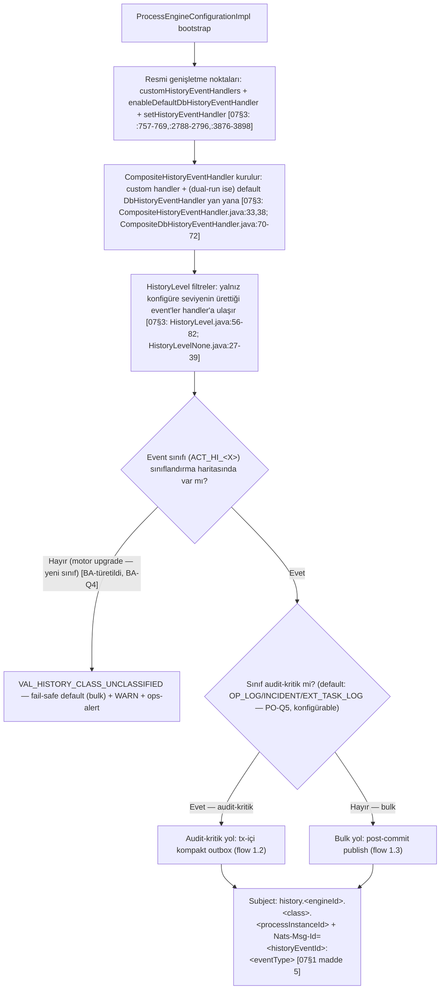

**Not:** `[07§3]` SPI arayüzü `HistoryEventHandler.java:38-53` (`handleEvent`/`handleEvents`, Javadoc :26-29 async/MQ'ya açık kapı, fork'ta impl YOK); default zincir `DbHistoryEventHandler.java:40`; tx-içi/senkron çağrı zinciri `HistoryEventProcessor.java:73-85` → `DbHistoryEventHandler.java:172-174` → `CommandContext.java:186-197` (flushSessions→commit). `handleEvents(List)` toplu yolun gerçek kullanım sıklığı `[phase3'te doğrulanacak]` (`CompositeHistoryEventHandler.java:100-105`).

---

### 1.2 EPIC-A/B — Audit-kritik yol: tx-içi kompakt outbox → relay → NATS → PubAck-sonrası-delete (US-A3, B1)

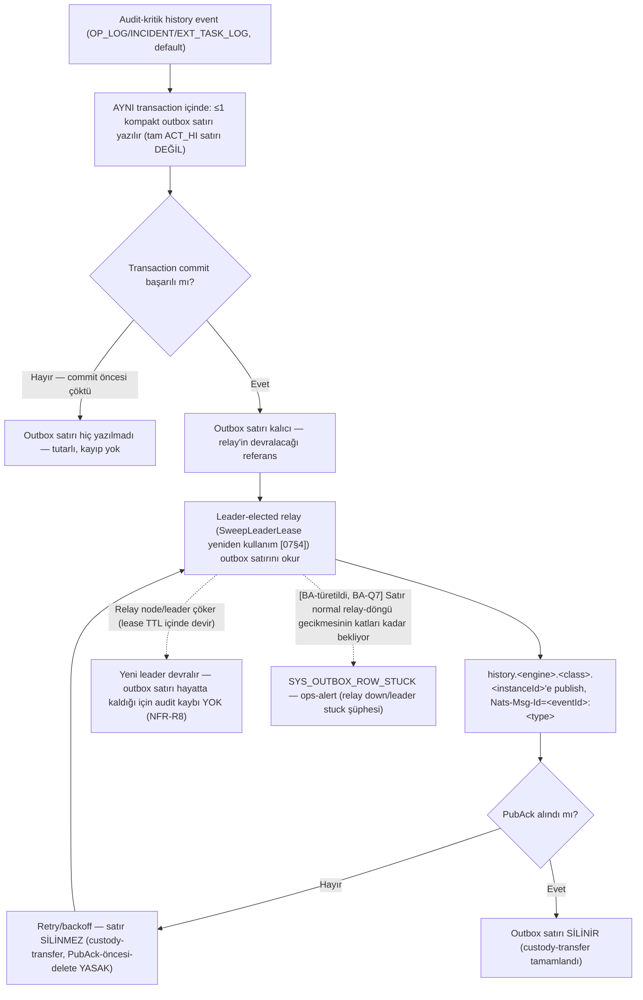

**Not:** Bu akış, basamak-1'in "outbox yok olma problemi" [07§4] dersinin doğrudan çözümüdür: DB handler kapandığında (cutover sonrası) kaçan publish'in telafi kaynağı da yok olur — bu yüzden audit-kritik yol **kendi kalıcı ara-kaydını** (kompakt outbox) taşır, sweep'e değil relay'e dayanır. Handler-içi senkron NATS publish **YASAK** (D-A, `[07§3]` `HistoryEventProcessor.java:73-85` tx-içi/senkron çağrı zincirinin ta kendisi bu riski kanıtlar — publish exception'ı commit'i atlatıp runtime tx'i rollback ederdi).

---

### 1.3 EPIC-A — Bulk yol: post-commit publish, sıfır DB yazımı (US-A4)

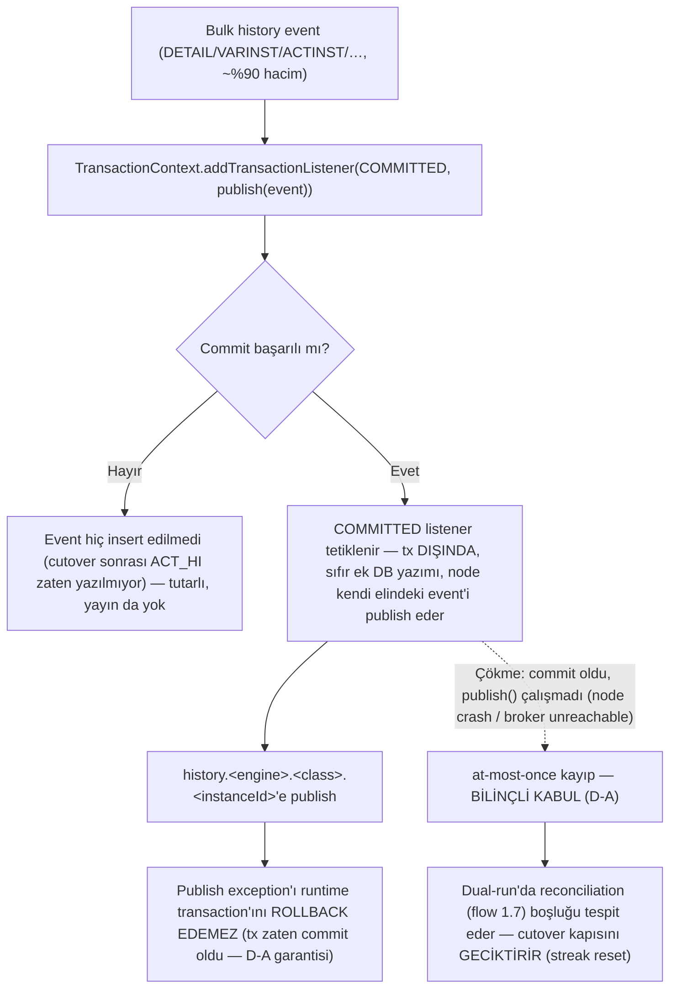

**Not:** `[07§4]` post-commit `TransactionListener` deseni basamak-1'den birebir yeniden kullanılır. Bulk sınıflarda kayıp penceresi **kalıcı kabul edilir** — reconciliation (US-D1) bunu **tespit eder**, telafi etmez (bulk sınıflar için telafi kaynağı yoktur, yalnız audit-kritik yolda vardır — bu asimetri D-A'nın kasıtlı sonucudur).

---

### 1.4 EPIC-B — Projeksiyon consumer: instance-partition + merge-upsert (US-B2, B3)

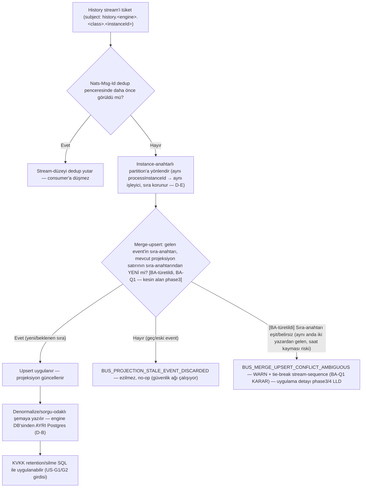

**Not:** Global tek-consumer ve sırasız+salt-upsert **REDDEDİLDİ** (D-E) — bu akış bilinçli olarak yeniden açılmamıştır.

---

### 1.5 EPIC-B — History DLQ davranışı (US-B4, B5)

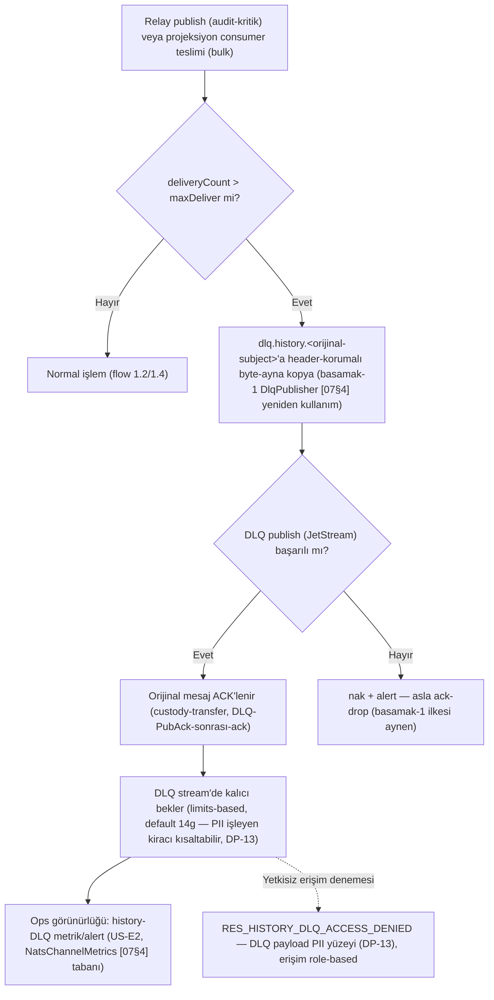

**Not:** Basamak-1'in **`dlq-of-dlq YOK`** ilkesi ve custody-transfer ilkesi aynen taşınır; ayrı-stream şartı [CQ-6] `[07§4]` history stream'lerine de uygulanır.

---

### 1.6 EPIC-C — Sorgu-API istek işleme + Cockpit-körleşme telafisi (US-C1, C2)

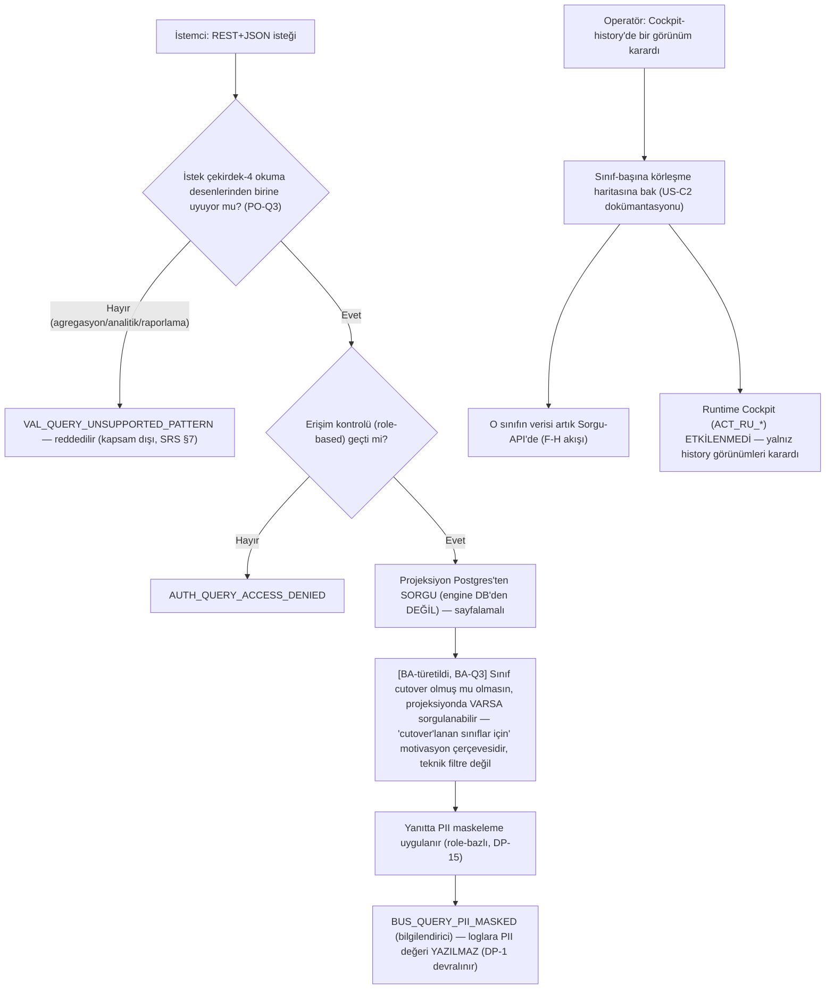

**Not:** Cockpit history UI'ının `ACT_HI` bağımlılık yüzeyi `[phase3'te doğrulanacak]` (D-C öncesi, `07§7`); bu US o doğrulamanın teslimat yeridir.

---

### 1.7 EPIC-D — Reconciliation + kademeli cutover karar akışı (US-D1, D2, D3)

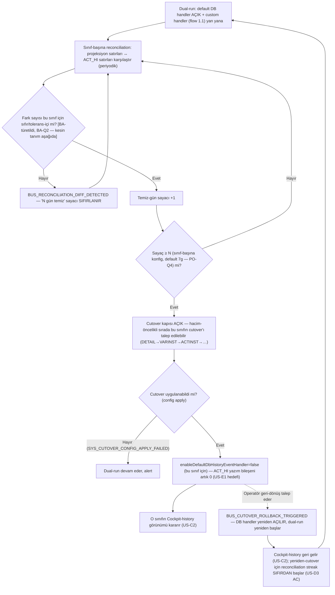

**Not:** İki kapı ayrımı (D-F): reconciliation-temizliği = **cutover kapısı** (bu akış); normalize DB-yazım metriği (US-E1) = yazım-azaltmanın **TEK sert kapısı** (ayrı, bkz. BR-OBS-001). Big-bang cutover ve kalıcı dual-run **REDDEDİLDİ** (D-C/NFR-R5) — bu akışta yeniden açılmamıştır.

---

### 1.8 EPIC-G — Retention enforcement (US-G1)

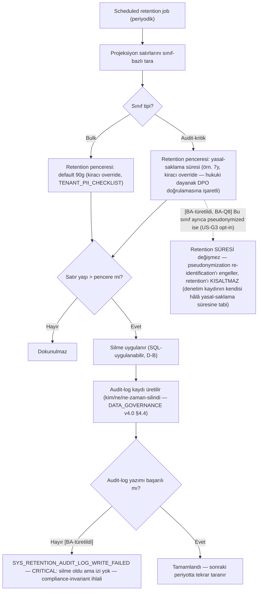

**Not:** `VAL_RETENTION_OVERRIDE_BELOW_LEGAL_MINIMUM` — kiracı audit-kritik retention'ı yasal-asgari altına çekmeye çalışırsa reddedilir (hukuki/DPO onayı gerekir).

---

### 1.9 EPIC-G — Erasure pipeline (bulk PII, US-G2)

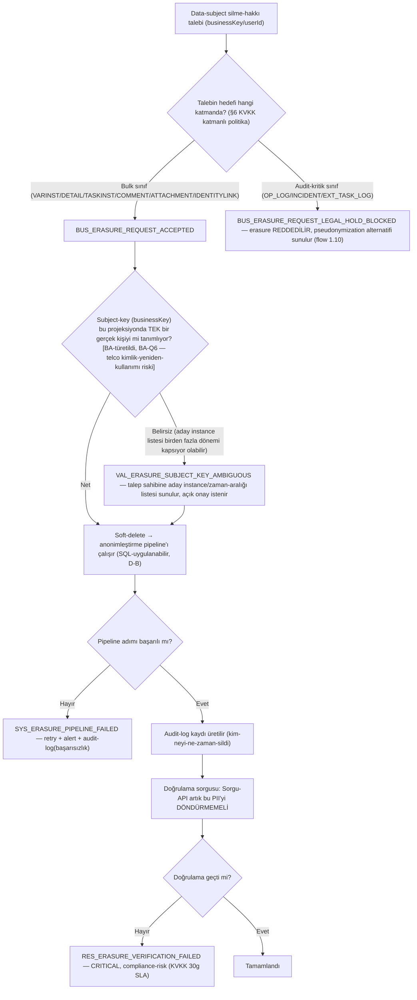

---

### 1.10 EPIC-G — Pseudonymization (audit-kritik, opt-in, US-G3)

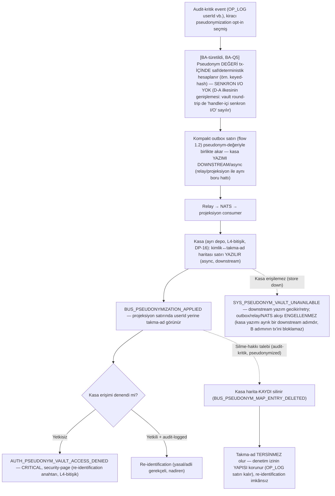

**Not:** Bu akış, D-A'nın "handler-içi senkron I/O yasak" ilkesinin EPIC-G'ye **BA-düzeyinde genişletilmiş** sonucudur (`[BA-türetildi]`) — SRS/US bu zamanlamayı açıkça belirtmez, bkz. BA-Q5.

---

## 2. Durum makineleri

### 2.1 Sınıf-bazlı cutover yaşam döngüsü — basamak-2'nin merkezi durum makinesi

Her `ACT_HI` event-sınıfı (VARINST, DETAIL, OP_LOG, …) kendi cutover durumunu taşır. Bu, klasik varlık durum makinesinden farklıdır: **durum bir satırın değil, bir SINIF-KONFİGÜRASYONUNUN** durumudur.

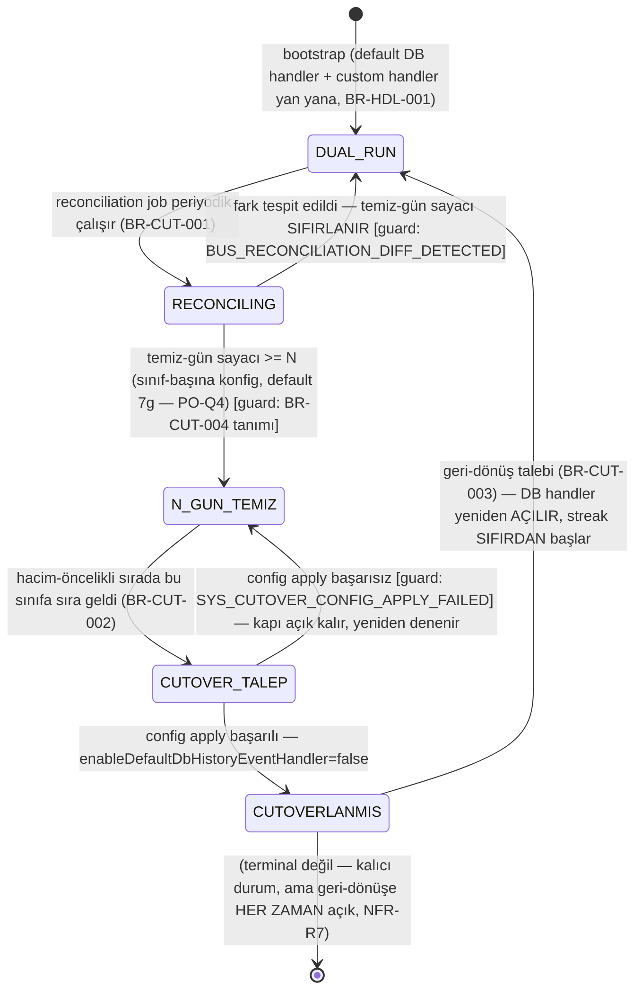

**Guard notu:** `RECONCILING → N_GUN_TEMIZ` geçişinin guard koşulu ("temiz" tanımı) audit-kritik ve bulk sınıflar için **farklı** olabilir — bkz. BR-CUT-004 (`[BA-türetildi]`, BA-Q2). `CUTOVERLANMIS` durumu **kalıcı dual-run'a eşdeğer DEĞİLDİR** (NFR-R5 REDDEDİLDİ) — DB yazımı gerçekten kalkar; yalnız geri-dönüş yolu (NFR-R7) her zaman açık kalır.

---

### 2.2 Audit-kritik kompakt outbox satırı — yaşam döngüsü

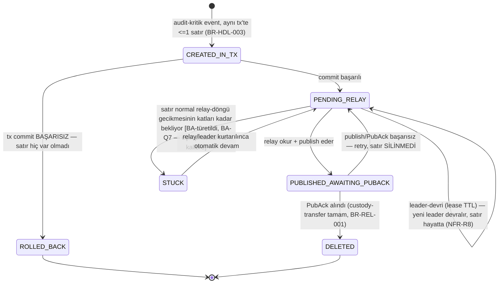

---

### 2.3 History mesaj custody-transfer (relay-publisher / projeksiyon-consumer / DLQ) — basamak-1 desenin history izdüşümü

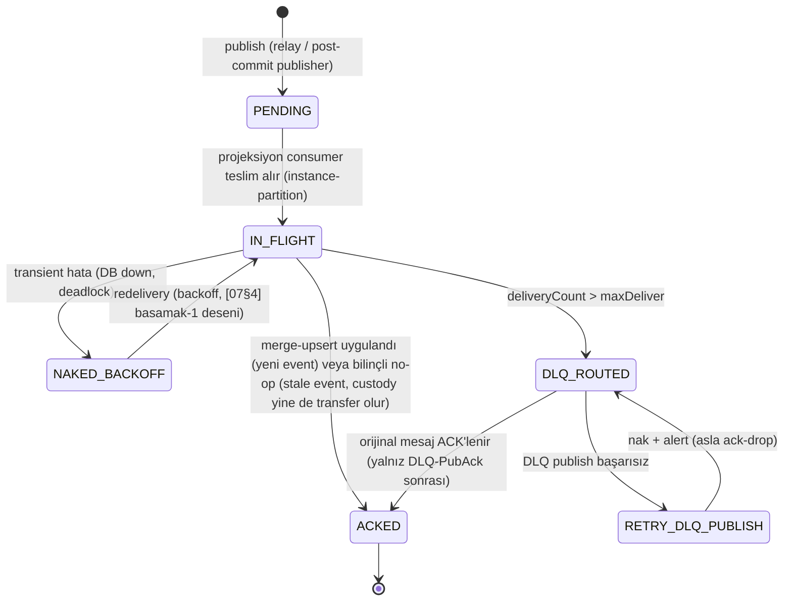

**Not:** Bu diyagram özet/görselleştirmedir; tam guard-koşulları `DECISION_MATRIX.md` Matris 4/5'tedir.

---

### 2.4 PII yaşam döngüsü — retention / erasure / pseudonymization birleşik görünüm (EPIC-G)

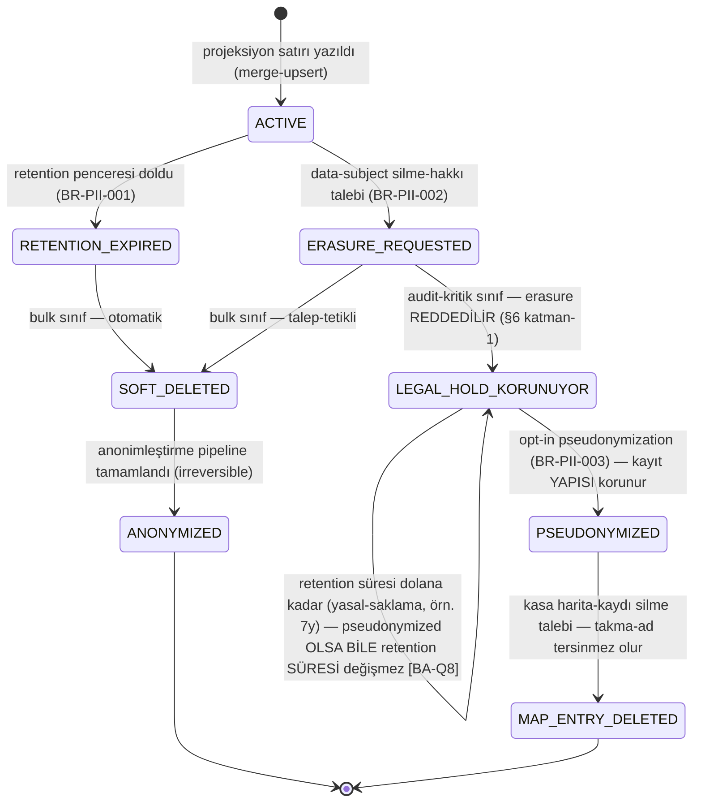

---

## 3. İş Kuralları Kataloğu (BR-XXX)

> Format: `BR-{MODÜL}-{NO}`. Modüller: **HDL** (EPIC-A, handler+hibrit yol), **REL** (EPIC-B, relay+projeksiyon), **QRY** (EPIC-C, sorgu-API), **CUT** (EPIC-D, reconciliation+cutover), **OBS** (EPIC-E, metrik/bench), **DBT** (EPIC-F, devreden borçlar), **PII** (EPIC-G, retention/erasure/pseudonymization). Her kural bir US + FR'ye bağlıdır. **31 kural** — 25 US'nin tamamı 1:1 kapsanır (sıfır boşluk) + **6 kenar-durum kuralı** (`[BA-türetildi]`, §0'daki BA-Q'lara karşılık gelir).

### BR-HDL-001: Composite HistoryEventHandler kancası — fork motor değişmez
**User Story:** US-A1 | **FR:** FR-A1, FR-A2 | **Öncelik:** Must

**Tanım:** Custom composite handler yalnız resmi genişletme noktalarıyla (`customHistoryEventHandlers`, `enableDefaultDbHistoryEventHandler`, `setHistoryEventHandler`) takılır; fork motor kodu **değişmez**. Üç senaryo desteklenir: (1) dual-run (custom + default DB yan yana), (2) sınıf-başına cutover (`enableDefaultDbHistoryEventHandler=false`), (3) tam ikame.

**Kanıt:** `[07§3]` `ProcessEngineConfigurationImpl.java:757-769` (alanlar), `:2788-2796` (`initHistoryEventHandler()` — yalnız null iken kurar), `:3876-3898` (setter'lar); `HistoryEventHandler.java:38-53` (SPI).

**Koşullar:**
| # | Koşul | Beklenen sonuç |
|---|---|---|
| 1 | `customHistoryEventHandlers` set + default-DB açık | Dual-run — ikisi de çalışır |
| 2 | Sınıf-başına `enableDefaultDbHistoryEventHandler=false` | Yalnız custom yol (o sınıf için) |
| 3 | Camunda 7 / CadenzaFlow | Tek adapter paylaşılır (byte-ayna) — Flowable KAPSAM DIŞI (D-G) |

**Bağımlılık:** yok (tüm EPIC-A'nın temeli).

---

### BR-HDL-002: Event-sınıfı sınıflandırması — audit-kritik ↔ bulk, konfigürable
**User Story:** US-A2 | **FR:** FR-A3 | **Öncelik:** Must

**Tanım:** Her `ACT_HI` sınıfı audit-kritik ya da bulk olarak sınıflandırılır (konfigürable, fork rebuild gerektirmez). **Nihai default (PO-Q5):** audit-kritik = {OP_LOG, INCIDENT, EXT_TASK_LOG}; IDENTITYLINK/COMMENT/ATTACHMENT **bulk yolda kalır** — PII-yoğunluk tek başına audit-kritik gerekçesi DEĞİLDİR (PII koruması EPIC-G'den gelir).

**Koşullar:**
| # | Koşul | Beklenen sonuç |
|---|---|---|
| 1 | Sınıf audit-kritik | Outbox yolu (BR-HDL-003) |
| 2 | Sınıf bulk (default) | Post-commit yolu (BR-HDL-004) |
| 3 | Kiracı IDENTITYLINK'i audit-kritik'e taşımak ister | Konfigle mümkün (TENANT_PII_CHECKLIST §2.1 rehberi) |

**Bağımlılık:** BR-HDL-001.

---

### BR-HDL-003: Audit-kritik yol — tx-içi kompakt outbox, at-least-once
**User Story:** US-A3 | **FR:** FR-A4 | **Öncelik:** Must

**Tanım:** Audit-kritik event, oluşturulduğu tx içinde **≤1 kompakt outbox satırına** yazılır (tam ACT_HI satırı değil). NATS publish tx-dışı relay'e bırakılır — handler-içi senkron publish **YASAK** (D-A).

**Kanıt:** `[07§4]` "outbox yok olma problemi" (basamak-1'den kritik fark: DB handler kapandığında sweep'in telafi kaynağı da yok olur — bu yüzden audit-kritik yolun KENDİ dayanıklı ara-kaydı gerekir).

**Sınır değerler:**
| Parametre | Hedef | Kanıt |
|---|---|---|
| Outbox satır sayısı / tx | ≤1 kompakt satır | `07§1` madde 7 (D-F) |

**Koşullar:**
| # | Koşul | Beklenen sonuç |
|---|---|---|
| 1 | Commit öncesi çökme | Satır hiç yazılmadı — tutarlı |
| 2 | Commit sonrası, publish öncesi çökme | Satır hayatta — relay devralır (audit kaybı YOK) |
| 3 | Çift teslim (relay retry) | dedup (`Nats-Msg-Id`) + merge-upsert yutar |

**Bağımlılık:** BR-HDL-002; besler BR-REL-001.

---

### BR-HDL-004: Bulk yol — post-commit publish, sıfır DB yazımı
**User Story:** US-A4 | **FR:** FR-A5 | **Öncelik:** Must

**Tanım:** Bulk event `TransactionState.COMMITTED` listener'ında, tx-dışı, sıfır ek DB yazımıyla yayınlanır. Cutover sonrası bu sınıf için `ACT_HI` INSERT'i **yok**. At-most-once **bilinçli kabul** — kayıp reconciliation'da tespit edilir, telafi edilmez.

**Kanıt:** `[07§4]` post-commit `TransactionListener` deseni basamak-1'den yeniden kullanılır; `[07§3]` `HistoryEventProcessor.java:73-85` (in-handler senkron çağrının tx-içi doğası — bu yüzden post-commit tx DIŞINDA olmak zorunda).

**Koşullar:**
| # | Koşul | Beklenen sonuç |
|---|---|---|
| 1 | Commit başarılı + publish başarılı | Normal |
| 2 | Commit sonrası çökme (publish öncesi) | Kalıcı kayıp — BİLİNÇLİ KABUL (D-A) |
| 3 | Publish exception | Runtime tx'i rollback EDEMEZ (tx zaten commit oldu) |

**Bağımlılık:** BR-HDL-002.

---

### BR-HDL-005: Tüm-sınıf kapsamı + hacim-öncelikli cutover sırası
**User Story:** US-A5 | **FR:** FR-A6 | **Öncelik:** Must

**Tanım:** Kapsam = **tüm** `ACT_HI` sınıfları (D-D, istisna yok — audit-kritik sınıflar da dahil, yalnız D-A'da farklı tutarlılık yoluna ayrılmışlardı). Cutover sırası hacim-öncelikli: DETAIL→VARINST→ACTINST→…

**Kanıt:** `[07§3]` ACT_HI 16+ sınıf haritası; `[phase3'te doğrulanacak]` `handleEvents(List)` batch yolunun gerçek kullanım sıklığı (`CompositeHistoryEventHandler.java:100-105`).

**Koşullar:**
| # | Koşul | Beklenen sonuç |
|---|---|---|
| 1 | Yüksek-hacim sınıf (DETAIL) | Cutover sırasında ÖNCE |
| 2 | Düşük-hacim audit-kritik sınıf (OP_LOG) | Sırada SONRA (hacim düşük) ama **muaf DEĞİL** — nihayetinde cutover'lanır (kalıcı dual-run REDDEDİLDİ, NFR-R5) |
| 3 | HistoryLevel event üretmiyor | Handler'a hiç ulaşmaz — sınıf zaten "boş" |

**Bağımlılık:** BR-HDL-001, BR-HDL-002; besler BR-CUT-002.

---

### BR-HDL-006: Subject şeması + dedup id
**User Story:** US-A6 | **FR:** FR-A7 | **Öncelik:** Must

**Tanım:** Subject: `history.<engineId>.<class>.<processInstanceId>` (instance-anahtarlı → stream sırası korunur). Dedup: `Nats-Msg-Id=<historyEventId>:<eventType>`. Hem relay hem post-commit yayını aynı şemayı kullanır.

**Kanıt:** `[07§1]` madde 5 (D-E).

**Koşullar:**
| # | Koşul | Beklenen sonuç |
|---|---|---|
| 1 | Aynı instance, farklı event tipleri | Aynı subject'te, sırayla |
| 2 | Aynı event iki kez publish edilir (relay retry + post-commit çakışması teorik) | dedup yutar |

**Bağımlılık:** BR-HDL-003, BR-HDL-004; kanonik tanım BR-REL-004.

---

### BR-HDL-007: `[BA-türetildi]` HistoryLevel × audit-kritik önkoşulu
**User Story:** US-A2 (kenar-durum) | **FR:** FR-A3, FR-A2 | **Öncelik:** Must (BA-Q4)

**Tanım:** "Audit kaybı imkansız" garantisi (NFR-R1) **yalnız** konfigüre `HistoryLevel`'in ilgili event'i ÜRETTİĞİ durumda geçerlidir — `HistoryLevel=NONE` (veya OP_LOG üretmeyen özel bir seviye) audit-kritik sınıfı sessizce "boş" bırakabilir; bu, handler seviyesinde tespit edilemez (event handler'a hiç ulaşmaz).

**Kanıt:** `[07§3]` `HistoryLevel.java:56-82`, `HistoryLevelNone.java:27-39` (NONE → hiç event üretilmez).

**Koşullar:**
| # | Koşul | Beklenen sonuç |
|---|---|---|
| 1 | HistoryLevel=AUDIT (default) | OP_LOG/INCIDENT/EXT_TASK_LOG üretilir — garanti geçerli |
| 2 | HistoryLevel=NONE, bir sınıf audit-kritik konfigüre edilmiş | `VAL_HISTORY_LEVEL_AUDIT_CRITICAL_MISMATCH` — deployment-time WARN (BA-Q4 KARAR 2026-07-17: hard-reject DEĞİL) |

**Bağımlılık:** BR-HDL-002.

---

### BR-REL-001: Outbox relay — leader-elected, PubAck-sonrası-delete
**User Story:** US-B1 | **FR:** FR-B1 | **Öncelik:** Must

**Tanım:** Relay tek node/leader'da koşar (`SweepLeaderLease` [07§4] yeniden kullanım). Outbox satırını okur → publish → **yalnız PubAck sonrası** siler (custody-transfer). Çökme-güvenli: yayınlanmamış satırlar hayatta kalır.

**Kanıt:** `[07§4]` reusable `SweepLeaderLease`, custody-transfer ilkesi.

**Koşullar:**
| # | Koşul | Beklenen sonuç |
|---|---|---|
| 1 | PubAck alındı | Satır silinir |
| 2 | PubAck alınamadı (broker down) | Retry/backoff, satır silinmez |
| 3 | Leader çöker | Lease TTL içinde devir — audit kaybı YOK (NFR-R8) |

**Edge-case notu (`[BA-türetildi]`, BA-Q7):** DP-12 "kısa maruziyet" varsayımı relay'in normal-döngü içinde çalıştığını varsayar. Relay uzun süre çalışmazsa (leader stuck, broker sürekli erişilemez) outbox satırları birikir — `SYS_OUTBOX_ROW_STUCK` (bkz. flow 1.2) tetiklenmesi gereken **nicel eşik** SRS'de tanımlı değildir; phase3/4'te kalibre edilir (PO-Q4'ün "kalibre edilebilir başlangıç" desenine paralel).

**Bağımlılık:** BR-HDL-003, BR-HDL-006.

---

### BR-REL-002: Projeksiyon consumer — instance-partition + merge-upsert
**User Story:** US-B2 | **FR:** FR-B2 | **Öncelik:** Must

**Tanım:** Consumer history stream'ini instance-anahtarıyla partition'lı tüketir (aynı instanceId → aynı işleyici). Idempotent merge-upsert: geç/eski event yeni state'i ezmez. Dedup `Nats-Msg-Id`. Yazım hedefi engine DB'sinden AYRI Postgres.

**Kanıt:** `[07§1]` madde 2/5 (D-B/D-E).

**Koşullar:**
| # | Koşul | Beklenen sonuç |
|---|---|---|
| 1 | Event sırayla geliyor | Normal upsert |
| 2 | Event geç/eski (sıra-anahtarına göre) | Ezilmez, no-op |
| 3 | REDDEDİLEN: sırasız+salt-upsert, global tek-consumer | Yeniden açılmaz (D-E) |

**Bağımlılık:** BR-REL-001 (audit-kritik girdi), BR-HDL-004 (bulk girdi), BR-REL-004 (kontrat).

---

### BR-REL-003: Denormalize, sorgu-odaklı projeksiyon şeması
**User Story:** US-B3 | **FR:** FR-B3 | **Öncelik:** Must

**Tanım:** Şema denormalize/sorgu-odaklı (ACT_HI normalize düzeninin aynası değil). Minimal sorgu-API'nin erişim desenlerini destekler. KVKK retention/silme SQL'le uygulanabilir. ClickHouse'a evrim wire-contract sabit kalarak izole edilebilir (**ClickHouse-şimdi REDDEDİLDİ**).

**Kanıt:** `[07§1]` madde 2 (D-B).

**Koşullar:**
| # | Koşul | Beklenen sonuç |
|---|---|---|
| 1 | Sorgu-API çekirdek-4 deseni | Şema doğrudan destekler |
| 2 | Retention job SQL DELETE/UPDATE çalıştırır | Denormalize şema üzerinde doğrudan uygulanabilir |

**Bağımlılık:** BR-REL-002.

---

### BR-REL-004: History wire-contract (asyncapi)
**User Story:** US-B4 | **FR:** FR-B4 | **Öncelik:** Must

**Tanım:** Subject, mesaj/header şemaları, dedup id, DLQ kontratı basamak-1 asyncapi'sine (ADR-0006 [07§4]) eklenir. **DLQ: basamak-1 D-E kontratı AYNEN** (`dlq.history.>`, header-korumalı, custody-transfer, ayrı-stream [CQ-6]).

**Koşullar:**
| # | Koşul | Beklenen sonuç |
|---|---|---|
| 1 | Yeni consumer (Flowable basamak-2b) aynı kontrata bağlanmak ister | Wire-contract sabit — yalnız adapter işi (NFR-M5) |

**Bağımlılık:** yok (substrat); US-A6/US-B2/US-B5 buna bağlı.

---

### BR-REL-005: History DLQ runtime davranışı — custody-transfer, sessiz kayıp yok
**User Story:** US-B5 | **FR:** FR-B5 | **Öncelik:** Must

**Tanım:** Delivery bütçesi bitince mesaj `dlq.history.<...>`'a header-korumalı byte-ayna kopyayla düşer. Custody-transfer: consumer DLQ-PubAck'ten önce ack-drop yapmaz. DLQ payload = PII yüzeyi (DP-13).

**Kanıt:** `[07§4]` basamak-1 DLQ substratı + custody-transfer ilkesi reusable.

**Koşullar:**
| # | Koşul | Beklenen sonuç |
|---|---|---|
| 1 | DLQ publish başarılı | Orijinal mesaj ACK'lenir |
| 2 | DLQ publish başarısız | nak + alert, asla ack-drop |
| 3 | Yetkisiz DLQ okuma denemesi | `RES_HISTORY_DLQ_ACCESS_DENIED` |

**Bağımlılık:** BR-REL-004.

---

### BR-REL-006: `[BA-türetildi]` Merge-upsert çatışma-çözüm sıra-anahtarı
**User Story:** US-B2 (kenar-durum) | **FR:** FR-B2 | **Öncelik:** Must (BA-Q1)

**Tanım:** NFR-R4 "geç/eski event yeni state'i ezmez" der ama hangi alanın "daha yeni"yi belirlediğini (event-timestamp mi, NATS stream-sequence mi, ayrı monotonik sayaç mı) tanımlamaz — SRS §2.5 bunu açıkça "phase3'te doğrulanacak: projeksiyon merge-upsert çatışma-çözüm kenar durumları" olarak işaretler.

**KARAR (BA-Q1, 2026-07-17):** NATS JetStream **stream-sequence numarası** birincil tie-breaker olsun (broker tarafından atanır, monotonik, engine node'ları arası saat kaymasından etkilenmez); event-timestamp yalnız ikincil/görüntüleme alanı olarak taşınsın.

**Koşullar:**
| # | Koşul | Beklenen sonuç |
|---|---|---|
| 1 | İki event, farklı stream-sequence | Yüksek sequence "daha yeni" kabul edilir |
| 2 | Aynı sequence (teorik, tekilleştirme sonrası olmamalı) | dedup zaten bu durumu önler |

**Bağımlılık:** BR-REL-002.

---

### BR-QRY-001: Çekirdek-4 okuma deseni + erişim kontrolü + PII maskeleme
**User Story:** US-C1 | **FR:** FR-C1 | **Öncelik:** Must

**Tanım:** REST+JSON, sayfalamalı, read-only. Kapsam (PO-Q3) **çekirdek-4**: (1) processInstanceId→tam geçmiş, (2) businessKey→instance listesi, (3) zaman-aralığı+processDefinition→liste, (4) instance→task/activity/variable geçmişi. Okuma projeksiyon Postgres'ten (engine DB'den DEĞİL). Agregasyon/analitik **KAPSAM DIŞI**.

**Kanıt:** `[07§1]` madde 3 (D-C); PO-Q3.

**Koşullar:**
| # | Koşul | Beklenen sonuç |
|---|---|---|
| 1 | İstek çekirdek-4'e uyuyor | İşlenir, PII maskelenir |
| 2 | Agregasyon isteği | `VAL_QUERY_UNSUPPORTED_PATTERN` |
| 3 | Yetkisiz istek | `AUTH_QUERY_ACCESS_DENIED` |

**Bağımlılık:** BR-REL-002, BR-REL-003.

---

### BR-QRY-002: Cockpit-körleşme dokümantasyonu + migrasyon rehberi
**User Story:** US-C2 | **FR:** FR-C2 | **Öncelik:** Should (PO-Q6: dahil)

**Tanım:** Sınıf-başına, cutover olunca hangi Cockpit-history görünümünün karardığı dokümante edilir. Runtime Cockpit (`ACT_RU_*`) **etkilenmez**. Geri-dönüş (BR-CUT-003) o sınıfın Cockpit-history'sini geri getirir.

**Kanıt:** `[07§1]` madde 3 (D-C); `[phase3'te doğrulanacak]` Cockpit `ACT_HI` bağımlılık yüzeyi.

**Koşullar:**
| # | Koşul | Beklenen sonuç |
|---|---|---|
| 1 | Sınıf cutover oldu | İlgili Cockpit-history görünümü kararır, rehber Sorgu-API'ye yönlendirir |
| 2 | Sınıf geri açıldı | Cockpit-history geri gelir |

**Bağımlılık:** BR-QRY-001, BR-CUT-002.

---

### BR-QRY-003: `[BA-türetildi]` Sorgu-API kapsamı — cutover-bağımsız
**User Story:** US-C1 (kenar-durum) | **FR:** FR-C1 | **Öncelik:** Must (BA-Q3)

**Tanım:** SRS "cutover'lanan sınıflar için" ifadesi **motivasyon çerçevesidir** (Cockpit-körleşmesinin karşılığı), teknik bir filtre değildir. Projeksiyon store dual-run başlangıcından itibaren (reconciliation için) TÜM sınıfları içerir — bu yüzden Sorgu-API, projeksiyonda VAR OLAN her sınıfı (cutover olmuş ya da olmamış) sunabilir.

**Koşullar:**
| # | Koşul | Beklenen sonuç |
|---|---|---|
| 1 | Sınıf henüz cutover olmamış (dual-run'da) | Projeksiyonda veri VAR — Sorgu-API sunar (Cockpit de hâlâ çalışıyor, iki kaynak paralel) |
| 2 | Sınıf cutover olmuş | Sorgu-API TEK kaynak (Cockpit kararmış) |

**Bağımlılık:** BR-QRY-001, BR-CUT-001.

---

### BR-CUT-001: Sınıf-başına reconciliation raporu + fark sayacı
**User Story:** US-D1 | **FR:** FR-D1 | **Öncelik:** Must

**Tanım:** Dual-run boyunca sınıf-başına projeksiyon ↔ `ACT_HI` fark raporu + fark sayacı SLI. Rapor **PII değeri sızdırmaz** (yalnız sayaç/id, DP-14). Reconciliation-temizliği = **cutover kapısı** (normalize DB-yazım metriği ise ayrı, sert kapı — D-F).

**Kanıt:** `[07§1]` madde 3/7 (D-C/D-F).

**Koşullar:**
| # | Koşul | Beklenen sonuç |
|---|---|---|
| 1 | Fark tespit edildi | `BUS_RECONCILIATION_DIFF_DETECTED`, streak sıfırlanır |
| 2 | Job'ın kendisi başarısız (DB read hatası) | `SYS_RECONCILIATION_JOB_FAILED`, bir sonraki döngüde tekrar |
| 3 | Fark sürekli/eşik-üstü | `RES_RECONCILIATION_DIFF_THRESHOLD_EXCEEDED` — ops alert |

**Bağımlılık:** BR-HDL-001 (dual-run), BR-REL-002.

---

### BR-CUT-002: Kademeli sınıf-bazlı cutover — hacim-öncelikli, reconciliation-kapılı
**User Story:** US-D2 | **FR:** FR-D2 | **Öncelik:** Must

**Tanım:** Cutover = sınıf-başına default DB handler'ı kapatma. Kapı: sınıf N gün temiz (PO-Q4 default 7g). Sıra hacim-öncelikli. **Big-bang REDDEDİLDİ; kalıcı dual-run REDDEDİLDİ.** Cutover sonrası o sınıfın `ACT_HI` yazım bileşeni = **0**.

**Kanıt:** `[07§1]` madde 3/4/7 (D-C/D-D/D-F).

**Koşullar:**
| # | Koşul | Beklenen sonuç |
|---|---|---|
| 1 | Kapı açık, sıra geldi | Cutover uygulanır |
| 2 | Config apply başarısız | `SYS_CUTOVER_CONFIG_APPLY_FAILED`, dual-run devam |
| 3 | Kapı kapalı ama cutover manuel zorlanmaya çalışılır | `BUS_CUTOVER_GATE_NOT_MET` — reddedilir |

**Bağımlılık:** BR-CUT-001, BR-HDL-002, BR-HDL-005.

---

### BR-CUT-003: Cutover geri-dönüşü (sınıfı yeniden açma)
**User Story:** US-D3 | **FR:** FR-D3 | **Öncelik:** Should (PO-Q6: dahil)

**Tanım:** Geri-dönüş = default DB handler'ı yeniden etkinleştirme (yalnız konfig, kod değişikliği yok). O sınıfın Cockpit-history'sini geri getirir. Geri-dönüşte dual-run yeniden başlar; yeniden-cutover öncesi reconciliation streak SIFIRDAN başlar.

**Kanıt:** `[07§1]` madde 3 (D-C — "geri dönüş = sınıfı yeniden açmak, konfig").

**Koşullar:**
| # | Koşul | Beklenen sonuç |
|---|---|---|
| 1 | Operatör geri-dönüş talep eder | `BUS_CUTOVER_ROLLBACK_TRIGGERED`, audit-log |
| 2 | Geri-dönüş sonrası yeniden-cutover denemesi | Streak sıfırdan — eski "N gün temiz" geçmişi SAYILMAZ |

**Bağımlılık:** BR-CUT-002.

---

### BR-CUT-004: `[BA-türetildi]` "N gün temiz" tanımı — sınıf-tipine göre tolerans
**User Story:** US-D1 (kenar-durum) | **FR:** FR-D1 | **Öncelik:** Must (BA-Q2)

**Tanım:** SRS "N gün temiz" der ama "temiz"in mutlak sıfır fark mı yoksa tolerans-bantlı mı olduğunu tanımlamaz. Bulk sınıflar **tasarım gereği** at-most-once kayıp yaşayabilir (D-A bilinçli kabul) — bu, mutlak-sıfır kriterinin yüksek-hacimli sınıflar için pratikte ULAŞILAMAZ olmasına yol açabilir.

**KARAR (BA-Q2, 2026-07-17):** Audit-kritik sınıflar için **mutlak sıfır** fark (at-least-once garantisiyle tutarlı — herhangi bir fark bir hata sinyalidir). Bulk sınıflar için fark-sayısı ≤ **konfigürable epsilon** (default öneri: 0, ama sınıf-başına açıkça override edilebilir çünkü çökme-penceresi kaybı mimari olarak beklenen bir sonuçtur) + **azalan/sabit trend** şartı (artan trend streak'i bozar).

**Koşullar:**
| # | Koşul | Beklenen sonuç |
|---|---|---|
| 1 | Audit-kritik sınıf, fark > 0 | Streak HER ZAMAN sıfırlanır |
| 2 | Bulk sınıf, fark ≤ epsilon VE trend artmıyor | Streak devam eder |
| 3 | Bulk sınıf, fark epsilon'u aşıyor VEYA trend artıyor | Streak sıfırlanır |

**Bağımlılık:** BR-CUT-001.

---

### BR-OBS-001: Normalize DB yazım-op metriği — TEK sert kapı
**User Story:** US-E1 | **FR:** FR-E1 | **Öncelik:** Must

**Tanım:** Process-adımı başına normalize DB yazım-op metriği: cutover'lanan sınıflarda `ACT_HI` bileşeni **0**, outbox bileşeni audit-kritikte **≤1 kompakt satır/tx**, baseline = dual-run öncesi AUDIT seviyesi. **Bu, yazım-azaltmanın TEK sert kapısıdır** (reconciliation-temizliği ayrı, cutover kapısıdır — iki ayrı kapı, D-F/PO-Q7).

**Kanıt:** `[07§1]` madde 7 (D-F); ölçüm `pg_stat_statements` fingerprint, izolasyon `[phase3'te doğrulanacak]`.

**Koşullar:**
| # | Koşul | Beklenen sonuç |
|---|---|---|
| 1 | Cutover'lanan bulk sınıf | ACT_HI bileşeni = 0 |
| 2 | Cutover'lanan audit-kritik sınıf | ACT_HI bileşeni = 0, outbox bileşeni ≤1/tx (kalıcı, sıfıra inmez) |
| 3 | Hedef kaçırıldı | `BUS_BENCH_HISTORY_METRIC_REGRESSION` — build-fail |

**Bağımlılık:** BR-HDL-003, BR-HDL-004, BR-CUT-002.

---

### BR-OBS-002: Destekleyici SLI'lar — soft target
**User Story:** US-E2 | **FR:** FR-E2 | **Öncelik:** Should (PO-Q6: dahil)

**Tanım:** Projeksiyon gecikmesi p95 (event→query-store), reconciliation fark sayacı, history-stream DLQ/nak/ack sayaçları. Micrometer/`NatsChannelMetrics` [07§4] tabanı üstüne kurulur. **SLI, sert kapı DEĞİL** (NFR-P3).

**Koşullar:**
| # | Koşul | Beklenen sonuç |
|---|---|---|
| 1 | p95 hedefi kaçırıldı | `SYS_BENCH_HISTORY_SLI_DRIFT` — rapor edilir, build BLOKLANMAZ |

**Bağımlılık:** BR-OBS-001, BR-CUT-001.

---

### BR-OBS-003: `nats-bpm-bench` history modu — iki mod
**User Story:** US-E3 | **FR:** FR-E3 | **Öncelik:** Must

**Tanım:** Aynı senaryo iki modda koşar: DB-history baseline (default AUDIT) ↔ offload-edilmiş history (cutover'lanmış). US-E1 metriğini iki mod için üretir. Basamak-1 bench altyapısı [07§4] üstüne kurulur.

**Koşullar:**
| # | Koşul | Beklenen sonuç |
|---|---|---|
| 1 | Bench altyapısı ayağa kalkmadı (Docker yok vb.) | `SYS_BENCH_HISTORY_ENVIRONMENT_UNAVAILABLE` — warn-only, CI FAIL etmez |
| 2 | Basamak-1 İLK GERÇEK KOŞU (BR-DBT-001) henüz yapılmamış | Regresyon oranı hesaplanamaz — baseline eksik uyarısı |

**Bağımlılık:** BR-OBS-001, BR-DBT-001.

---

### BR-DBT-001: Bench İLK GERÇEK KOŞU — basamak-1 baseline = basamak-2 hedef-tavanı
**User Story:** US-F1 | **FR:** FR-F1 | **Öncelik:** Must

**Tanım:** Basamak-1 bench'inin ilk gerçek koşusu (`fetchAndLock`=0 kanıtı + DB yazım-op taban çizgisi) yürütülür; bu sayılar basamak-2 history-modu baseline referansı olur. Basamak-1 D-F kapanış kriteri kapanır.

**Kanıt:** `[07§5]` borç #7 (D-F kapanış kriteri).

**Bağımlılık:** yok; besler BR-OBS-003.

---

### BR-DBT-002: Stream provisioning genişlemesi — history + DLQ
**User Story:** US-F2 | **FR:** FR-F2 | **Öncelik:** Should (PO-Q6: dahil)

**Tanım:** `BenchEnvironment.ensureStreams()` + prod stream provisioning, history stream'ini ve `dlq.history.>`'i kapsayacak şekilde genişletilir (ayrı-stream [CQ-6]).

**Koşullar:**
| # | Koşul | Beklenen sonuç |
|---|---|---|
| 1 | Bench/prod provisioning history stream'i eksik bırakıyor | `VAL_HISTORY_STREAM_PROVISIONING_MISSING` |

**Bağımlılık:** BR-REL-004.

---

### BR-DBT-003: Devreden borç triyaj etiketleme
**User Story:** US-F3 | **FR:** FR-F3 | **Öncelik:** Could (PO-Q6: backlog)

**Tanım:** Basamak-1'in kalan devreden borçları (#1,3,4,5,6) **basamak-2-ilgili / basamak-1-kuyruğu / basamak-2b** olarak triyaj edilir; hiçbir borç sessizce düşmez.

**Kanıt:** `[07§5]` borç tablosu.

**Bağımlılık:** yok.

---

### BR-PII-001: Sınıf-bazlı projeksiyon retention enforcement
**User Story:** US-G1 | **FR:** FR-G1 | **Öncelik:** Must

**Tanım:** Otomatik retention job (scheduled), sınıf-başına retention penceresi uygular. **PO-Q7 default'ları:** bulk **90 gün** (kiracı override); audit-kritik **yasal-saklama süresi** (kiracı override, hukuki dayanak DPO doğrulamasına işaretli). Her silme audit-log kaydı üretir.

**Kanıt:** PO-Q7 kararı; D-B; `DATA_CLASSIFICATION.md` DP-9; `DATA_GOVERNANCE v4.0 §4.2/§4.4`.

**Sınır değerler:**
| Sınıf tipi | Default | Kaynak |
|---|---|---|
| Bulk | 90 gün | PO-Q7 |
| Audit-kritik | Yasal-saklama (örn. 7y) | `DATA_GOVERNANCE v4.0 §4.2`, `KVKK v1.0 §4.2` |

**Koşullar:**
| # | Koşul | Beklenen sonuç |
|---|---|---|
| 1 | Satır yaşı > pencere | Silinir + audit-log |
| 2 | Audit-log yazımı başarısız | `[BA-türetildi]` `SYS_RETENTION_AUDIT_LOG_WRITE_FAILED` — CRITICAL (silme oldu, iz yok = compliance-invariant ihlali) |
| 3 | Kiracı retention'ı yasal-asgarinin altına çekmeye çalışır | `VAL_RETENTION_OVERRIDE_BELOW_LEGAL_MINIMUM` — reddedilir |

**Edge-case notu (`[BA-türetildi]`, BA-Q8):** Bir sınıf hem audit-kritik yasal-saklamaya hem de opt-in pseudonymization'a (BR-PII-003) tabiyse, pseudonymization **retention süresini KISALTMAZ** — retention denetim kaydının kendisinin yaşam döngüsünü yönetir, PII alanının tersinebilirliğini değil.

**Bağımlılık:** BR-REL-003.

---

### BR-PII-002: Bulk sınıf PII erasure pipeline
**User Story:** US-G2 | **FR:** FR-G2 | **Öncelik:** Must

**Tanım:** Data-subject anahtarına göre bulk sınıf PII'ları silinir/anonimleştirilir (soft-delete → anonymize). SQL-uygulanabilir. Erasure audit-log'lanır. Erasure sonrası Sorgu-API o PII'yi döndürmez (doğrulanabilir tamlık).

**Kanıt:** PO-Q2 katman-2; D-B; `DATA_CLASSIFICATION.md` DP-10; `DATA_GOVERNANCE v4.0 §2.5`; `KVKK v1.0 §2.1/§4.3`.

**Koşullar:**
| # | Koşul | Beklenen sonuç |
|---|---|---|
| 1 | Bulk sınıf hedefli talep | `BUS_ERASURE_REQUEST_ACCEPTED` |
| 2 | Audit-kritik sınıf hedefli talep | `BUS_ERASURE_REQUEST_LEGAL_HOLD_BLOCKED` — pseudonymization alternatifi sunulur |
| 3 | Pipeline adımı başarısız | `SYS_ERASURE_PIPELINE_FAILED` — retry + alert |
| 4 | Doğrulama sorgusu hâlâ PII döndürüyor | `RES_ERASURE_VERIFICATION_FAILED` — CRITICAL (KVKK 30g SLA riski) |

**Bağımlılık:** BR-REL-003, BR-PII-001.

---

### BR-PII-003: Audit-kritik pseudonymization (kimlik↔takma-ad kasası)
**User Story:** US-G3 | **FR:** FR-G3 | **Öncelik:** Should (PO-Q6: dahil)

**Tanım:** Audit-kritik kayıtta PII alanı (userId) tersinmez takma-ada çevrilir; kimlik↔takma-ad haritası **ayrı bir kasada** tutulur (L4-bitişik, DP-16). Silme = harita kaydını silmek → takma-ad tersinmez olur, denetim izinin yapısı korunur.

**Kanıt:** PO-Q2 katman-3; `DATA_CLASSIFICATION.md` §6, DP-11/DP-16.

**Koşullar:**
| # | Koşul | Beklenen sonuç |
|---|---|---|
| 1 | Kiracı opt-in seçmiş | Pseudonym uygulanır |
| 2 | Silme-hakkı talebi (pseudonymized kayıt) | Yalnız harita-kaydı silinir; OP_LOG satırının kendisi (yasal-saklama altında) SİLİNMEZ |
| 3 | Kasaya yetkisiz erişim | `AUTH_PSEUDONYM_VAULT_ACCESS_DENIED` — CRITICAL, security-page |

**Bağımlılık:** BR-PII-001; audit-kritik yol BR-HDL-003.

---

### BR-PII-004: `[BA-türetildi]` Pseudonym üretimi in-tx saf hesap; kasa-persist downstream
**User Story:** US-G3 (kenar-durum) | **FR:** FR-G3 | **Öncelik:** Koşullu-Must (US-G3 [S] kapsamda kaldıkça bağlayıcı — BA-Q5; phase2-review F-003)

**Tanım:** US-G3/FR-G3 pseudonymization'ın **NE ZAMAN** uygulandığını (tx-içi mi, downstream mi) belirtmez. D-A'nın kilitli ilkesi — "handler-içi senkron I/O yasak" (NATS publish için) — **aynı mantıkla** kasa round-trip'i için de geçerli olmalıdır: bir vault çağrısı da tx-içi senkron dış-I/O'dur, D-A'nın reddettiği tam risk profilini taşır (latency engine komutunu bloklar; exception commit'i atlatabilir).

**KARAR (BA-Q5, 2026-07-17 — D-A ilkesinin genişlemesi):** Pseudonym **DEĞERİ** tx-içinde **saf/deterministik** hesaplanır (örn. kiracı-anahtarlı keyed-hash — I/O gerektirmez); kasaya **YAZIM** (kimlik↔takma-ad haritası satırı) downstream/async olarak, relay/projeksiyon ile aynı boru hattında gerçekleşir.

**Koşullar:**
| # | Koşul | Beklenen sonuç |
|---|---|---|
| 1 | Audit-kritik event, pseudonymization opt-in | Pseudonym değeri tx-içi hesaplanır, kompakt outbox akışına (BR-HDL-003) eşlik eder |
| 2 | Kasa store erişilemez (downstream) | `SYS_PSEUDONYM_VAULT_UNAVAILABLE` — downstream retry; outbox/relay/NATS akışı ENGELLENMEZ |

**Bağımlılık:** BR-HDL-003, BR-PII-003.

---

### BR-PII-005: `[BA-türetildi]` Erasure subject-key kapsamı — telco kimlik-yeniden-kullanımı riski
**User Story:** US-G2 (kenar-durum) | **FR:** FR-G2 | **Öncelik:** Should (BA-Q6)

**Tanım:** Erasure, data-subject anahtarına (businessKey/userId) göre çalışır ama telco bağlamında (MSISDN) bu kimlikler **zaman içinde yeniden atanabilir** (churn) — aynı businessKey farklı dönemlerde farklı gerçek kişileri temsil edebilir. Bare key-match, YANLIŞ kişinin verisini silme/koruma riski taşır.

**KARAR (BA-Q6, 2026-07-17):** Erasure talepleri, bare businessKey eşleşmesiyle **doğrudan** yürütülmez; önce aday instance/zaman-aralığı listesi sunulur, talep sahibinden **açık kapsam onayı** istenir.

**Koşullar:**
| # | Koşul | Beklenen sonuç |
|---|---|---|
| 1 | businessKey tek bir zaman-aralığında tek instance kümesine karşılık geliyor | Doğrudan yürütülür |
| 2 | businessKey birden fazla döneme yayılan instance kümelerine karşılık geliyor | `VAL_ERASURE_SUBJECT_KEY_AMBIGUOUS` — aday liste sunulur |

**Bağımlılık:** BR-PII-002.

---

## 4. Veri doğrulama kuralları

| Alan | Format | Aralık/bağımlılık | Cross-field |
|---|---|---|---|
| `Nats-Msg-Id` (history) | `<historyEventId>:<eventType>` | Hem relay hem post-commit yayınında zorunlu | D-E dedup şartı |
| Subject | `history.<engineId>.<class>.<processInstanceId>` | `processInstanceId` gömülü, `businessKey` GÖMÜLMEZ (DP-2 devralınan) | Instance-anahtarlı sıra şartı |
| Kompakt outbox satırı | ≤1 satır / audit-kritik event / tx | Tam ACT_HI satırı DEĞİL | BR-HDL-003 |
| Reconciliation `N` (gün) | ≥1, sınıf-başına konfig, default 7 | PO-Q4 | BR-CUT-002 kapı koşulu |
| Retention (bulk) | ≥0 gün, default 90, kiracı override | PO-Q7 | BR-PII-001 |
| Retention (audit-kritik) | Yasal-asgari altına düşürülemez | `VAL_RETENTION_OVERRIDE_BELOW_LEGAL_MINIMUM` ile korunur | BR-PII-001, hukuki onay gerekir |
| Erasure subject-key (businessKey/userId) | boş olamaz | Ambiguity durumunda kapsam-onayı gerekir | BR-PII-005 (BA-Q6) |
| Sorgu-API istek deseni | çekirdek-4'ten biri (PO-Q3) | Agregasyon/analitik REDDEDİLİR | BR-QRY-001 |
| HistoryLevel × sınıflandırma | Audit-kritik sınıf, event üreten bir seviyede olmalı | `VAL_HISTORY_LEVEL_AUDIT_CRITICAL_MISMATCH` | BR-HDL-007 (BA-Q4) |

---

## 5. Entegrasyon noktaları

### Entegrasyon: Projeksiyon Postgres (engine DB'den AYRI)
**Tür:** JDBC (asyncapi-kontratlı consumer tarafından yazılır)
**Yön:** Inbound (history stream'den) + query-API'den okunur

**Kontrat:**
- **Şema:** denormalize/sorgu-odaklı (BR-REL-003).
- **Yazan:** projeksiyon consumer (instance-partition + merge-upsert).
- **Okuyan:** Sorgu-API (BR-QRY-001), retention job (BR-PII-001), erasure pipeline (BR-PII-002).
- **Auth:** `[phase3'te doğrulanacak]` (NFR-S2).

**Hata yönetimi:**
| Hata | Aksiyon | Business Exception |
|---|---|---|
| Projeksiyon DB yazım hatası | nak, redelivery | `SYS_PROJECTION_WRITE_FAILED` |
| Şema uyuşmazlığı (contract drift) | Consumer durur, alert | `SYS_PROJECTION_SCHEMA_DRIFT` |

### Entegrasyon: Pseudonymization kasası (ayrı depo, L4-bitişik)
**Tür:** Ayrı persistans (Postgres/KV — phase3/4 kararı)
**Yön:** Downstream write (async, BR-PII-004) + nadir okuma (re-identification)

**Hata yönetimi:**
| Hata | Aksiyon | Business Exception |
|---|---|---|
| Kasa erişilemez | Downstream retry; audit-kritik outbox/relay akışı ENGELLENMEZ | `SYS_PSEUDONYM_VAULT_UNAVAILABLE` |
| Yetkisiz erişim | CRITICAL, security-page | `AUTH_PSEUDONYM_VAULT_ACCESS_DENIED` |

**SLA:** Projeksiyon gecikmesi p95 (SLI, sert kapı değil — NFR-P3); kasa yazım gecikmesi ayrı izlenmeli (`[BA-türetildi]`, phase3/4 ölçüm kapsamı).

---

## 6. Uyumluluk / veri koruma referansı

Bu belge PII sınıflandırmasını **tekrarlamaz** — tam envanter `DATA_CLASSIFICATION.md`'dedir (DP-1…16). İş kuralı düzeyinde bağlayıcı noktalar:
- **DP-9/DP-10 (NFR-S2/S3):** Projeksiyon = L3 store; retention/erasure SQL-uygulanabilir — BR-PII-001/002.
- **DP-11 (NFR-S3/S6):** Operatör kimlikleri RESTRICTED/PII, sorgu-API'de maskelenir — BR-QRY-001.
- **DP-12 (NFR-S5):** Kompakt outbox kısa maruziyet — BR-HDL-003, BR-REL-001 (BA-Q7 eşiği).
- **DP-13 (NFR-S4):** History stream + DLQ PII taşır — BR-REL-005.
- **DP-14/DP-15 (NFR-S6):** Reconciliation raporu ve sorgu-API PII değeri sızdırmaz — BR-CUT-001, BR-QRY-001.
- **DP-16 (NFR-S8):** Pseudonymization kasası L4-bitişik — BR-PII-003/004.
- **§6 KVKK katmanlı politikası (PO-Q2):** hiçbir BR bu üç-katmanlı kararı (yasal-saklama istisnası / bulk erasure / audit-kritik pseudonymization) değiştirmez, yalnız uygular.
- **KVKK/GDPR:** production açılışı `TENANT_PII_CHECKLIST_TEMPLATE.md` (basamak-2 genişletmesi) doldurulmadan yapılamaz — bu, BR'lerin ÖNKOŞULUDUR.

---

## 7. Reddedilenler (kilitli, bu fazda yeniden açılmadı)

| Öğe | Durum | Bu BR kataloğuna etkisi |
|---|---|---|
| Handler-içi senkron NATS publish | REDDEDİLDİ (D-A) | BR-HDL-003/004'te "YASAK" olarak modellendi |
| Tam-outbox / tam-post-commit | REDDEDİLDİ (D-A) | BR-HDL-002'nin sınıf-bazlı ayrımı bu yüzden var |
| JetStream-only query-store | REDDEDİLDİ (D-B) | BR-REL-003 ayrı Postgres varsayar |
| ClickHouse-şimdi | ERTELENDİ (D-B) | BR-REL-003'te "izole edilebilir" notu, aktif kural değil |
| Big-bang cutover / kalıcı dual-run | REDDEDİLDİ (D-C/NFR-R5) | BR-CUT-002/state machine 2.1'de modellenmedi |
| Sırasız+salt-upsert / global tek-consumer | REDDEDİLDİ (D-E) | BR-REL-002 |
| Sorgu-API agregasyon/analitik | KAPSAM DIŞI (PO-Q3) | BR-QRY-001 |
| Flowable history / üç-motor-birlikte | ERTELENDİ/REDDEDİLDİ (D-G) | Bu belgede yok (Camunda 7 + CadenzaFlow) |

---

## 8. İzlenebilirlik özeti (US → BR → FR)

| US | BR | FR |
|---|---|---|
| US-A1 | BR-HDL-001 | FR-A1, FR-A2 |
| US-A2 | BR-HDL-002, BR-HDL-007 (kenar-durum) | FR-A3 |
| US-A3 | BR-HDL-003 | FR-A4 |
| US-A4 | BR-HDL-004 | FR-A5 |
| US-A5 | BR-HDL-005 | FR-A6 |
| US-A6 | BR-HDL-006 | FR-A7 |
| US-B1 | BR-REL-001 | FR-B1 |
| US-B2 | BR-REL-002, BR-REL-006 (kenar-durum) | FR-B2 |
| US-B3 | BR-REL-003 | FR-B3 |
| US-B4 | BR-REL-004 | FR-B4 |
| US-B5 | BR-REL-005 | FR-B5 |
| US-C1 | BR-QRY-001, BR-QRY-003 (kenar-durum) | FR-C1 |
| US-C2 | BR-QRY-002 | FR-C2 |
| US-D1 | BR-CUT-001, BR-CUT-004 (kenar-durum) | FR-D1 |
| US-D2 | BR-CUT-002 | FR-D2 |
| US-D3 | BR-CUT-003 | FR-D3 |
| US-E1 | BR-OBS-001 | FR-E1 |
| US-E2 | BR-OBS-002 | FR-E2 |
| US-E3 | BR-OBS-003 | FR-E3 |
| US-F1 | BR-DBT-001 | FR-F1 |
| US-F2 | BR-DBT-002 | FR-F2 |
| US-F3 | BR-DBT-003 | FR-F3 |
| US-G1 | BR-PII-001 | FR-G1 |
| US-G2 | BR-PII-002, BR-PII-005 (kenar-durum) | FR-G2 |
| US-G3 | BR-PII-003, BR-PII-004 (kenar-durum) | FR-G3 |

**Sonuç:** 25/25 US kapsandı (**0 boşluk**). Toplam **31 iş kuralı** (25 US'ye 1:1 + **6 kenar-durum kuralı** — BR-HDL-007, BR-REL-006, BR-QRY-003, BR-CUT-004, BR-PII-004, BR-PII-005 — mevcut US'lerin içindeki tanımsız parametre/mekanizma boşluklarına karşılık gelir, §9 BA-QUESTIONS'a taşınmıştır).

---

## 9. BA-QUESTIONS — Karar Kaydı (KARARA BAĞLANDI 2026-07-17)

Aşağıdaki 8 soru bu fazda SRS/US/docs/07 metninin **açıkça çözmediği** kenar-durumlar olarak ortaya çıktı; hiçbiri D-A…D-G'yi veya PO-Q1…7'yi yeniden açmaz — hepsi bu kararların **içindeki**, kasıtlı olarak açık bırakılmış (ya da fark edilmemiş) parametre/mekanizma boşluklarıdır. Her biri için seçenekler + kısa gerekçeli **ÖNERİ** sunulmuştur (basamak-1'in BAQ-1…8 deseni). **Levent 2026-07-17'de tek tek karar verdi — 8/8 önerilen seçenek KABUL** (karar özeti tablonun altında).

| # | Soru (BA-QUESTION) | Seçenekler | ÖNERİ (gerekçeli) |
|---|---|---|---|
| **BA-Q1** | Merge-upsert çatışma-çözümünde "daha yeni" event'i hangi alan belirler? (US-B2, NFR-R4; SRS §2.5 "phase3'te doğrulanacak" olarak işaretli) | (a) Event içindeki timestamp; (b) NATS JetStream stream-sequence numarası; (c) ayrı monotonik per-instance sayaç | **(b) stream-sequence.** Broker-atanmış, monotonik, engine node'ları arası saat kaymasından etkilenmez; ek bir sayaç altyapısı gerektirmez. Event-timestamp yalnız ikincil/görüntüleme alanı kalır. |
| **BA-Q2** | Reconciliation "N gün temiz" — mutlak sıfır fark mı, tolerans-bantlı mı? Bulk sınıflar tasarım gereği (D-A at-most-once) ara sıra kayıp yaşayabilir; mutlak-sıfır kriteri yüksek-hacimli sınıflarda pratikte ulaşılamaz olabilir. | (a) Tüm sınıflar için mutlak sıfır; (b) sınıf-tipine göre farklı eşik (audit-kritik=sıfır, bulk=konfigürable epsilon+trend şartı) | **(b).** Audit-kritik at-least-once garantisiyle tutarlı (herhangi bir fark = hata sinyali, sıfır tolerans). Bulk'ta mimari-kabul-edilen kayıp var; epsilon (default 0, sınıf-başına override) + "artan trend yok" şartı, cutover'ı imkânsız kılmadan sinyal kalitesini korur. |
| **BA-Q3** | Sorgu-API (FR-C1) yalnız cutover'lanmış sınıfları mı, projeksiyondaki TÜM sınıfları mı sunar? SRS ifadesi ("cutover'lanan sınıflar için") motivasyon mu, teknik kısıt mı belirsiz. | (a) Yalnız cutover'lanmış sınıflar (Cockpit hâlâ çalışan sınıflar için API'yi kapat); (b) projeksiyonda VAR olan her sınıf (dual-run dahil) | **(b).** Projeksiyon dual-run başlangıcından itibaren tüm sınıfları içerir (reconciliation için zaten yazılıyor) — veriyi gereksiz yere gizlemenin faydası yok; "cutover'lanan sınıflar için" ifadesi API'nin VAR OLMA sebebini (Cockpit-körleşme telafisi) açıklar, teknik filtre değildir. |
| **BA-Q4** | Bootstrap, audit-kritik konfigüre edilmiş bir sınıfın aktif `HistoryLevel` altında hiç üretilmediğini (örn. NONE) tespit ederse ne yapmalı? (NFR-R1 "kayıp imkansız" garantisi bu durumda sessizce boşa düşer.) | (a) Yalnız dokümantasyon, kod-düzeyi kontrol yok; (b) deployment-time WARN; (c) deployment-time hard-reject (reject-startup, basamak-1 BAQ-3 desenine paralel) | **(b) WARN, hard-reject değil.** Basamak-1'in `VAL_UMBRELLA_LOCK_TOO_SHORT` hard-reject deseni burada tam benzemez — HistoryLevel bir motor-genel ayardır (yalnız history'ye özel değil), hard-reject motor bootstrap'ını basamak-2 kapsamının ötesinde etkileyebilir. WARN + kalıcı log, riski görünür kılar ama motoru bloklamaz. |
| **BA-Q5** | Pseudonymization kasa-yazımı tx-içi senkron mu, downstream/async mi olmalı? D-A'nın "handler-içi senkron I/O yasak" ilkesi (NATS publish için) mantıken vault round-trip'ine de uygulanır mı? | (a) Tx-içi senkron kasa çağrısı (basit ama D-A'nın riskini taşır); (b) pseudonym-değeri tx-içi saf hesap, kasa-persist downstream/async (D-A ilkesinin genişlemesi) | **(b).** D-A'nın gerekçesi (latency engine komutunu bloklar; exception commit'i atlatabilir) vault çağrısı için BİREBİR geçerlidir — aynı riski bilerek tekrar açmamak için pseudonym DEĞERİ deterministik/saf hesaplanmalı (I/O'suz), kasa YAZIMI ise mevcut downstream boru hattına (relay/projeksiyon) eklenmelidir. |
| **BA-Q6** | Erasure talepleri bare businessKey eşleşmesiyle mi yürütülür, yoksa kapsam (instance/zaman-aralığı) açıkça onaylatılır mı? Telco MSISDN'leri zaman içinde yeniden atanabilir (churn) — aynı key farklı gerçek kişilere ait olabilir. | (a) Bare key-match, doğrudan yürüt; (b) aday instance/zaman-aralığı listesi sun, açık kapsam onayı iste | **(b).** Telco bağlamında (3eAI Labs hedef sektörü) MSISDN yeniden-kullanımı gerçek bir risktir — yanlış kişinin verisini silmek (veya yanlışlıkla korumak) hem KVKK hem operasyonel güven riski. Ek bir onay adımı, yanlış-kapsamlı silmeye karşı ucuz bir korumadır. |
| **BA-Q7** | Kompakt outbox satırının "sıkışmış" (relay down/leader stuck) sayılacağı nicel eşik nedir? DP-12 "kısa maruziyet" varsayımını nicel bir alarm eşiği olmadan garanti edemiyoruz. | (a) Sabit süre (örn. 5 dakika); (b) normal relay-döngü gecikmesinin bir katı (örn. 5x), phase3/4 bench ile kalibre edilir | **(b).** PO-Q4'ün "N=7 gün, kalibre edilebilir başlangıç" desenine paralel — sabit bir sayı şimdi uydurmak yerine, ilk gerçek relay-döngü ölçümlerinden (US-E2 SLI substratı) türetilecek bir çarpan-tabanlı eşik önerilir; ilk değer phase3/4'te kalibre edilir. |
| **BA-Q8** | Bir sınıf hem audit-kritik yasal-saklamaya HEM opt-in pseudonymization'a tabiyse, pseudonymized satır hâlâ tam yasal-saklama süresine mi tabidir, yoksa PII olmadığı için (tersinmez takma-ad) daha kısa/farklı bir retention'a mı geçer? | (a) Retention süresi DEĞİŞMEZ (pseudonymization yalnız re-identification'ı engeller, kaydın kendisini "PII olmayan" yapmaz); (b) pseudonymization sonrası retention kısalır/kalkar (artık kişisel veri değil sayılır) | **(a).** Retention, DENETİM KAYDININ (audit trail'in) yaşam döngüsünü yönetir — pseudonymization yalnız o kaydın İÇİNDEKİ bir alanın (userId) tersinebilirliğini değiştirir, kaydın kendisinin varlık nedenini (denetim/uyum) değil. Kaydı erken silmek denetim izinin bütünlüğünü bozar; bu, §6 katman-1'in (yasal-saklama istisnası) ruhuna aykırı olur. |

**KARAR ÖZETİ (Levent, 2026-07-17 — hepsi önerilen seçenek):**

| # | KARAR |
|---|---|
| **BA-Q1** | Merge-upsert tie-break = **NATS stream-sequence** (broker-atanmış monotonik; event-timestamp yalnız ikincil/görüntüleme alanı) |
| **BA-Q2** | Reconciliation "temiz" = **sınıf-tipine göre**: audit-kritik mutlak sıfır (fark → streak sıfırlanır), bulk epsilon (default 0, sınıf-başına override) + "artan trend yok" şartı |
| **BA-Q3** | Sorgu-API **projeksiyonda var olan her sınıfı** sunar (dual-run dahil, cutover-bağımsız); "cutover'lanan sınıflar için" ifadesi motivasyon, teknik filtre değil |
| **BA-Q4** | HistoryLevel × audit-kritik uyumsuzluğu = **deployment-time WARN** (hard-reject DEĞİL — HistoryLevel motor-genel ayar; basamak-1 `VAL_UMBRELLA_LOCK_TOO_SHORT` deseninden bilinçli sapma) |
| **BA-Q5** | Pseudonym **değeri tx-içi saf/deterministik hesap** (I/O'suz); **kasa-persist downstream/async** (relay/projeksiyon hattı) — D-A "handler-içi senkron I/O yasak" ilkesinin genişlemesi; kasa kesintisi audit akışını ENGELLEMEZ |
| **BA-Q6** | Erasure = **açık kapsam-onayı akışı**: aday instance/zaman-aralığı listesi sunulur, talep sahibi onaylamadan pipeline tetiklenmez (telco MSISDN churn koruması) |
| **BA-Q7** | Outbox-stuck eşiği = **normal relay-döngü gecikmesinin çarpanı** (örn. 5x); nicel değer phase3/4 bench ölçümüyle kalibre edilir (PO-Q4 deseni) |
| **BA-Q8** | **Retention süresi pseudonymization'dan ETKİLENMEZ** — retention denetim kaydının yaşam döngüsünü yönetir, pseudonymization yalnız alan tersinebilirliğini değiştirir |

**Not:** BA-Q1…8 sorularının hiçbiri D-A…D-G'yi veya PO-Q1…7'yi yeniden açmamıştır; hepsi mevcut US/FR/DP'lerin içindeki, SRS §2.5/§9'da zaten "phase3'te doğrulanacak" olarak kısmen işaretlenmiş ya da hiç fark edilmemiş kenar-durum netleştirmeleridir. Kararların teslimatlara işlenişi §1-§8'de ilgili BR/matris/kod satırlarında görülebilir.

---

*Devamı: `DECISION_MATRIX.md` (6 ana + 3 destekleyici karar matrisi), `EXCEPTION_CODES.md` (basamak-1 taksonomisini devralan + history-özel kod kataloğu). BA-Q1…8 kararları her iki belgede de ilgili satırlara İŞLENDİ (2026-07-17).*
