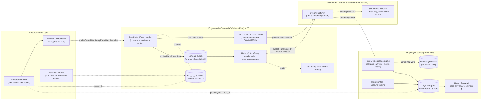

# HLD — High-Level Design
## Basamak-2: History Offload (ACT_HI → NATS → async query-store)

**Repo:** `nats-bpm-channels` (3eAI Labs, Apache 2.0)
**Sentinel fazı:** Phase 3 — Architect (AI performs, Human validates)
**Girdi:** `docs/sentinel/step2/phase2/` (BUSINESS_LOGIC 31 BR, DECISION_MATRIX 9 matris/62 satır, EXCEPTION_CODES 41 kod, PHASE2_REVIEW koşullu-onay kapanışı), `docs/sentinel/step2/phase1/` (25 US, 26 FR + 30 NFR + 7 IR, DATA_CLASSIFICATION DP-1…16), `docs/07-history-offload.md` (D-A…D-G kilitli)
**Tarih:** 2026-07-17
**Durum:** ARCH-Q1…5 KARARA BAĞLANDI (2026-07-18, 5/5 önerilen seçenek — §12); ADR 0009…0019 **11/11 Kabul** (ADR-0016 ARCH-Q2 kararıyla Kabul'e geçti) — phase-review bekliyor

> Bu belge **HLD**'dir (bileşen mimarisi + entegrasyon), LLD değildir. Sınıf-içi algoritma/DDL detayı phase4'e bırakılır. Motor/adapter iddiaları `file:line` kanıtlı (`[07§3]` = docs/07 §3/§7'de DOĞRULANMIŞ; bu fazda fork kaynağı 2 kalemde tekrar spot-check edildi — §11). Kilitli kararlar (D-A…D-G, PO-Q1…7, BA-Q1…8) DEĞİŞTİRİLMEZ; mimari onların üstüne kurulur. **Effort tahmini içermez.** Dokümantasyon TR, kod/tanımlayıcı EN.

---

## 1. Sistem kapsamı & hedefler

**İş problemi:** `ACT_HI_*` history tabloları engine DB'sinin **en büyük yazım hacmidir** — her process-adımı/task/variable-güncelleme/job-log satırı runtime state ile **aynı ACID transaction'ında** yazılır (`HistoryEventProcessor.java:73-85` → `CommandContext.java:186-197` flushSessions→commit) `[07§3]`. Basamak-2 bu yazımı **SPI katmanında** motor-dışı push + async projeksiyona taşır; **fork core'a dokunmaz**.

**Başarı metriği (D-F, TEK sert kapı):** cutover'lanan sınıflarda process-adımı başına `ACT_HI` yazım-op'u **0**; audit-kritik yolda tx-içi ek yazı **≤1 kompakt outbox satırı/tx** (bkz. §7 NFR, ADR-0015).

**Ana yetenekler:** (1) fork-ailesi composite `HistoryEventHandler` + sınıf-bazlı hibrit tutarlılık yolu (audit-kritik outbox/relay at-least-once ↔ bulk post-commit at-most-once); (2) ayrı Postgres projeksiyon (instance-partition + merge-upsert); (3) minimal read-only history sorgu-API'si (çekirdek-4); (4) sınıf-başına reconciliation + kademeli cutover + geri-dönüş; (5) metrik/bench history modu; (6) projeksiyon retention + KVKK erasure + pseudonymization (EPIC-G).

**Kapsam dışı (SRS §7, yeniden açılmaz):** handler-içi senkron publish / tam-outbox / tam-post-commit (D-A); JetStream-only store / ClickHouse-şimdi (D-B); big-bang / kalıcı dual-run (D-C); sırasız+salt-upsert / global tek-consumer (D-E); Flowable history / üç-motor-birlikte (D-G — basamak-2b); sorgu-API agregasyon/analitik (PO-Q3).

**Kapsam = Camunda 7 + CadenzaFlow** (Flowable = basamak-2b, D-G).

---

## 2. Mimari genel bakış

Basamak-2, history yazım yolunu **motor-içi in-tx DB handler**'dan **motor-dışı push + async projeksiyon**'a taşır. İki yayın yolu (D-A hibrit) tek wire-contract (ADR-0013) üretir; consumer taraf ayrım yapmaz.

**Dürüst tavan (kilitli):** basamak-2 history-yazımını kaldırır; **token-move/completion transaction** (basamak-6) kapsam dışı. "Sıfır DB yazımı" yalnız history bileşeni için satılır.

---

## 3. Bileşen mimarisi

Her bileşen ≥1 BR/FR/US'ye izlenir (tam sayım §9). Kanca noktaları `[07§3]` DOĞRULANMIŞ; fork DEĞİŞMEZ.

### 3.1 EPIC-A — Handler + hibrit yol

**3.1.1 NatsHistoryEventHandler (US-A1/A2/A5 · FR-A1/A2/A3/A6 · BR-HDL-001/002/005/007 · ADR-0009)**
Composite handler resmi genişletme noktalarıyla takılır (`ProcessEngineConfigurationImpl.java:757-769,2788-2796,3876-3898`) `[07§3]`; dual-run varsayılan bootstrap. HistoryLevel filtreler (yalnız üretilen event'ler; `HistoryLevel.java:56-82`, `HistoryLevelNone.java:27-39`) `[07§3]`. Her `ACT_HI` sınıfı audit-kritik (default {OP_LOG, INCIDENT, EXT_TASK_LOG}) ↔ bulk olarak sınıflandırılır (konfigürable, PO-Q5). Kapsam = tüm sınıflar (D-D); cutover sırası hacim-öncelikli. Bootstrap guard'ları: `VAL_HISTORY_CLASS_UNCLASSIFIED` (fail-safe bulk), `VAL_HISTORY_LEVEL_AUDIT_CRITICAL_MISMATCH` (WARN, BA-Q4). Camunda 7 ↔ CadenzaFlow tek adapter (byte-ayna). `handleEvents(List)` tek-tek `handleEvent`'e düşer (fork doğrulaması §11).

**3.1.2 CompactHistoryOutbox (US-A3 · FR-A4 · BR-HDL-003 · ADR-0010)**
Audit-kritik event, oluşturulduğu tx içinde ≤1 kompakt outbox satırına yazılır (engine DB; tam ACT_HI satırı DEĞİL). Commit öncesi çökme → satır hiç yazılmadı (tutarlı). "Outbox yok-olma problemi"nin (`[07§4]`) doğrudan çözümü. Payload taşıma = **referans** (ARCH-Q1 KARAR 2026-07-18).

**3.1.3 HistoryPostCommitPublisher (US-A4/A5 · FR-A5/A6 · BR-HDL-004/005 · ADR-0010)**
Bulk event `TransactionState.COMMITTED` listener'ında tx-dışı, sıfır ek DB yazımıyla yayınlanır (basamak-1 deseni `[07§4]` yeniden kullanım). Publish exception runtime tx'i rollback EDEMEZ. At-most-once bilinçli kabul.

**3.1.4 History publish şeması (US-A6 · FR-A7 · BR-HDL-006 · ADR-0013)**
Subject `history.<engineId>.<class>.<processInstanceId>` (instance-anahtarlı → stream sırası); dedup `Nats-Msg-Id=<historyEventId>:<eventType>`. Hem relay hem post-commit aynı şema.

### 3.2 EPIC-B — Relay + projeksiyon

**3.2.1 HistoryOutboxRelay (US-B1 · FR-B1 · BR-REL-001 · ADR-0010 + ADR-0002)**
Leader-elected (basamak-1 `SweepLeaderLease` KV-lease yeniden kullanım). Outbox satırını okur → publish → **PubAck sonrası** siler (custody-transfer). Publish fail → retry/backoff, satır SİLİNMEZ (`SYS_OUTBOX_RELAY_PUBLISH_FAILED`); leader devri lease TTL içinde (`SYS_OUTBOX_RELAY_LEADER_LOST`, NFR-R8); uzun-bekleme → `SYS_OUTBOX_ROW_STUCK` (BA-Q7/ARCH-Q5).

**3.2.2 HistoryProjectionConsumer (US-B2 · FR-B2 · BR-REL-002/006 · ADR-0011/0012)**
History stream'ini instance-anahtarıyla partition'lı tüketir (ARCH-Q3); idempotent merge-upsert, tie-break = JetStream **stream-sequence** monotonik versiyon (BA-Q1). Geç/eski event no-op (`BUS_PROJECTION_STALE_EVENT_DISCARDED`). Yazım hatası → nak (`SYS_PROJECTION_WRITE_FAILED`); kontrat-drift → durur (`SYS_PROJECTION_SCHEMA_DRIFT`).

**3.2.3 ProjectionStore (US-B3 · FR-B3 · BR-REL-003 · ADR-0011)**
Engine DB'den AYRI Postgres; denormalize/sorgu-odaklı; zaman-bazlı range-partition (retention için). L3 (PII) store (NFR-S2: AES-256, role-based). ClickHouse'a evrim kontrat-stabil izole (NFR-M4; ClickHouse-şimdi ertelendi).

**3.2.4 History wire-contract (US-B4 · FR-B4 · BR-REL-004 · ADR-0013)**
`api/asyncapi.yaml` (AsyncAPI 3.1.0, validator temiz). Subject/header/dedup/DLQ; basamak-1 ADR-0006 deseninin history izdüşümü; Flowable basamak-2b aynı kontrata bağlanabilir (NFR-M5).

**3.2.5 HistoryDlq (US-B5 · FR-B5 · BR-REL-005 · ADR-0013/0019 + ADR-0004)**
`dlq.history.>` ayrı stream (CQ-6); header-korumalı byte-ayna; custody-transfer (DLQ-PubAck-sonrası-ack; publish fail → nak, `SYS_HISTORY_DLQ_PUBLISH_FAILED`); dlq-of-dlq YOK; CB korumalı (ADR-0004). PII yüzeyi (DP-13) → `RES_HISTORY_DLQ_ACCESS_DENIED`.

### 3.3 EPIC-C — Sorgu-API + Cockpit-körleşme

**3.3.1 HistoryQueryApi (US-C1 · FR-C1 · BR-QRY-001/003 · ADR-0014)**
`api/openapi.yaml` (OpenAPI 3.0.3, redocly temiz). Read-only REST/JSON, çekirdek-4, sayfalamalı; projeksiyon Postgres'ten. Erişim kontrolü + PII maskeleme (`AUTH_QUERY_ACCESS_DENIED`, `BUS_QUERY_PII_MASKED`, `VAL_QUERY_UNSUPPORTED_PATTERN`). Cutover-bağımsız kapsam (BA-Q3). Pluggable authz (ARCH-Q4).

**3.3.2 Cockpit-körleşme dokümantasyonu (US-C2 · FR-C2 · BR-QRY-002 · ADR-0014)**
Cockpit history görünümleri `ACT_HI_*`'e bağlı, enterprise-only; history'yi ayrı DB'ye yazmak history görünümlerini bozar `[resmi Camunda manual — §11]`. Runtime Cockpit (`ACT_RU_*`) ETKİLENMEZ. Sınıf-başına körleşme haritası + geri-dönüş dokümante.

### 3.4 EPIC-D — Reconciliation + cutover

**3.4.1 ReconciliationJob (US-D1 · FR-D1 · BR-CUT-001/004 · ADR-0015)**
Sınıf-başına projeksiyon ↔ `ACT_HI` fark sayacı; PII sızdırmaz (DP-14). "N gün temiz" = audit-kritik mutlak sıfır / bulk epsilon+trend (BA-Q2); default N=7g (PO-Q4). `BUS_RECONCILIATION_DIFF_DETECTED` (streak-reset), `RES_RECONCILIATION_DIFF_THRESHOLD_EXCEEDED`, `SYS_RECONCILIATION_JOB_FAILED`.

**3.4.2 CutoverControlPlane (US-D2/A5 · FR-D2/A6 · BR-CUT-002/BR-HDL-005 · ADR-0015 + ADR-0009)**
Kapı açık + hacim-öncelikli sıra → `enableDefaultDbHistoryEventHandler=false`. Kapalı kapı zorlaması → `BUS_CUTOVER_GATE_NOT_MET`; apply fail → `SYS_CUTOVER_CONFIG_APPLY_FAILED` (dual-run fail-safe devam). Config-flip = **rolling-restart** (ARCH-Q5 KARAR 2026-07-18; hot-reconfigure phase4/5 doğrulamasına açık iyileştirme).

**3.4.3 CutoverRollback (US-D3 · FR-D3 · BR-CUT-003 · ADR-0015)**
Sınıfı yeniden açma (konfig) → `BUS_CUTOVER_ROLLBACK_TRIGGERED` (audit-logged); dual-run yeniden, streak SIFIRDAN; Cockpit-history geri gelir. Kalıcı dual-run REDDEDİLDİ (NFR-R5).

### 3.5 EPIC-E/F — Metrik/bench + devreden borçlar

**3.5.1 NormalizeWriteMetric + bench history modu (US-E1/E3 · FR-E1/E3 · BR-OBS-001/003 · ADR-0015)**
Normalize DB yazım-op metriği = TEK sert kapı (D-F); `pg_stat_statements` fingerprint (§11). Bench iki mod (DB-history ↔ offload); hedef kaçarsa `BUS_BENCH_HISTORY_METRIC_REGRESSION` → build-fail. `SYS_BENCH_HISTORY_ENVIRONMENT_UNAVAILABLE`/`_SLI_DRIFT` warn-only.

**3.5.2 Destekleyici SLI'lar (US-E2 · FR-E2 · BR-OBS-002)**
Projeksiyon gecikmesi p95, reconciliation fark sayacı, history-DLQ/nak/ack sayaçları (basamak-1 `NatsChannelMetrics` `[07§4]` tabanı). SLI, sert kapı DEĞİL (NFR-P3).

**3.5.3 Bench İLK GERÇEK KOŞU (US-F1 · FR-F1 · BR-DBT-001)** — basamak-1 baseline = basamak-2 hedef-tavanı; `BUS_BENCH_BASELINE_MISSING`.
**3.5.4 Stream provisioning (US-F2 · FR-F2 · BR-DBT-002 · ADR-0019/0013)** — `ensureStreams()` history + `dlq.history.>` (CQ-6); `VAL_HISTORY_STREAM_PROVISIONING_MISSING`.
**3.5.5 Devreden borç triyajı (US-F3 · FR-F3 · BR-DBT-003)** — borç #1,3,4,5,6 basamak-2-ilgili/basamak-1-kuyruğu/basamak-2b etiketlenir (§10).

### 3.6 EPIC-G — Retention / erasure / pseudonymization (ilk-sınıf, phase1-review F-002)

**3.6.1 RetentionEnforcementJob (US-G1 · FR-G1 · BR-PII-001 · ADR-0018)**
Sınıf-bazlı scheduled job; bulk 90g / audit-kritik yasal-saklama (PO-Q7); retention-expiry = `DROP/DETACH PARTITION` (§11). Audit-log invariant: `SYS_RETENTION_AUDIT_LOG_WRITE_FAILED` = **CRITICAL**. `VAL_RETENTION_OVERRIDE_BELOW_LEGAL_MINIMUM`. Pseudonymization retention'ı KISALTMAZ (BA-Q8).

**3.6.2 ErasurePipeline (US-G2 · FR-G2 · BR-PII-002/005 · ADR-0017)**
Bulk PII soft-delete→anonymize (SQL); kapsam-onayı akışı (BA-Q6, `VAL_ERASURE_SUBJECT_KEY_AMBIGUOUS`); audit-kritik → `BUS_ERASURE_REQUEST_LEGAL_HOLD_BLOCKED`. Doğrulama: `RES_ERASURE_VERIFICATION_FAILED` = CRITICAL (30g SLA).

**3.6.3 PseudonymizationVault (US-G3 · FR-G3 · BR-PII-003/004 · ADR-0016 Kabul · ARCH-Q2 KARAR)**
Ayrı depo (L4-bitişik, DP-16); pseudonym değeri tx-içi saf hesap, kasa-persist downstream/async (BA-Q5, `SYS_PSEUDONYM_VAULT_UNAVAILABLE` akışı ENGELLEMEZ). Silme=harita-kaydı (`BUS_PSEUDONYM_MAP_ENTRY_DELETED`). Yetkisiz erişim → `AUTH_PSEUDONYM_VAULT_ACCESS_DENIED` = **CRITICAL**. Depo = **ayrı Postgres örneği/şeması** (ARCH-Q2 KARAR 2026-07-18).

---

## 4. Veri akışı & durum

Merkezi durum makinesi = **sınıf-bazlı cutover yaşam döngüsü** (DUAL_RUN → RECONCILING → N_GUN_TEMIZ → CUTOVER_TALEP → CUTOVERLANMIS ↔ geri-dönüş; tam diyagram `BUSINESS_LOGIC.md §2.1`). Kompakt outbox satırı yaşam döngüsü (`§2.2`), custody-transfer mesaj durumu (`§2.3`), PII yaşam döngüsü (`§2.4`) iş-mantığı belgesindedir.

**Kritik invariant'lar (NFR-R):**
- **R1** audit-kritik at-least-once + dayanıklı outbox handoff → kalıcı kayıp imkansız (önkoşul: HistoryLevel event üretir — BA-Q4/§3.1.1).
- **R2** bulk at-most-once; kayıp reconciliation'da tespit.
- **R3** custody-transfer: sessiz kayıp yok (nak/DLQ).
- **R4** instance-partition sıra + merge-upsert güvenlik ağı (stream-sequence tie-break, BA-Q1).
- **R5** dual-write kalıcılaşmaz (cutover DB yazımını gerçekten kaldırır).
- **R6** idempotency: dedup + merge-upsert.
- **R7** cutover geri-döndürülebilir (konfig).

---

## 5. Arayüz & veri sözleşmeleri

Makine-okunur sözleşmeler **yalnız `api/`** altındadır (ADR-0013/0014; inline spec = phase-review 🔴):
- **`api/asyncapi.yaml`** — history tel sözleşmesi (subject/header/dedup/DLQ; `asyncapi validate` **0 error / 0 governance issue**).
- **`api/openapi.yaml`** — read-only history sorgu-API (çekirdek-4; `redocly lint` **temiz**).

Anlatı + AsyncAPI-dışı JetStream stream/consumer konfigürasyonu: `API_CONTRACTS.md`. Standart yanıt zarfı (`{success, message, code, data, meta}`) sorgu-API'de (ARCHITECT_GUIDELINE §4). URL versiyonlama (`/api/v1`). Veri-sahipliği: `DATA_OWNERSHIP.yaml`. IR-1…IR-7 karşılıkları API_CONTRACTS §1-§4.

---

## 6. Güvenlik & erişim kontrolü

Tam envanter: `DATA_CLASSIFICATION.md` (DP-1…16). **Uyum sürücüsü:** history telco-PII (MSISDN/IMSI, operatör kimlikleri) taşır → **KVKK + GDPR** normatiftir. Mimari-düzey kararlar:

| Konu | Karar | Kaynak/ADR |
|---|---|---|
| **Transport** | Production'da TLS + NKey/JWT zorunlu (basamak-1 devralınır) | DP-4 · ADR-0019 (ADR-0008 genişlemesi) |
| **History subject authz** | `history.>` / `dlq.history.>` subject-level ACL (relay/publisher yalnız pub; consumer yalnız sub; DLQ inceleme yetkili) — **NFR-S7 kapanır** | DP-13 · ADR-0019 |
| **Projeksiyon store** | L3 (PII): at-rest AES-256, role-based erişim, SQL retention/erasure | DP-9 · ADR-0011/0017/0018 |
| **Pseudonym kasası** | L4-bitişik: ayrı depo, en-az-yetki + audit, projeksiyon'dan izole | DP-16 · ADR-0016 |
| **Sorgu-API** | role-based erişim + PII maskeleme; log'a PII değeri YOK | DP-1/DP-15 · ADR-0014 |
| **Reconciliation** | yalnız sayaç/id/hash; PII değeri sızdırmaz | DP-14 · ADR-0015 |
| **DLQ maruziyeti** | `dlq.history.>` byte-ayna (14g) = en uzun PII maruziyeti → erişim kontrolü + kiracı retention kısaltma | DP-13 · ADR-0019 |

### 6.1 Threat model (STRIDE — yeni yüzeyler)

| Kategori | Tehdit | Azaltma / Kontrol |
|---|---|---|
| **Spoofing** | Sahte history publish / yetkisiz projeksiyon okuma | Subject-level ACL (relay/consumer hesap izolasyonu) + TLS + NKey/JWT (ADR-0019) |
| **Tampering** | Retention silmesi izsiz kalır | Audit-log invariant; `SYS_RETENTION_AUDIT_LOG_WRITE_FAILED` = CRITICAL page (ADR-0018) |
| **Repudiation** | "Silme yapılmadı/yanlış yapıldı" | Erasure/retention/pseudonym-map her işlem audit-logged (ADR-0017/0018/0016) |
| **Information Disclosure** | PII sızıntısı (sorgu-API, DLQ, log, kasa) | Role-based PII maskeleme (DP-15); log'a PII değeri YOK (DP-1); DLQ subject-ACL (DP-13); kasa L4-bitişik izole (DP-16) |
| **Denial of Service** | Broker/consumer down → history birikir | Audit-kritik outbox dayanıklı (kayıp yok); relay retry/backoff; projeksiyon nak/redelivery; CB DLQ-bridge (ADR-0004) |
| **Elevation of Privilege** | Re-identification anahtarına yetkisiz erişim | Kasa en-az-yetki + audit; `AUTH_PSEUDONYM_VAULT_ACCESS_DENIED` = CRITICAL security-page (ADR-0016) |

### 6.2 Veri hassasiyeti sınıflandırması
`data_classification`: history payload/operatör-kimlikleri/DLQ = **RESTRICTED/PII** (encryption + mask-in-logs + access-logging); businessKey = CONFIDENTIAL (koşullu PII); pseudonym kasası = **L4-bitişik** (re-identification anahtarı). Tam eşleme `DATA_CLASSIFICATION.md`.

---

## 7. Gözlemlenebilirlik (per OBSERVABILITY / NFR-O)

Mevcut Micrometer tabanı (`NatsChannelMetrics` `[07§4]`) üstüne kurulur:
- **Yeni sayaçlar (NFR-O1):** history publish/consume/DLQ/nak/ack; relay-republish; en-yaşlı-outbox-satırı yaşı (`SYS_OUTBOX_ROW_STUCK` sinyali); projeksiyon gecikmesi (event→query-store, p95); reconciliation fark sayacı (sınıf-başına); cutover durumu (sınıf-başına); retention/erasure silme sayacı.
- **Birincil metrik (NFR-P1/FR-E1):** process-adımı başına normalize DB yazım-op (`pg_stat_statements` fingerprint, §11); TEK sert kapı (ADR-0015).
- **Trace korelasyonu (NFR-O2):** `X-Cadenzaflow-Trace-Id` → MDC; metrik tag'lerine PII girmez (DP-1/DP-2; tag yalnız `class`/`subject`/`engineId` — düşük kardinalite).
- **Alarm:** `SYS_RETENTION_AUDIT_LOG_WRITE_FAILED` (CRITICAL page), `AUTH_PSEUDONYM_VAULT_ACCESS_DENIED` (security-page), `RES_ERASURE_VERIFICATION_FAILED` (compliance-risk), `SYS_OUTBOX_ROW_STUCK` (relay stuck), reconciliation eşik-aşımı, CB OPEN geçişi.

---

## 8. NFR (30/30 — her biri bir tasarım öğesine ya da açık ertelemeye bağlı)

**Tier notu:** `system_tier=carrier-grade-backend` (BESPOKE, T1-T4 dışı; headless kütüphane). Standart T-tablosu doğrudan uygulanmaz; SPOF disiplini §8.2'de. Modül-başına somut hedef LLD'ye (phase4) taşınır; bu tablo NFR→tasarım bağını kapatır.

| NFR | Hedef (özet) | Tasarım öğesi / kapanış |
|---|---|---|
| P1 | cutover'da ACT_HI yazım-op 0 | §3.5.1 metrik / §3.4.2 cutover — ADR-0015 |
| P2 | audit-kritik ≤1 kompakt outbox satırı/tx | §3.1.2 — ADR-0010 |
| P3 | projeksiyon gecikmesi p95 SLI (sert kapı değil) | §3.5.2 SLI |
| P4 | relay/reconciliation hot-path'e yük bindirmez | §3.2.1 leader-elected / §3.4.1 amortize |
| P5 | projeksiyon consumer yatay ölçeklenir | §3.2.2 instance-partition — ADR-0011/ARCH-Q3 |
| R1 | audit at-least-once, kalıcı kayıp imkansız (HistoryLevel önkoşulu) | §3.1.2/§3.2.1 + §3.1.1 guard — ADR-0010, BA-Q4 |
| R2 | bulk at-most-once, reconciliation tespit | §3.1.3 + §3.4.1 |
| R3 | custody-transfer, sessiz kayıp yok | §3.2.1/§3.2.5 |
| R4 | sıra + merge-upsert güvenlik ağı | §3.2.2 — ADR-0012 |
| R5 | dual-write kalıcılaşmaz | §3.4.2 — ADR-0015 |
| R6 | idempotency (dedup + merge-upsert) | §3.2.2 |
| R7 | cutover geri-döndürülebilir | §3.4.3 — ADR-0015 |
| R8 | kurtarma zarfı: relay HA devralınır; projeksiyon PG RTO/RPO kiracı-owned | §8.2 + ADR-0010/0002; relay lider-devri = lease TTL (ölçülen failover phase4/5 — §11 kalem 4) |
| S1 | log/metrik-tag'e PII değeri YOK | §7 + DP-1 |
| S2 | projeksiyon PG L3 (AES-256, erişim, retention) | §3.2.3 — ADR-0011/0018 |
| S3 | KVKK erasure uygulanabilir (katmanlı politika) | §3.6.2/§3.6.3 — ADR-0017/0016/0018 **(kapanır)** |
| S4 | history stream+DLQ at-rest PII (TLS+erişim+retention, ayrı-stream) | §3.2.5 — ADR-0019 |
| S5 | kompakt outbox kısa maruziyet | §3.1.2/§3.2.1 — ADR-0010 (SYS_OUTBOX_ROW_STUCK) |
| S6 | reconciliation/sorgu-API PII sızdırmaz | §3.4.1/§3.3.1 — DP-14/DP-15 |
| S7 | transport TLS+NKey/JWT + history subject authz | §6 — ADR-0019 **(kapanır)** |
| S8 | pseudonym kasası L4-bitişik | §3.6.3 — ADR-0016 |
| O1 | Micrometer tüm history olayları | §7 |
| O2 | reconciliation + projeksiyon gecikmesi izlenir | §7/§3.4.1 |
| O3 | bench history modu CI nightly | §3.5.1 |
| M1 | fork değişmez; impl-sınıf yüzeyi dokümante | §3.1.1 — ADR-0009 (+ADR-0005) |
| M2 | Camunda↔CadenzaFlow adapter taşınabilir | §3.1.1 |
| M3 | wire-contract tek makine-okunur artefakt | §3.2.4 — ADR-0013 |
| M4 | query-store ClickHouse-evrilebilir (kontrat-stabil) | §3.2.3 — ADR-0011 |
| M5 | Flowable basamak-2b aynı kontrat | §3.2.4 — ADR-0013 (kontrat-hazır; impl basamak-2b) |
| L1 | Apache-2.0 deps, $0 | §Dış bağımlılıklar (INTEGRATION_MAP §4) |

**Kapanış vurgusu:** basamak-1 phase3-review'unun "NFR-S3 kapatılmamış" sınıfı bu tabloda önlendi — **NFR-S3 (erasure) ve NFR-S7 (subject authz) açıkça bir ADR'ye bağlandı** (ADR-0017/0016/0018 ve ADR-0019); "phase3'te netleşecek" artığı bırakılmadı.

---

## 8.2 Hata modları & kurtarma (SPOF disiplini)

| Senaryo | Tespit | Otomatik yanıt | Manuel kurtarma | Etki |
|---|---|---|---|---|
| Relay leader düşer | lease TTL süresi dolar | Yeni leader devralır (KV-lease); outbox satırları hayatta | — | Devir penceresinde (≤ lease TTL) kısa gecikme; audit kaybı YOK (NFR-R8) |
| Broker erişilemez | PubAck timeout | Relay retry/backoff (outbox SİLİNMEZ); post-commit at-most-once kaybı | broker kurtar | Audit-kritik kayıp YOK; bulk kayıp reconciliation'da görünür |
| Projeksiyon PG down | consumer yazım hatası | nak/redelivery (idempotent); projeksiyon-lag büyür | PG restore (kiracı RTO/RPO) | Sorgu-API/projeksiyon gecikir; audit kaybı YOK (outbox güvende) |
| Pseudonym kasası down | downstream yazım fail | retry; **audit akışı ENGELLENMEZ** (BA-Q5) | kasa kurtar | Kasa-persist gecikir; pseudonym değeri zaten hesaplandı |
| Reconciliation job fail | job exception | döngü atlanır; streak ilerlemez (geri de gitmez) | job kurtar | Cutover kapısı bir döngü beklet |
| Retention silme + audit-log fail | audit yazım hatası | `SYS_RETENTION_AUDIT_LOG_WRITE_FAILED` CRITICAL page | insan müdahalesi | Compliance-invariant ihlali — anında ele alınır |

**SPOF analizi (istek yolu):** relay leader (mitigasyon: KV-lease failover); projeksiyon PG (kiracı-owned HA/failover — gömülebilir-kütüphane duruşu, NFR-R8); pseudonym kasası (izole; kesintisi audit akışını bloklamaz). Audit-kritik dayanıklılık outbox+relay'de olduğundan projeksiyon/kasa kesintisi **audit kaybı üretmez** — bu, tasarımın SPOF-güvenlik ekseninin çekirdeğidir.

---

## 9. Bileşen → BR/FR/US izlenebilirliği (her bileşen ≥1; SAYARAK doğrulandı)

| Bileşen (§3) | BR | FR | US | ADR |
|---|---|---|---|---|
| NatsHistoryEventHandler | BR-HDL-001/002/005/007 | FR-A1/A2/A3/A6 | US-A1/A2/A5 | 0009 |
| CompactHistoryOutbox | BR-HDL-003 | FR-A4 | US-A3 | 0010 |
| HistoryPostCommitPublisher | BR-HDL-004/005 | FR-A5/A6 | US-A4/A5 | 0010 |
| History publish şeması | BR-HDL-006 | FR-A7 | US-A6 | 0013 |
| HistoryOutboxRelay | BR-REL-001 | FR-B1 | US-B1 | 0010/0002 |
| HistoryProjectionConsumer | BR-REL-002/006 | FR-B2 | US-B2 | 0011/0012 |
| ProjectionStore | BR-REL-003 | FR-B3 | US-B3 | 0011 |
| History wire-contract | BR-REL-004 | FR-B4 | US-B4 | 0013 |
| HistoryDlq | BR-REL-005 | FR-B5 | US-B5 | 0013/0019/0004 |
| HistoryQueryApi | BR-QRY-001/003 | FR-C1 | US-C1 | 0014 |
| Cockpit-körleşme dok. | BR-QRY-002 | FR-C2 | US-C2 | 0014 |
| ReconciliationJob | BR-CUT-001/004 | FR-D1 | US-D1 | 0015 |
| CutoverControlPlane | BR-CUT-002/BR-HDL-005 | FR-D2/FR-A6 | US-D2/US-A5 | 0015/0009 |
| CutoverRollback | BR-CUT-003 | FR-D3 | US-D3 | 0015 |
| NormalizeWriteMetric + bench | BR-OBS-001/003 | FR-E1/E3 | US-E1/E3 | 0015 |
| Destekleyici SLI'lar | BR-OBS-002 | FR-E2 | US-E2 | — (NatsChannelMetrics) |
| Bench İLK GERÇEK KOŞU | BR-DBT-001 | FR-F1 | US-F1 | — (bench) |
| Stream provisioning | BR-DBT-002 | FR-F2 | US-F2 | 0019/0013 |
| Devreden borç triyajı | BR-DBT-003 | FR-F3 | US-F3 | — |
| RetentionEnforcementJob | BR-PII-001 | FR-G1 | US-G1 | 0018 |
| ErasurePipeline | BR-PII-002/005 | FR-G2 | US-G2 | 0017 |
| PseudonymizationVault | BR-PII-003/004 | FR-G3 | US-G3 | 0016 |

**Sayarak doğrulama (basamak-1 MAJOR-1 sınıfını önler):**
FR = A(7: A1–A7) + B(5: B1–B5) + C(2: C1–C2) + D(3: D1–D3) + E(3: E1–E3) + F(3: F1–F3) + G(3: G1–G3) = **26/26 FR**.
US = A(6: A1–A6) + B(5: B1–B5) + C(2: C1–C2) + D(3: D1–D3) + E(3: E1–E3) + F(3: F1–F3) + G(3: G1–G3) = **25/25 US**.
31 BR'nin tamamı ≥1 bileşene bağlı (BR-HDL 7 + BR-REL 6 + BR-QRY 3 + BR-CUT 4 + BR-OBS 3 + BR-DBT 3 + BR-PII 5 = 31). **0 boşluk** (izlenebilirlik: SRS §6, USER_STORIES §3, BUSINESS_LOGIC §8, EXCEPTION_CODES §13).

---

## 10. ADR endeksi + devreden borç triyajı

| ADR | Başlık | Durum |
|---|---|---|
| [0009](ADR/0009-composite-history-event-handler-plugin.md) | Composite HistoryEventHandler plug-in stratejisi | Kabul |
| [0010](ADR/0010-hybrid-publish-topology-outbox-relay-postcommit.md) | Hibrit yayın topolojisi (outbox+relay / post-commit) | Kabul (ARCH-Q1 alt-eksen) |
| [0011](ADR/0011-projection-store-separate-postgres.md) | Projeksiyon store: ayrı Postgres, denormalize | Kabul (ARCH-Q3 alt-eksen) |
| [0012](ADR/0012-merge-upsert-stream-sequence-tiebreak.md) | Merge-upsert = NATS stream-sequence tie-break | Kabul (BA-Q1) |
| [0013](ADR/0013-history-wire-contract-asyncapi.md) | History wire-contract (AsyncAPI, ADR-0006 genişlemesi) | Kabul |
| [0014](ADR/0014-history-query-api-readonly-rest.md) | History sorgu-API (read-only REST, çekirdek-4) | Kabul (ARCH-Q4 alt-eksen) |
| [0015](ADR/0015-gradual-cutover-control-plane-reconciliation.md) | Kademeli cutover kontrol düzlemi + reconciliation (iki-kapı) | Kabul (ARCH-Q5 alt-eksen) |
| [0016](ADR/0016-pseudonymization-vault.md) | Pseudonymization kasası (L4-bitişik) | Kabul (ARCH-Q2 KARAR 2026-07-18: ayrı Postgres) |
| [0017](ADR/0017-erasure-pipeline-scope-approval.md) | Erasure pipeline + kapsam-onayı | Kabul (BA-Q6) |
| [0018](ADR/0018-class-based-retention-enforcement.md) | Sınıf-bazlı retention + audit-log invariant | Kabul |
| [0019](ADR/0019-history-stream-retention-subject-authz.md) | History stream retention + subject-level authz (ADR-0008 genişlemesi) | Kabul |

**Basamak-1 ADR atıfları (kesişen konular):** ADR-0002 (KV-lease → relay leader), ADR-0004 (CB → history-DLQ bridge), ADR-0005 (impl-sınıf upgrade → history SPI yüzeyi), ADR-0006 (AsyncAPI → ADR-0013), ADR-0008 (subject-authz → ADR-0019). Basamak-1 ADR-0001…0008 `docs/sentinel/phase3/ADR/`de; DEĞİŞTİRİLMEZ.

**Devreden borç triyajı (US-F3/BR-DBT-003):**

| Borç | Triyaj | Gerekçe |
|---|---|---|
| #1 unsafe-lock runbook | basamak-1-kuyruğu | history L-parametresi yok; basamak-1 ops devri |
| #3 scheduler shutdown await | basamak-2-ilgili | history relay/consumer scheduler'ına aynı desen uygulanmalı (phase4 not) |
| #4 FailureEventBridge NonMatchingEventConsumer | basamak-1-kuyruğu | history kapsamına girmiyor |
| #5 Flowable timer maliyet ölçümü | basamak-2b | Flowable ertelendi (D-G) |
| #6 sweep captured-variables | basamak-2-ilgili (doğrulama) | history publish captured-payload tamlığı aynı sınıf-hatayı tekrarlamamalı (ADR-0010 payload — ARCH-Q1) |

---

## 11. Phase3 doğrulama listesi kapanışı (kanıt-temelli)

Görev talimatının 7 kalemi. **✅ = resmi doküman/fork-kaynağı ile doğrulandı; ⏭ = phase4/5'e gerekçeyle devredildi.**

| # | Kalem | Durum | Kanıt / karar |
|---|---|---|---|
| 1 | Cockpit history `ACT_HI` bağımlılık yüzeyi (D-C körleşme haritası) | ✅ | Camunda manual (webapps/cockpit/bpmn/process-history-views): history görünümleri `ACT_HI_*`'e bağlı, **enterprise-only**; history'yi ayrı DB'ye yazmak history görünümlerini bozar. Runtime Cockpit (`ACT_RU_*`) etkilenmez → FR-C2 doğru. Sınıf-başına harita US-C2 teslimatı (§3.3.2, ADR-0014). |
| 2 | `handleEvents(List)` batch yolu kullanım sıklığı | ✅ | **Fork kaynağı doğrulandı:** `CompositeHistoryEventHandler.handleEvents(List) { for (e : events) handleEvent(e); }` (CompositeHistoryEventHandler.java:100-105) → batch tek-tek `handleEvent`'e düşer; custom handler batch-özel optimizasyon GEREKTİRMEZ (§3.1.1, ADR-0009). |
| 3 | `pg_stat_statements` history-write fingerprint izolasyonu (D-F) | ✅ | PostgreSQL docs: statements queryid (parse-tree hash) ile gruplanır, literaller `$n`'e normalize. History INSERT'leri (`ACT_HI_*`, `ByteArrayEntity` insert) ayrı queryid alır. Basamak-1 IN-list arity uyarısı history basit-INSERT'lerinde geçerli değil → ölçüm temiz (§3.5.1, ADR-0015). |
| 4 | Relay lider-devri süresi (NFR-R8) + BA-Q7 outbox-stuck eşik kalibrasyonu | ⏭ (kısmen ✅) | **Tasarım kapandı:** relay HA = basamak-1 `SweepLeaderLease` (lease TTL bound, ADR-0002/0010); outbox-stuck eşiği = relay-döngü-gecikmesinin çarpanı (BA-Q7). **Ölçülen failover süresi + çarpan kalibrasyonu phase4/5 bench'e devredildi** (carrier-grade "measured, not estimated" — ARCH-Q5). |
| 5 | Merge-upsert mekanizması (BA-Q1 stream-sequence → projeksiyon şeması) | ✅ | NATS docs / nats-server: stream-sequence monotonik-artan API garantisi; PubAck atanmış sequence döndürür (retry'de atlayabilir ama monotonluk bozulmaz). Projeksiyon satırında monotonik versiyon kolonu; gelen seq > mevcut → upsert, ≤ → no-op (§3.2.2, ADR-0012). |
| 6 | History stream retention + subject-level authz (ADR-0008 genişlemesi; DP-13) | ✅ | NATS docs: Limits-based stream retention (konfigürable) + subject-level `permissions.publish/subscribe`. History namespace ACL + ayrı-stream (CQ-6) + kısa history-stream retention + DLQ 14g kiracı-kısaltma (§6, ADR-0019). NFR-S7 kapanır. |
| 7 | Byte-array HISTORY payload taşıma (inline vs referans) | ✅ (karar ARCH-Q1) | **Fork kaynağı doğrulandı:** `DbHistoryEventHandler` byte value'yu ayrı `ByteArrayEntity(..., ResourceTypes.HISTORY)` + `byteArrayManager.insertByteArray` ile yazar (DbHistoryEventHandler.java:97-105); event objesi `getByteValue()`'yu handle-zamanında taşır → offload bu ayrı yazıyı komple atlar. Taşıma biçimi (inline byte vs referans) **ARCH-Q1 önerisi = referans** (NFR-P2 kompakt kalsın; ADR-0010). |

---

## 12. ARCH-QUESTIONS — Karar Kaydı (KARARA BAĞLANDI 2026-07-18)

> **Levent 2026-07-18'de tek tek karar verdi — 5/5 önerilen seçenek KABUL:** Q1=referans, Q2=ayrı Postgres (ADR-0016 → Kabul), Q3=subject-mapped deterministic partition, Q4=gömülebilir+standalone+authz-SPI, Q5=rolling-restart+çarpan-eşik. Kararlar ilgili ADR/bileşen metinlerine işlendi. Basamak-1 ARCH-Q1…4 deseni.

| # | Soru | Seçenekler | ÖNERİ (gerekçeli) |
|---|---|---|---|
| **ARCH-Q1** | Kompakt outbox history payload'ını nasıl taşır? (byte-array HISTORY payload — §11 kalem 7) | (a) inline byte gövdesi outbox satırında; (b) referans + relay yeniden-kurar; (c) hibrit (küçük audit-kritik payload inline, büyük referans) | **(b) referans.** NFR-P2 "≤1 kompakt satır/tx" gerçekten kompakt kalsın, DP-12 maruziyeti minimize olsun. Audit-kritik sınıflar (OP_LOG/INCIDENT/EXT_TASK_LOG) küçük payload'lı olduğundan (c) hibrit de savunulabilir; wire-contract (ADR-0013) her halde sabit. (ADR-0010) |
| **ARCH-Q2** | Pseudonymization kasası deposu? (yeni stateful yüzey, DP-16 L4-bitişik) | (a) ayrı Postgres örneği/şeması; (b) NATS JetStream KV; (c) OpenBao | **(a) ayrı Postgres.** Silme=harita-kaydı semantiği SQL-DELETE ile birebir, erasure ops'uyla (ADR-0017) tutarlı, L4-bitişik izolasyon (ayrı instance+AES-256+en-az-yetki) sağlanabilir. OpenBao yalnız kiracı zaten key-management için kullanıyorsa. Bu ADR-0016'yı **Önerildi**'den Kabul'e taşır. (ADR-0016) |
| **ARCH-Q3** | Projeksiyon consumer instance-partition mekanizması? (NFR-P5 yatay ölçek + per-instance sıra) | (a) JetStream deterministik subject-mapped partition token + partition-başına durable consumer (server-side); (b) client-side partitioned consumer group (NATS Orbit); (c) instance-hash başına ordered-consumer maxAckPending=1 | **(a) subject-mapped deterministic partition.** En az istemci-koordinasyonu; `processInstanceId` token hash'iyle per-key sıra korunur (core queue-group tek başına partition-less — NATS docs). Mekanizma phase4 LLD'de somutlaşır. (ADR-0011) |
| **ARCH-Q4** | Sorgu-API dağıtım biçimi + authz? (SRS §4.7 pluggable) | (a) yalnız gömülebilir kütüphane; (b) yalnız standalone read-only servis; (c) ikisi de (gömülebilir + opsiyonel standalone), pluggable authz SPI | **(c) ikisi de + pluggable authz SPI.** Kiracı gömer veya standalone çalıştırır; kimlik/authz kiracı stack'i (Keycloak/APISIX/JWT) SPI ile bağlanır. OpenAPI kontratı (çekirdek-4, zarf, maskeleme) her halde sabit. (ADR-0014) |
| **ARCH-Q5** | Cutover config-flip mekanizması + outbox-stuck eşik-kalibrasyon tasarımı? (§11 kalem 4) | flip: (a) rolling-restart; (b) hot-reconfigure (motor destekliyorsa). eşik: (a) sabit süre; (b) relay-döngü-gecikmesi çarpanı, bench-kalibre | **flip=(a) rolling-restart** (deterministik, en az motor-içi durum riski; hot-reconfigure phase4/5'te doğrulanırsa tercih). **eşik=(b) çarpan** (örn. 5×), ilk değer phase4/5 bench ölçümüyle kalibre (PO-Q4 "kalibre edilebilir başlangıç" deseni). (ADR-0015) |

---

## 13. Referanslar & kaynaklar

**Proje girdileri:** `docs/07-history-offload.md` (D-A…D-G), `docs/sentinel/step2/phase1/*` (US/SRS/DATA_CLASSIFICATION/TENANT_PII_CHECKLIST/GUIDELINES_MANIFEST), `docs/sentinel/step2/phase2/*` (BUSINESS_LOGIC/DECISION_MATRIX/EXCEPTION_CODES/PHASE2_REVIEW), basamak-1 `docs/sentinel/phase3/*` (yapısal taban + ADR-0001…0008), fork kaynağı `~/Workspaces/cadenzaflow/cadenzaflow-bpm-platform/engine`.

**Resmi doküman kaynakları (§11 doğrulamaları):**
- [Camunda 7 Manual — Process History Views (Cockpit)](https://docs.camunda.org/manual/latest/webapps/cockpit/bpmn/process-history-views/)
- [Camunda Docs Manual — process-history-views.md (kaynak)](https://github.com/camunda/camunda-docs-manual/blob/master/content/webapps/cockpit/bpmn/process-history-views.md)
- [NATS Docs — JetStream (stream sequence, PubAck)](https://docs.nats.io/nats-concepts/jetstream)
- [NATS Docs — JetStream Model Deep Dive (monotonic sequence)](https://docs.nats.io/using-nats/developer/develop_jetstream/model_deep_dive)
- [NATS Docs — Subject Mapping and Partitioning (deterministic partition)](https://docs.nats.io/nats-concepts/subject_mapping)
- [NATS Blog — Client-side Partitioned Consumer Groups (Orbit)](https://nats.io/blog/orbit-partitioned-consumer-groups/)
- [PostgreSQL Docs — pg_stat_statements (queryid/fingerprint)](https://www.postgresql.org/docs/current/pgstatstatements.html)
- [PostgreSQL Docs — Table Partitioning (range, DROP/DETACH)](https://www.postgresql.org/docs/current/ddl-partitioning.html)
