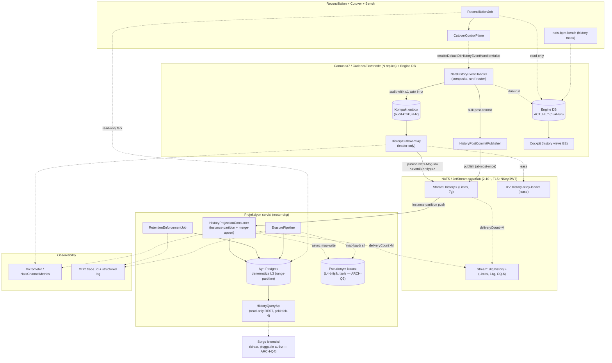

# INTEGRATION MAP — Sistem Entegrasyon Haritası
## Basamak-2: History Offload (ACT_HI → NATS → async query-store)

**Repo:** `nats-bpm-channels` (3eAI Labs, Apache 2.0)
**Sentinel fazı:** Phase 3 — Architect
**Tarih:** 2026-07-17

> Bileşenlerin ve dış sistemlerin entegrasyon topolojisi. Her entegrasyon noktası bir protokol + bir BR/FR'ye izlenebilir. Bileşen ayrıntıları: `HLD.md §3`; sözleşme: `API_CONTRACTS.md` + `api/asyncapi.yaml` + `api/openapi.yaml`; veri-sahipliği: `DATA_OWNERSHIP.yaml`.

---

## 1. Sistem entegrasyon diyagramı



---

## 2. Entegrasyon noktaları kataloğu

| # | Kaynak → Hedef | Protokol / mekanizma | Sözleşme | BR / FR | ADR |
|---|---|---|---|---|---|
| I-1 | Handler → Kompakt outbox | in-tx JDBC (≤1 satır) | engine DB outbox tablosu | BR-HDL-003 / FR-A4 | 0010 |
| I-2 | Handler → PostCommitPublisher | in-memory event (COMMITTED listener) | tx-dışı publish kancası | BR-HDL-004 / FR-A5 | 0010 |
| I-3 | Relay → `history.<...>` | JetStream publish (PubAck), `Nats-Msg-Id=<eventId>:<type>`; PubAck-sonrası outbox-delete | asyncapi `publishHistoryEvent` | BR-REL-001 / FR-B1 | 0010/0013 |
| I-4 | Relay ↔ KV `history-relay-leader` | JetStream KV lease (TTL) | leader election | BR-REL-001 / FR-B1 | 0002/0010 |
| I-5 | PostCommitPublisher → `history.<...>` | JetStream publish (at-most-once, DB-sorgusuz) | asyncapi `publishHistoryEvent` | BR-HDL-004 / FR-A5 | 0010/0013 |
| I-6 | `history.<...>` → ProjectionConsumer | JetStream push, instance-partition (subject-mapped — ARCH-Q3) | asyncapi `consumeHistoryEvent` | BR-REL-002 / FR-B2 | 0011/0012 |
| I-7 | ProjectionConsumer → Ayrı Postgres | JDBC merge-upsert (stream-sequence versiyon) | denormalize L3 şema | BR-REL-002/003 / FR-B2/B3 | 0011/0012 |
| I-8 | Consumer/Relay → `dlq.history.>` | in-band `maxDeliver+1` → publish (header+meta+`<id>.dlq`) | asyncapi `routeHistoryToDlq` | BR-REL-005 / FR-B5 | 0013/0019 |
| I-9 | `dlq.history.>` → ops inceleme | JetStream consume (yetkili); CB korumalı | asyncapi `consumeHistoryDlq` | BR-REL-005 / FR-B5 | 0019/0004 |
| I-10 | Sorgu istemcisi → HistoryQueryApi | REST/JSON (GET, çekirdek-4, sayfalamalı), pluggable authz | openapi (`/api/v1/history/*`) | BR-QRY-001 / FR-C1 | 0014 |
| I-11 | HistoryQueryApi → Ayrı Postgres | JDBC read-only (çekirdek-4 sorgu) | denormalize L3 şema | BR-QRY-001 / FR-C1 | 0014/0011 |
| I-12 | ReconciliationJob → Postgres + Engine DB | JDBC read-only (fark sayacı) | projeksiyon ↔ ACT_HI | BR-CUT-001 / FR-D1 | 0015 |
| I-13 | CutoverControlPlane → Handler | config-flip (rolling-restart — ARCH-Q5) | `enableDefaultDbHistoryEventHandler` | BR-CUT-002 / FR-D2 | 0015/0009 |
| I-14 | RetentionJob/ErasurePipeline → Postgres | JDBC (DROP/DETACH PARTITION; soft-delete→anonymize) | denormalize L3 şema | BR-PII-001/002 / FR-G1/G2 | 0017/0018 |
| I-15 | Consumer/ErasurePipeline → Pseudonym kasası | async write (map-satır) / delete (map-kaydı) | L4-bitişik izole depo (ARCH-Q2) | BR-PII-003/004 / FR-G3 | 0016 |
| I-16 | Bench → PG+engine+NATS | Testcontainers (iki mod) | `pg_stat_statements` fingerprint | BR-OBS-001/003 / FR-E1/E3 | 0015 |
| I-17 | Bootstrap → stream/config provisioning | `ensureStreams()` (history + dlq.history) + config guard | `VAL_HISTORY_STREAM_PROVISIONING_MISSING` | BR-DBT-002 / FR-F2 | 0019/0013 |
| I-18 | Tüm bileşenler → Observability | Micrometer sayaç/timer + MDC log | `NatsChannelMetrics` | BR-OBS-002 / FR-E2 | — |
| I-19 | Engine/consumer/relay ↔ NATS | TLS + NKey/JWT + subject-level ACL | history.*/dlq.history.* permission | NFR-S4/S7 / FR-B4 | 0019 |

> **Not (reconciliation DB erişimi):** I-12 (fark sayacı) **read-only**'dir (hot-path yükü bindirmez, NFR-P4); PII değeri sızdırmaz (yalnız sayaç/id/hash — DP-14). I-14 (retention/erasure) DB yazısı üretir ama scheduled/talep-tetiklidir, sıcak-yol değildir.

---

## 3. Güven sınırları (trust boundaries)

```
[Engine node + DB]                    [Ayrı Postgres projeksiyon]         [Sorgu istemcisi]
  ACT_HI event (PII)                        PII AT REST (uzun)                 PII (maskeli)
     │                                            ▲
     ├── audit-kritik → kompakt outbox ──(relay/PubAck-delete, at-least-once)──┐
     │                                                                          │
     └── bulk → post-commit publish (at-most-once) ────────────────────────────┤
                     │                                                          ▼
            [history.<...> (TLS, subject-ACL)] ──(instance-partition, merge-upsert)──> Postgres (L3)
                     │                                                          │
                     └── deliveryCount>M ──> [dlq.history.>, 14g byte-ayna]     └──(async)──> [Pseudonym kasası: L4-bitişik, İZOLE]
```

- **Kritik yeni geçiş (DP-9/DP-10):** history verisi artık **kalıcı, ayrı bir store'a** yazılır → PII **uzun süre at-rest** durur (retention/erasure zorunlu — ADR-0017/0018). Basamak-1'de payload geçiciydi.
- **Operatör kimlikleri güven sınırında:** OP_LOG/TASKINST/IDENTITYLINK operatör kimlikleri projeksiyon store'a ve sorgu-API'sine ulaşır → çalışan kişisel verisi (KVKK/GDPR controller yükümlülüğü); sorgu-API'de role-bazlı maskeli (DP-11/DP-15).
- **En uzun tel-maruziyeti:** `dlq.history.>` (14g byte-ayna) — erişim kontrolü + kiracı retention (DP-13).
- **L4-bitişik izole yüzey:** pseudonym kasası (re-identification anahtarı) projeksiyon store'dan ve tel'den izole; en-az-yetki + audit (DP-16 · ADR-0016).

---

## 4. Dış bağımlılıklar

| Bağımlılık | Sürüm | Rol | Lisans (NFR-L1) |
|---|---|---|---|
| NATS/JetStream | 2.10+ | Mesaj substratı + KV (relay leader) | Apache 2.0 |
| jnats | 2.20+ | Java NATS client | Apache 2.0 |
| PostgreSQL | birincil (engine) + **ayrı (projeksiyon)** | Engine DB + projeksiyon L3 store + (öneri) pseudonym kasası | PostgreSQL Lic. |
| Camunda 7 | 7.24+ | Engine (upstream; history views EE) | Apache 2.0 (community) |
| CadenzaFlow | 1.2+ (fork) | Engine (`org.cadenzaflow.*`) | Apache 2.0 |
| Flowable | 7.1+ | Engine — history offload **basamak-2b** (kapsam dışı) | Apache 2.0 |
| Spring Boot | 3.3+ | Uygulama runtime | Apache 2.0 |
| Micrometer | mevcut | Metrik (`NatsChannelMetrics` taban) | Apache 2.0 |
| Resilience4j | mevcut | Circuit-breaker (ADR-0004 → history-DLQ bridge) | Apache 2.0 |
| Testcontainers | mevcut | Bench (history modu) | MIT |
| pg_partman (opsiyonel) | — | Range-partition retention otomasyonu (ADR-0018) | PostgreSQL Lic. |

Tüm runtime bağımlılıklar Apache-2.0-uyumlu (NFR-L1; toplam lisans maliyeti $0). Pseudonym kasası ARCH-Q2'de OpenBao (LF, MPL-2.0 — Apache-uyumlu) değerlendirilirse ayrı bağımlılık; öneri ayrı Postgres (ek lisans yok).
