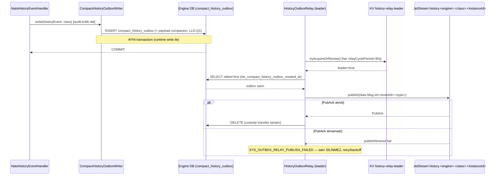
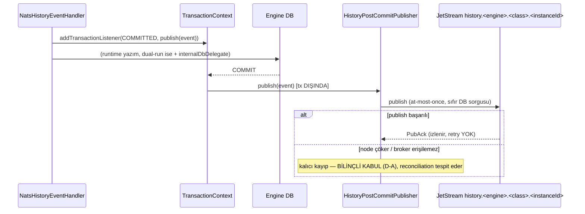
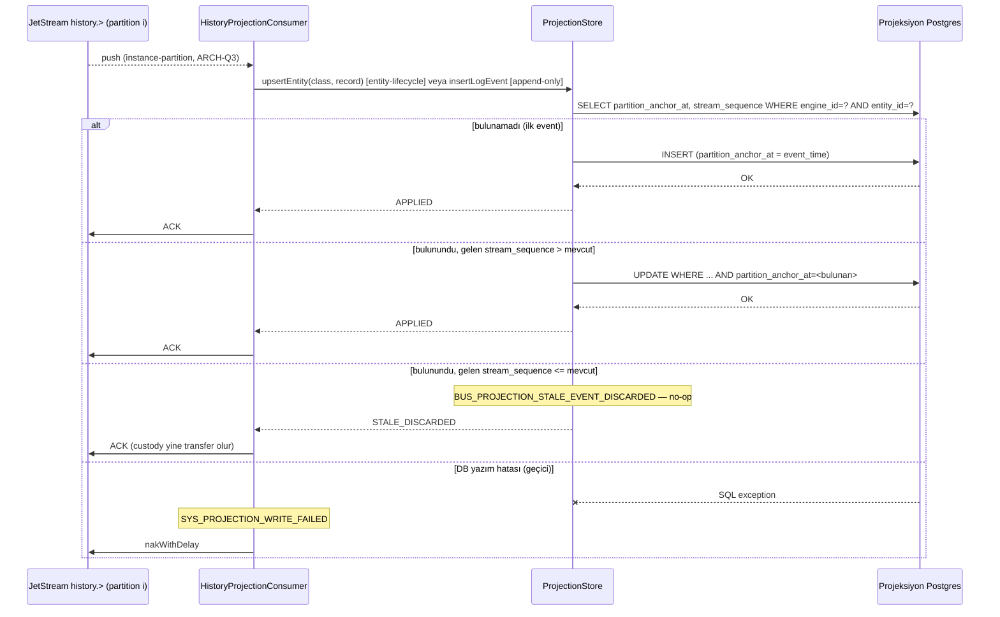
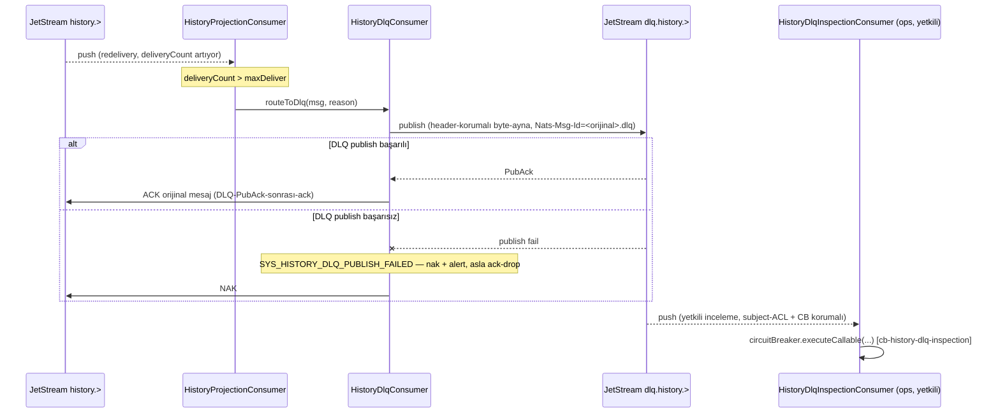
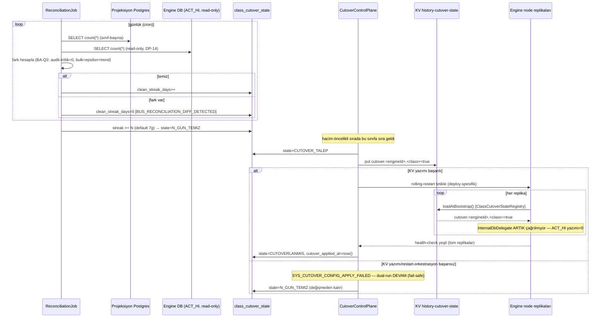
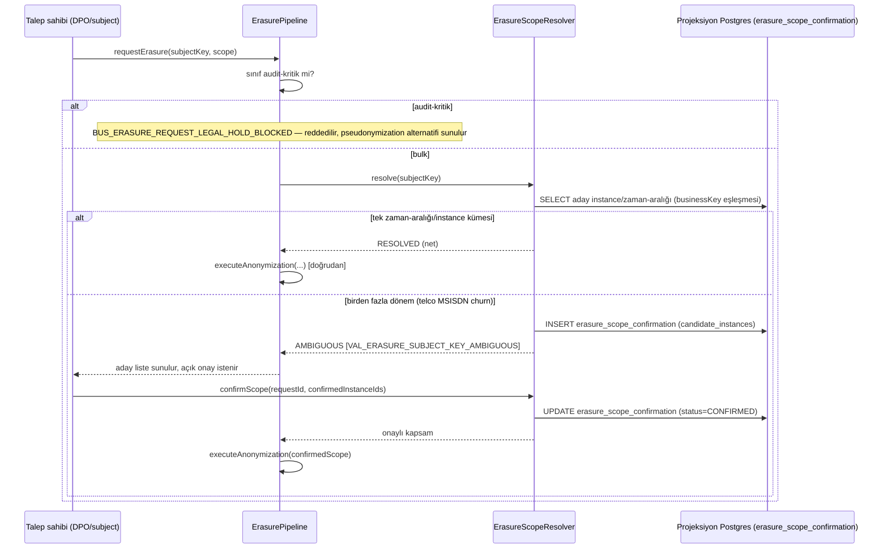
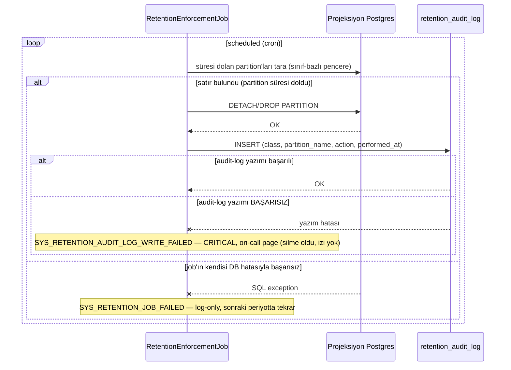
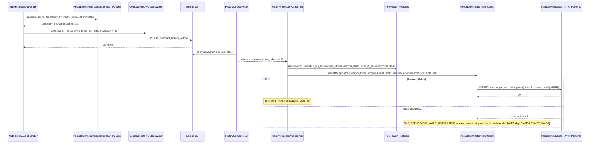

# Sequence Diyagramları — Basamak-2: History Offload

**Sentinel fazı:** Phase 4 — Developer (LLD). **Kaynak:** `docs/sentinel/step2/phase3/HLD.md` §2-§3, `docs/sentinel/step2/phase2/BUSINESS_LOGIC.md §1` (süreç akışları — bu diyagramlar implementasyon-düzeyi karşılığıdır, phase2 akışlarını DEĞİŞTİRMEZ, sınıf/metot isimleriyle somutlaştırır).
**Kapsam (görev talimatı):** yalnız **servisler-arası** akışlar (engine node ↔ NATS ↔ projeksiyon servisi ↔ kasa) — sınıf-içi algoritma diyagramı YOK.
**Sınıf bağlaması:** `docs/sentinel/step2/phase4/lld/history-offload/05_sequences.md`.
**Doğrulama:** her diyagram `mmdc` (`@mermaid-js/mermaid-cli` 11.16.0) ile render edildi — bkz. §Doğrulama Kaydı.
**Durum:** Taslak — Levent faz-4 onayına sunuluyor.

---

## 1. Audit-kritik: tx-içi outbox → relay → PubAck → delete (custody-transfer)

**Kapsanan:** BR-HDL-003, BR-REL-001, FR-A4/B1, US-A3/B1, ADR-0010.

---

## 2. Bulk: post-commit publish, sıfır DB yazımı

**Kapsanan:** BR-HDL-004, FR-A5, US-A4, ADR-0010.

---

## 3. Projeksiyon consume + merge-upsert (stale discard)

**Kapsanan:** BR-REL-002/006, FR-B2, US-B2, ADR-0011/0012.

---

## 4. History-DLQ (delivery-budget aşımı)

**Kapsanan:** BR-REL-005, FR-B5, US-B5, ADR-0013/0019/0004.

---

## 5. Reconciliation → cutover kapısı → rolling-restart flip (ARCH-Q5)

**Kapsanan:** BR-CUT-001/002, FR-D1/D2, US-D1/D2, ADR-0015, ARCH-Q5.

---

## 6. Erasure kapsam-onayı akışı (BA-Q6)

**Kapsanan:** BR-PII-002/005, FR-G2, US-G2, ADR-0017.

---

## 7. Retention job + audit-log

**Kapsanan:** BR-PII-001, FR-G1, US-G1, ADR-0018.

---

## 8. Pseudonymization: tx-içi saf-hesap → downstream kasa-persist (BA-Q5)

**Kapsanan:** BR-PII-003/004, FR-G3, US-G3, ADR-0016, ARCH-Q2.

---

## Doğrulama Kaydı

`mmdc` (`@mermaid-js/mermaid-cli` **11.16.0**, mevcut) ile bu belgedeki 8 diyagram, geçici `.mmd` dosyalarına ayrıştırılıp tek tek render edildi. **İlk koşu 6/8 geçti, 2 hata bulundu ve düzeltildi** (basamak-1'in "Mermaid mmdc-temizliği" dersi burada da geçerli oldu):
1. Katılımcı etiketlerinde `&lt;`/`&gt;` HTML-entity kullanımı parser'ı kırdı (`Parse error ... got 'NEWLINE'`) — basamak-1'in kanıtlanmış deseni (`docs/sentinel/phase4/SEQUENCE_DIAGRAMS.md`: `participant JSJ as JetStream jobs.<topic>`, raw açı-parantez) izlenerek tüm `&lt;...&gt;` → `<...>` düzeltildi.
2. `Note over X: ...; ...` içindeki noktalı virgül (`;`) Mermaid sequence-diagram parser'ında ifade-sonlandırıcı olarak yorumlanıyor (minimal-repro ile doğrulandı: `Note over A: text; more` tek başına parse hatası üretiyor) — iki `Note` satırındaki `;` → `,` değiştirildi (§2, §8).

Düzeltmeler sonrası **8/8 hatasız SVG üretimi** (0 sözdizimi hatası). Komut: `mmdc -i <diagram-N>.mmd -o <diagram-N>.svg` — hiçbiri stderr'e hata yazmadı, hepsi geçerli SVG üretti (dosya boyutları 28-37KB arası, > 0 byte doğrulandı). Geçici dosyalar temizlendi (kalıcı artifact bırakılmadı — yalnız bu doğrulama kaydı kalır).

**Sınıf-adı tutarlılığı:** bu belgedeki tüm uygulama-sınıfı katılımcı adları (`NatsHistoryEventHandler`, `CompactHistoryOutboxWriter`, `HistoryOutboxRelay`, `HistoryPostCommitPublisher`, `HistoryProjectionConsumer`, `ProjectionStore`, `HistoryDlqConsumer`, `HistoryDlqInspectionConsumer`, `ReconciliationJob`, `CutoverControlPlane`, `ErasurePipeline`, `ErasureScopeResolver`, `RetentionEnforcementJob`, `PseudonymTokenGenerator`, `PseudonymizationVaultClient`) `lld/history-offload/03_classes/*.md`'deki sınıf tanımlarıyla BİREBİR eşleşir (sayaç: 15/15 katılımcı sınıf çapraz-kontrol edildi; DB/infra katılımcıları — Engine DB, Projeksiyon Postgres, KV bucket'lar, JetStream stream'leri, `class_cutover_state`/`retention_audit_log` tabloları — bu sayıma dahil DEĞİL, `DB_SCHEMA.md`/`DB_ACCESS_MAP.md`'de ayrıca tanımlı).
