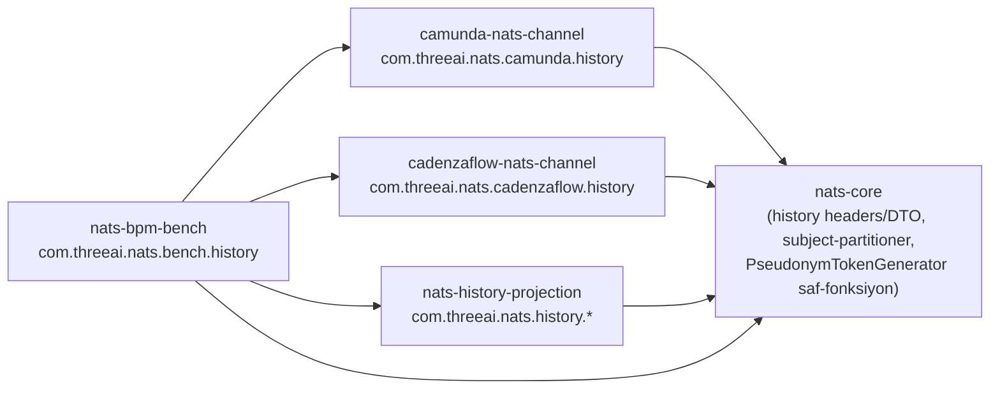

# 02 — Paket / Modül Yerleşimi

**Kaynak karar:** ADR-0007 (basamak-1, ARCH-Q4) — bu basamağın modül yerleşimi AYNI desene uyar: engine-nötr paylaşılan taban `nats-core`'da, motor-özgü kod ayna-modüllerde, motor-dışı yeni yetenek YENİ bir modülde.

---

## 1. Maven modülleri (mevcut 5 + yeni 1)

Basamak-1 sonrası mevcut hâl (`pom.xml:<modules>`, basamak-1 phase5 uygulamasından):

```xml
<modules>
    <module>nats-core</module>
    <module>flowable-nats-channel</module>
    <module>camunda-nats-channel</module>
    <module>cadenzaflow-nats-channel</module>
    <module>nats-bpm-bench</module>
</modules>
```

**Bu LLD'nin öngördüğü yeni modül:**

```xml
<modules>
    <module>nats-core</module>
    <module>flowable-nats-channel</module>
    <module>camunda-nats-channel</module>
    <module>cadenzaflow-nats-channel</module>
    <module>nats-bpm-bench</module>
    <module>nats-history-projection</module>  <!-- YENİ — motor-dışı projeksiyon servisi -->
</modules>
```

**`nats-history-projection` neden yeni bir modül (ve `nats-core`'un bir parçası DEĞİL):** HLD §2 mimari diyagramı bu bileşenleri açıkça `Proj["Projeksiyon servisi (motor-dışı)"]` alt-grafiğinde ayırır — engine node JVM'inde ÇALIŞMAZ, ayrı deploy edilebilir (SRS §4.7 "gömülebilir OSS kütüphane" duruşu; ADR-0014 ARCH-Q4: gömülebilir + opsiyonel standalone). `nats-core`'a koymak, engine-nötr "hiçbir engine-özgü modüle bağımlı değil" ilkesini bozar (bu modül Postgres JDBC + REST-katmanı taşır, `nats-core` taşımaz).

`flowable-nats-channel` basamak-2 kapsamı DIŞINDADIR (D-G — Flowable = basamak-2b) — bu basamakta HİÇ değişmez.

---

## 2. Paket kökü → sınıf haritası

| Paket kökü | Modül | İçerik (bu basamakta eklenen sınıflar) |
|---|---|---|
| `com.threeai.nats.core.history` | `nats-core` | `HistoryHeaders` (yeni — history-özgü header sabitleri), wire-contract DTO'ları (`HistoryEventPayload`, `HistoryEventEnvelope` — asyncapi şemasının Java karşılığı) |
| `com.threeai.nats.core.jetstream` | `nats-core` | (genişler) `JetStreamSubjectPartitioner` (**yeni** — `SubjectTransform`/`Partition(N,token)` provisioning yardımcı) |
| `com.threeai.nats.camunda.history` | `camunda-nats-channel` | `NatsHistoryEventHandler`, `CompactHistoryOutboxWriter`, `HistoryPostCommitPublisher`, `HistoryOutboxRelay`, `ClassCutoverStateRegistry` (**hepsi yeni**) |
| `com.threeai.nats.camunda.config` | `camunda-nats-channel` | (genişir) `HistoryClassificationProperties`, `HistoryOutboxProperties` bean kayıtları |
| `com.threeai.nats.cadenzaflow.history` | `cadenzaflow-nats-channel` | Camunda ile **birebir ayna** (yalnız `org.cadenzaflow.bpm.*` importları — ADR-0007) |
| `com.threeai.nats.history.projection` | **`nats-history-projection`** (yeni modül) | `HistoryProjectionConsumer`, `ProjectionStore`, `ProjectionUpsertProtocol` (entity-lifecycle merge-upsert yardımcı), `HistoryDlqConsumer` |
| `com.threeai.nats.history.query` | `nats-history-projection` | `HistoryQueryApi`, `HistoryQueryController` (REST, standalone modda), `HistoryQueryAuthzSpi` (pluggable, ARCH-Q4), `PiiMaskingService` |
| `com.threeai.nats.history.cutover` | `nats-history-projection` | `ReconciliationJob`, `CutoverControlPlane`, `CutoverRollback`, `ClassCutoverStateStore` (DB erişim katmanı) |
| `com.threeai.nats.history.governance` | `nats-history-projection` | `RetentionEnforcementJob`, `ErasurePipeline`, `ErasureScopeResolver` |
| `com.threeai.nats.history.vault` | `nats-history-projection` | `PseudonymizationVault`, `PseudonymTokenGenerator` (saf/deterministik, engine-node tarafında da kullanılır — bkz. not aşağıda), `VaultAccessAuditor` |
| `com.threeai.nats.bench.history` | `nats-bpm-bench` | (genişir) `HistoryBenchScenario`, `HistoryDbWriteOpReport`, `RelayFailoverBenchScenario` (**hepsi yeni**) |

**Not (`PseudonymTokenGenerator` iki tarafta):** BA-Q5 kararı gereği pseudonym DEĞERİ tx-içi, engine node'da, saf/deterministik hesaplanır (I/O yok) — bu sınıfın **saf fonksiyon kısmı** (`generate(realValue, tenantKey): String`) hem `nats-history-projection`'da (kasa-yazımı doğrulaması için) hem `camunda-nats-channel`/`cadenzaflow-nats-channel`'da (event handle-zamanında) çağrılır. Kod tekrarını önlemek için bu saf fonksiyon **`nats-core`**'da yaşar (`com.threeai.nats.core.history.PseudonymTokenGenerator`) — yalnız üretim mantığı, I/O YOK; `nats-history-projection`'daki `com.threeai.nats.history.vault.PseudonymTokenGenerator` referansı yukarıdaki tablo düzeltmesiyle **`nats-core`**'a taşınır (bkz. §3 bağımlılık grafiği).

---

## 3. Bağımlılık yönü (paket-arası, döngüsüz)



`nats-history-projection` **hiçbir engine-özgü modüle bağımlı DEĞİLDİR** (`camunda-nats-channel`/`cadenzaflow-nats-channel`'ı import ETMEZ) — yalnız `nats-core`'daki paylaşılan wire-contract DTO'larını ve subject şemasını kullanır (asyncapi-kontratlı, ADR-0013). Bu, projeksiyon servisinin motor-ailesinden BAĞIMSIZ deploy edilebilirliğini (NFR-M5: Flowable basamak-2b aynı kontrata bağlanabilir) yapısal olarak korur. `camunda-nats-channel` ↔ `cadenzaflow-nats-channel` arasında basamak-1'deki gibi **hiçbir bağımlılık yoktur** (ayna-tekrar, ADR-0007).

---

## 4. `nats-history-projection` — yeni modülün `pom.xml` iskeleti (Phase 5 kapsamı, burada yalnız işaretlenir)

Bağımlılıklar: `nats-core` (wire-contract), `jnats` (JetStream consumer), `spring-boot-starter-data-jdbc` veya `spring-boot-starter-jdbc` + HikariCP (projeksiyon + kasa DB — İKİ AYRI `DataSource` bean'i, `08_config.md` §1), `spring-boot-starter-web` (opsiyonel standalone REST, ARCH-Q4), `spring-boot-starter-quartz` veya `@Scheduled` (retention/reconciliation job'ları), `resilience4j` (mevcut, DLQ-bridge CB deseni yeniden kullanım).

**Bağımlılık:** BR-REL-002/003, BR-QRY-001, BR-CUT-001/002/003, BR-PII-001/002/003, ADR-0007/0011/0014/0016.
